## 💡 **Basic Spring CRUD Example**

### 1️⃣ Init spring boot project

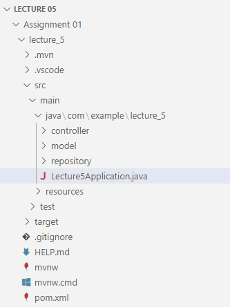

### 2️⃣ Add maven dependencies

Add maven dependencies in `pom.xml`.

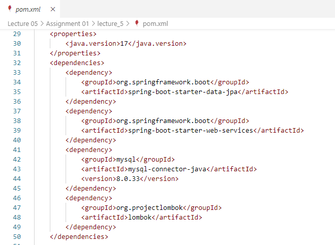

### 3️⃣ Init database

Create database called `lecture_5` in phpMyAdmin.

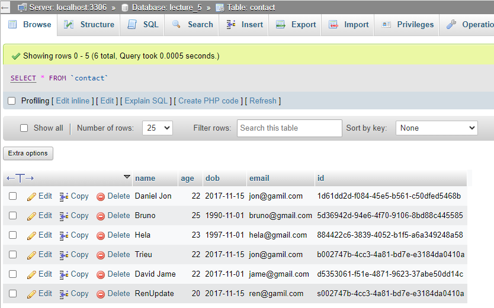

### 4️⃣ Configure properties

Configure properties in `application.properties`.

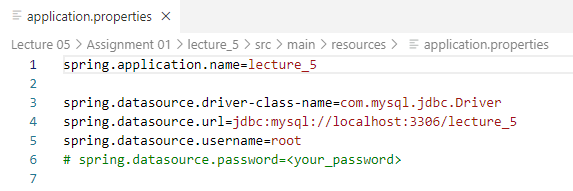

### 5️⃣ Create model

[Create model codes](img/maven.png)

### 6️⃣ Create jpa repository

[Create jpa repository codes](img/maven.png)

### 7️⃣ Create controller

[Create controller codes](img/maven.png)

**@GetMapping to get all the contacts**

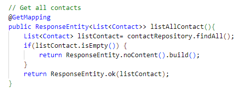

**@GetMapping(value = “/{id}”) to get contact detail by id**

**@PostMapping to create new contact**

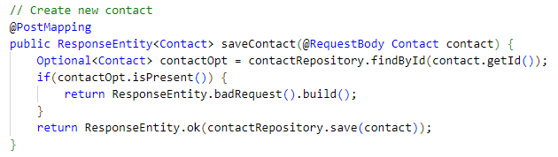

**@PutMapping(value = “/{id}”) to update contact by id**

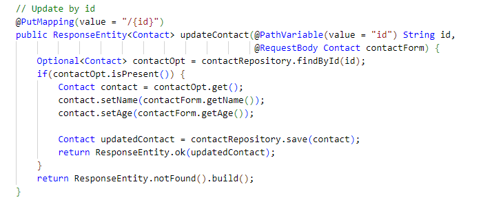

**@DeleteMapping(value = “/contact/{id}”) to delete contact by id**

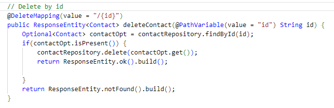

### 8️⃣ Import postman collection

After importing [`Findo-lecture-5.postman_collection.json`](https://github.com/NguyenVanTrieu/spring-crud/blob/main/image%2FFindo-lecture-5.postman_collection.json) in postman, we already can do CRUD operation in here.

**Get all contact**

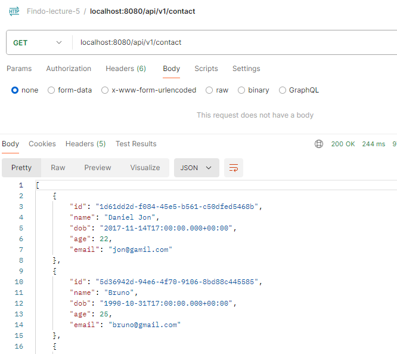

**Get contact detail by id**

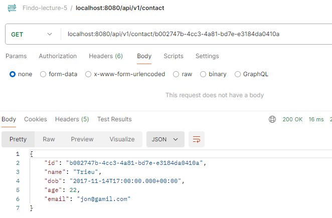

**Create new contact**

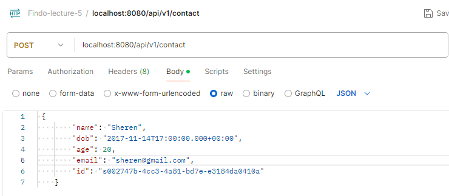

The new contact is already added.

**Update contact by id**

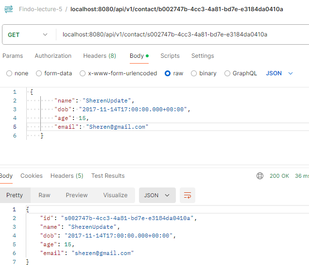

**Delete contact by id**

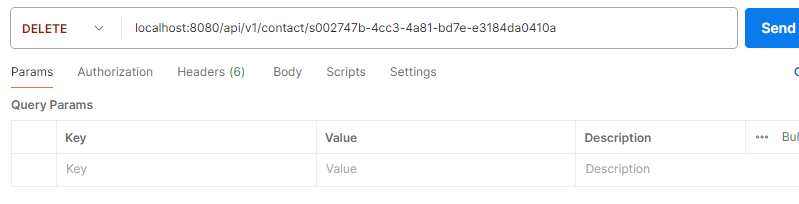