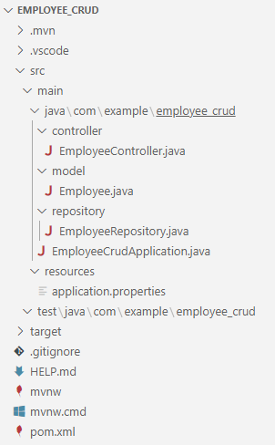
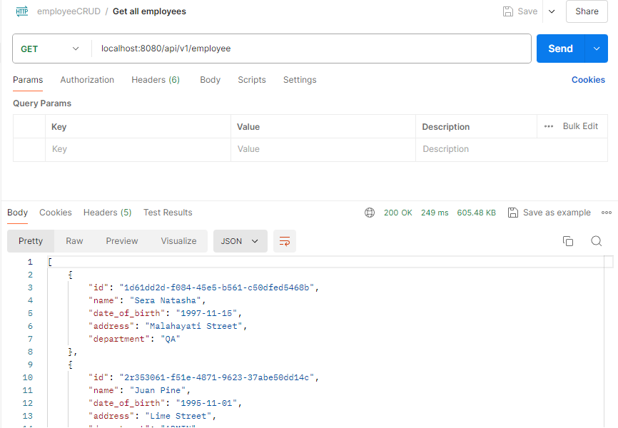
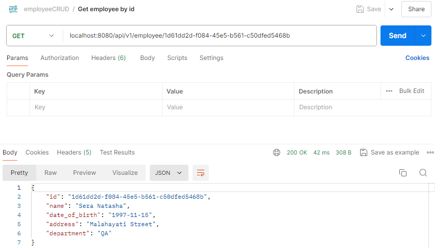
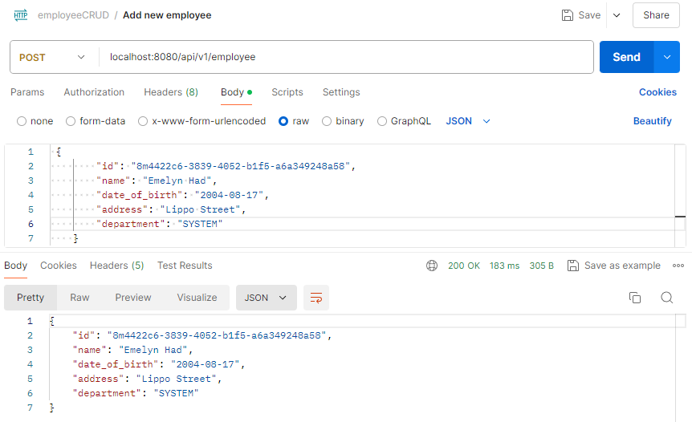
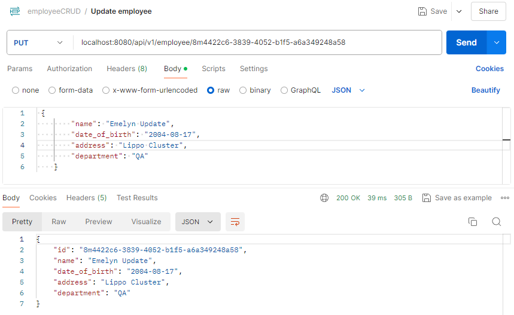
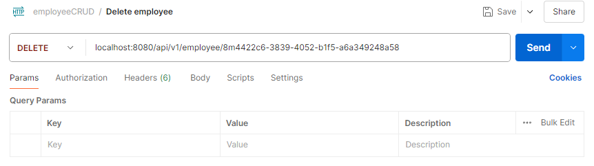
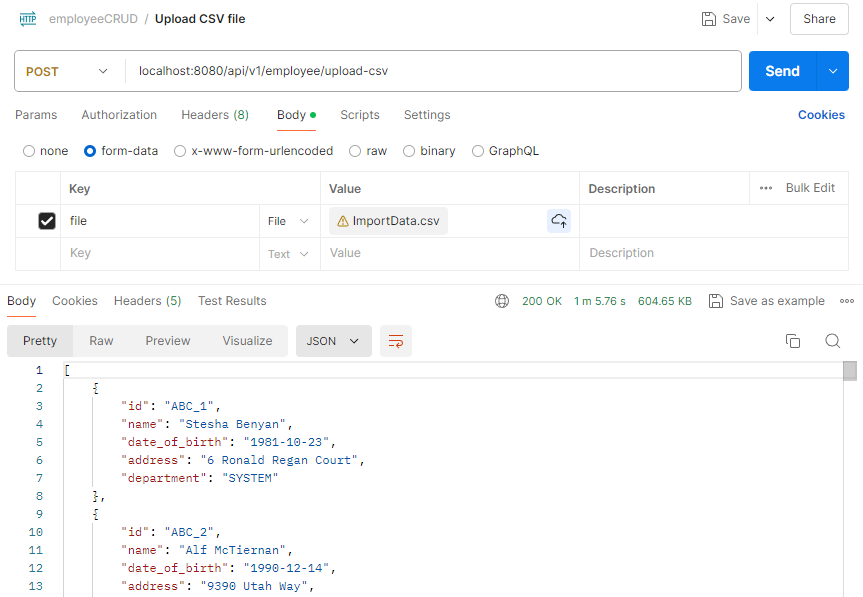
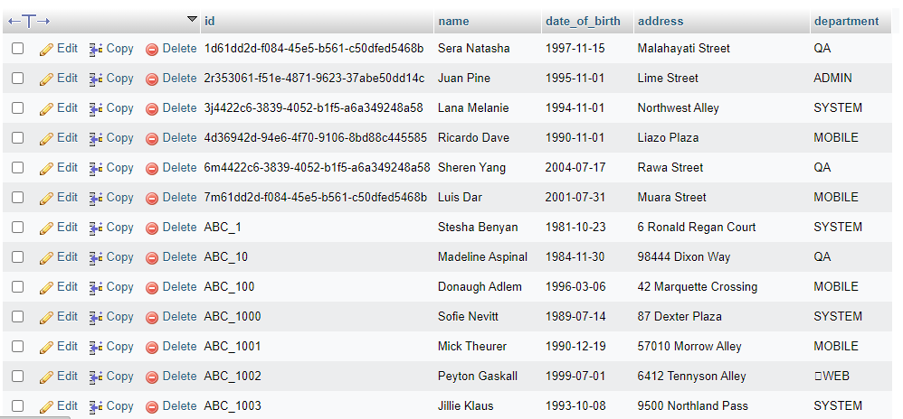
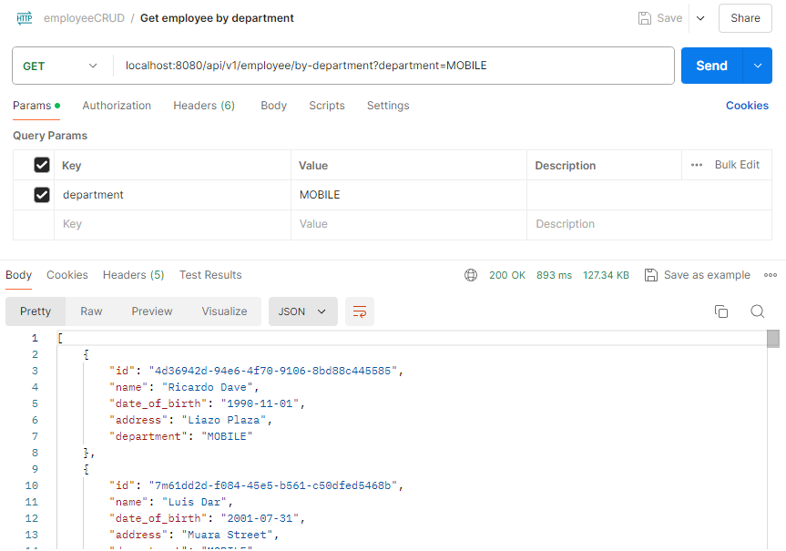

## 💡 Employee CRUD Project

### 1️⃣ Project structure

Below is the project structure of this employee CRUD project:



### 2️⃣ Add maven dependencies

Add maven dependencies in `pom.xml`

```xml
	<dependencies>
		<dependency>
			<groupId>org.springframework.boot</groupId>
			<artifactId>spring-boot-starter-data-jpa</artifactId>
		</dependency>
		<dependency>
            <groupId>org.springframework.boot</groupId>
            <artifactId>spring-boot-starter-web-services</artifactId>
        </dependency>
        <dependency>
            <groupId>mysql</groupId>
            <artifactId>mysql-connector-java</artifactId>
            <version>8.0.33</version>
        </dependency>
		<dependency>
            <groupId>org.projectlombok</groupId>
            <artifactId>lombok</artifactId>
        </dependency>
		<dependency>
			<groupId>org.apache.commons</groupId>
			<artifactId>commons-csv</artifactId>
			<version>1.9.0</version>
		</dependency>
	</dependencies>
```

### 3️⃣ Create database

Create new database `week3_employee` .

```markdown
CREATE TABLE `employee` (
    `id` varchar(50) NOT NULL,
    `name` varchar(100) COLLATE utf8mb4_unicode_ci NOT NULL,
    `date_of_birth` date NOT NULL,
    `address` varchar(255) NOT NULL,
    `department` varchar(100) NOT NULL,
    PRIMARY KEY (`id`)
) ENGINE=InnoDB DEFAULT CHARSET=utf8mb4 COLLATE=utf8mb4_unicode_ci;
    
INSERT INTO `employee` (`id`, `name`, `date_of_birth`, `address`, `department`) VALUES
('1d61dd2d-f084-45e5-b561-c50dfed5468b', 'Sera Natasha', '1997-11-15', 'Malahayati Street', 'QA'),
('2r353061-f51e-4871-9623-37abe50dd14c', 'Juan Pine', '1995-11-01', 'Lime Street', 'ADMIN'),
('3j4422c6-3839-4052-b1f5-a6a349248a58', 'Lana Melanie', '1994-11-01', 'Northwest Alley', 'SYSTEM'),
('4d36942d-94e6-4f70-9106-8bd88c445585', 'Ricardo Dave', '1990-11-01', 'Liazo Plaza', 'MOBILE');
```

### 4️⃣ Configure properties

Configure properties in `application.properties`.

```
spring.application.name=employee_crud

spring.datasource.driver-class-name=com.mysql.jdbc.Driver
spring.datasource.url=jdbc:mysql://localhost:3306/week3_employee
spring.datasource.username=root
spring.datasource.driver-class-name=com.mysql.cj.jdbc.Driver
spring.jpa.hibernate.ddl-auto=update
spring.jpa.show-sql=true
```

### 5️⃣ Create model

[Employee.java](https://github.com/affandyfandy/java-sheren/blob/week_03/Week%2003/Lecture%2005/Assignment%2002/employee_crud/src/main/java/com/example/employee_crud/model/Employee.java)

### 6️⃣ Create jpa repository

[EmployeeRepository.java](https://github.com/affandyfandy/java-sheren/blob/week_03/Week%2003/Lecture%2005/Assignment%2002/employee_crud/src/main/java/com/example/employee_crud/repository/EmployeeRepository.java)

### 7️⃣ Create controller

[EmployeeController.java](https://github.com/affandyfandy/java-sheren/blob/week_03/Week%2003/Lecture%2005/Assignment%2002/employee_crud/src/main/java/com/example/employee_crud/controller/EmployeeController.java)

### 8️⃣ Postman collection

[employeeCRUD.postman_collection.java](https://github.com/affandyfandy/java-sheren/blob/week_03/Week%2003/Lecture%2005/Assignment%2002/employeeCRUD.postman_collection.json)

### 9️⃣ Result

1. **Get all employees (GET localhost:8080/api/v1/employee)**
    
    


    
2. **Get employee detail by id (GET localhost:8080/api/v1/employee/1d61dd2d-f084-45e5-b561-c50dfed5468b)**
    
    
    


3. **Create new employee (POST localhost:8080/api/v1/employee)**
    
    


    
4. **Update employee by id (PUT localhost:8080/api/v1/employee/8m4422c6-3839-4052-b1f5-a6a349248a58)**
    
    


    
5. **Delete employee by id (DELETE localhost:8080/api/v1/employee/8m4422c6-3839-4052-b1f5-a6a349248a58)**
    
    


    
6. **Input CSV file (POST localhost:8080/api/v1/employee/upload-csv)**
    
    
    
    Result:
    
    

    

7. **Return employees by department (GET localhost:8080/api/v1/employee/by-department?department=MOBILE)**
    
    