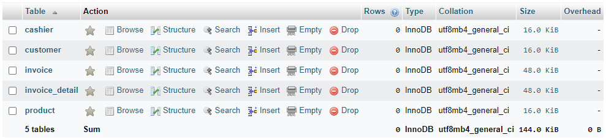
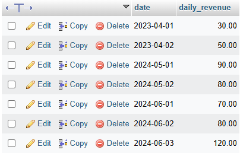
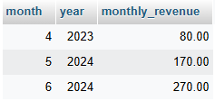
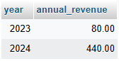

## 💡 Database (Invoices)

[Codes](https://github.com/affandyfandy/java-sheren/blob/week_03/Week%2003/Lecture%2006/Assignment%2002/query.sql)

### 🗒️ Initialize Database

Question:

A store want to have an application to manage invoices. And also can see the daily, monthly, annual revenue.

Write sql to create tables:

- customer: id, name, phone
- cashier: id, name
- invoice: id, customer_id, cashier_id, amount, created_date
- invoice_detail: id, quantity, product_id, product_price, invoice_id, amount
- product: id, name, price

**1️⃣ Create database**

```sql
CREATE DATABASE week03_invoice;
```

**2️⃣ Create customer table**

```sql
CREATE TABLE customer (
    id INT AUTO_INCREMENT PRIMARY KEY,
    name VARCHAR(255) NOT NULL,
    phone VARCHAR(30)
);
```

For all tables, I use auto_increment for id column.

**3️⃣ Create cashier table**

```sql
CREATE TABLE cashier (
    id INT AUTO_INCREMENT PRIMARY KEY,
    name VARCHAR(255) NOT NULL
);
```

**4️⃣ Create product table**

```sql
CREATE TABLE product (
    id INT AUTO_INCREMENT PRIMARY KEY,
    name VARCHAR(255) NOT NULL,
    price DECIMAL(10, 2) NOT NULL
);
```

**5️⃣ Create invoice table**

```sql
CREATE TABLE invoice (
    id INT AUTO_INCREMENT PRIMARY KEY,
    customer_id INT NOT NULL,
    cashier_id INT NOT NULL,
    amount DECIMAL(10, 2) NOT NULL,
    created_date DATE NOT NULL,
    FOREIGN KEY (customer_id) REFERENCES customer(id),
    FOREIGN KEY (cashier_id) REFERENCES cashier(id)
);
```

**6️⃣ Create invoice_detail table**

```sql
CREATE TABLE invoice_detail (
    id INT AUTO_INCREMENT PRIMARY KEY,
    quantity INT NOT NULL,
    product_id INT NOT NULL,
    product_price DECIMAL(10, 2) NOT NULL,
    invoice_id INT NOT NULL,
    amount DECIMAL(10, 2) NOT NULL,
    FOREIGN KEY (product_id) REFERENCES product(id),
    FOREIGN KEY (invoice_id) REFERENCES invoice(id)
);
```

**Result:**



In here, I use MySQL database in phpMyAdmin. All the tables are already created in week03_invoice database.

---

### 📝 Design Database

Question:

This is definition of some specific fields. It normally be calculated by coding. Mock your data with rules below:

- invoice: amount = sum(invoice_detail.amount)
- invoice_detail: amount = quantity * amount
All id columns can be auto_increment or uuid (prefer)

**Mock data insertion:**

**1️⃣ Insert customers**

```sql
INSERT INTO customer (name, phone) VALUES
('Renata May', '123-456-7890'),
('Jake Lim', '234-567-8901'),
('Sera Kim', '345-678-9012');
```

**2️⃣ Insert cashiers**

```sql
INSERT INTO cashier (name) VALUES
('Richard Lewis'),
('Kezia Larisha');
```

**3️⃣ Insert products**

```sql
INSERT INTO product (name, price) VALUES
('Product A', 20.00),
('Product B', 30.00),
('Product C', 40.00);
```

**4️⃣ Insert invoices**

```sql
INSERT INTO invoice (customer_id, cashier_id, amount, created_date) VALUES
(1, 1, 70.00, '2024-06-01'),
(2, 2, 80.00, '2024-06-02'),
(3, 1, 120.00, '2024-06-03'),
(2, 1, 90.00, '2024-05-01'),
(3, 2, 80.00, '2024-05-02'),
(1, 2, 30.00, '2023-04-01'),
(2, 1, 50.00, '2023-04-02');
```

Based on the invoice: amount = sum(invoice_detail.amount) rule.

**5️⃣ Insert invoice details**

```sql
INSERT INTO invoice_detail (quantity, product_id, product_price, invoice_id, amount) VALUES
(2, 1, 20.00, 1, 40.00), -- Invoice 1, Product A (2*20.00)
(1, 2, 30.00, 1, 30.00), -- Invoice 1, Product B (1*30.00)
(2, 1, 20.00, 2, 40.00), -- Invoice 2, Product A (2*20.00)
(1, 3, 40.00, 2, 40.00), -- Invoice 2, Product C (1*40.00)
(3, 3, 40.00, 3, 120.00), -- Invoice 3, Product C (3*40.00)
(3, 2, 30.00, 4, 90.00), -- Invoice 4, Product B (3*30.00)
(4, 1, 20.00, 5, 80.00), -- Invoice 5, Product A (4*20.00)
(1, 2, 30.00, 6, 30.00), -- Invoice 6, Product B (1*30.00)
(1, 1, 20.00, 7, 20.00), -- Invoice 7, Product A (1*20.00)
(1, 2, 30.00, 7, 30.00); -- Invoice 7, Product B (1*30.00)
```

Based on the invoice_detail: amount = quantity * amount rule.

---

### ✏️ Queries to Calculate Revenue

Below are the queries to calculate daily, monthly, and annual revenue:

**1️⃣ Daily revenue**

Query:

```sql
SELECT created_date AS date, SUM(amount) AS daily_revenue
FROM invoice
GROUP BY created_date;
```

Result:



**2️⃣ Monthly revenue**

Query:

```sql
SELECT MONTH(created_date) AS month, YEAR(created_date) AS year, SUM(amount) AS monthly_revenue
FROM invoice
GROUP BY MONTH(created_date), YEAR(created_date);
```

Result:



**3️⃣ Annual revenue**

Query:

```sql
SELECT YEAR(created_date) AS year, SUM(amount) AS annual_revenue
FROM invoice
GROUP BY YEAR(created_date);
```

Result:

