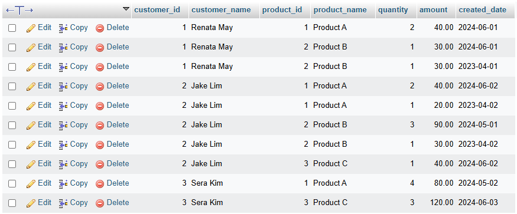
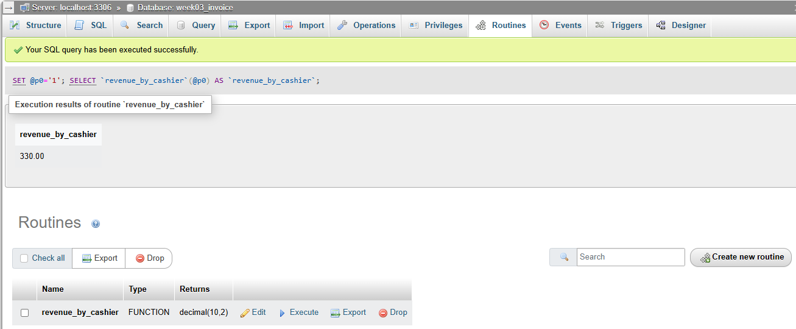
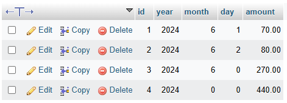

## 💡 Query

[Codes](https://github.com/affandyfandy/java-sheren/blob/week_03/Week%2003/Lecture%2006/Assignment%2003/query.sql)

**Question:**

Based on assignment 2:

- Mock your data
- Create view to show list products customer bought: customer_id, customer_name, product_id, product_name, quantity, amount, created_date
- Create a function calculating revenue by cashier: input cashier_id
- Create table revenue_report: id, year, month, day, amount
- Create store procedures to calculate and store output in revenue_report table:
    - revenue of day: input day of year
    - revenue of month: input month of year
    - revenue of year: input year

---

**Answer:**

Previously, I have created mock data.

[Mocked data codes]([https://github.com/affandyfandy/java-sheren/blob/week_03/Week 03/Lecture 06/Assignment 02/query.sql](https://github.com/affandyfandy/java-sheren/blob/week_03/Week%2003/Lecture%2006/Assignment%2002/query.sql))

Therefore, let’s get straight for creating a view to show list products customer bought.

---

### 📝 SQL Create View

In SQL, a view is a virtual table based on the result-set of an SQL statement. A view contains rows and columns, just like a real table. The fields in a view are fields from one or more real tables in the database.

**Create view syntax**

```sql
CREATE VIEW view_name AS
SELECT column1, column2, ...
FROM table_name
WHERE condition;
```

**Note:** A view always shows up-to-date data. The database engine recreates the view, every time a user queries it.

**Query to create view to show list products customer bought** **(customer_id, customer_name, product_id, product_name, quantity, amount, created_date) based on the syntax and the previous tables:**

```sql
CREATE VIEW customer_product_purchases AS
SELECT
	t1.id AS customer_id,
    t1.name AS customer_name,
    t2.id AS product_id,
    t2.name AS product_name,
    t3.quantity,
    t3.amount,
    t4.created_date
FROM
	customer t1
JOIN
	invoice t4 ON t1.id = t4.customer_id
JOIN
	invoice_detail t3 ON t3.invoice_id = t4.id
JOIN
	product t2 ON t2.id = t3.product_id;
```

**Query to show the view of customer product purchases:**

```sql
SELECT * FROM customer_product_purchases;
```

**Result:**



---

### 📐 SQL Function Calculating Revenue

A stored function in MySQL is a set of SQL statements that perform some task/operation and return a single value. To create a stored function, you use the `CREATE FUNCTION` statement. The following illustrates the basic syntax for creating a new stored function:

```sql
DELIMITER $$

CREATE FUNCTION function_name(
    param1,
    param2,…
)
RETURNS datatype
[NOT] DETERMINISTIC
BEGIN
 -- statements
END $$

DELIMITER ;
```

**Create a function calculating revenue by cashier (input cashier_id):**

```sql
DELIMITER $$

CREATE FUNCTION revenue_by_cashier(cashier_id_input INT) 
RETURNS DECIMAL(10,2)
DETERMINISTIC
BEGIN
    DECLARE revenue DECIMAL(10,2);
    
    SELECT SUM(amount) 
    INTO revenue 
    FROM invoice
    WHERE cashier_id = cashier_id_input;
    
    RETURN revenue;
END $$

DELIMITER ;
```

- The function `revenue_by_cashier` takes a cashier's id as input and returns the total revenue generated by that cashier
- The total revenue is calculated by summing the `amount` fields from the `invoice` table where the `cashier_id` matches the input parameter.
- The calculated revenue is returned as a `DECIMAL(10,2)` value.

**Query to show revenue by cashier:**

```sql
SELECT revenue_by_cashier(1) AS revenue_by_cashier_1;
SELECT revenue_by_cashier(2) AS revenue_by_cashier_2;
```

**Or we can also use the function in the routines section like the example below:**



---

### 📝 Create Table revenue_report

Create table revenue_report (id, year, month, day, amount):

```sql
CREATE TABLE revenue_report (
    id INT AUTO_INCREMENT PRIMARY KEY,
    year INT NOT NULL,
    month INT NOT NULL,
    day INT NOT NULL,
    amount DECIMAL(10,2) NOT NULL
);
```

---

### 📒 Create Store Procedures

A stored procedure is a prepared SQL code that we can save, so the code can be reused over and over again. So if we have an SQL query that we write over and over again, save it as a stored procedure, and then just call it to execute it.

**Stored procedure syntax**

```sql
CREATE PROCEDURE procedure_name
(parameter1 data_type, parameter2 data_type, …)
AS
BEGIN
   — SQL statements to be executed
END
```

Create store procedures to calculate and store output in revenue_report table:

- revenue of day: input day of year
- revenue of month: input month of year
- revenue of year: input year

**1️⃣ Create the stored procedure for daily revenue**

```sql
DELIMITER $$

CREATE PROCEDURE calculate_daily_revenue(IN input_day DATE)
BEGIN
    DECLARE daily_revenue DECIMAL(10,2);
    
    SELECT SUM(amount) INTO daily_revenue
    FROM invoice
    WHERE created_date = input_day;
    
    INSERT INTO revenue_report (year, month, day, amount)
    VALUES (YEAR(input_day), MONTH(input_day), DAY(input_day), daily_revenue);
END $$

DELIMITER ;
```

- **Input:** `input_day` (a specific date)
- **Calculation:** Summing the `amount` from the `invoice` table for the given day
- **Insertion:** Inserting the calculated revenue along with the year, month, and day into the `revenue_report` table.

**2️⃣ Create the stored procedure for monthly revenue**

```sql
DELIMITER $$

CREATE PROCEDURE calculate_monthly_revenue(IN input_year INT, IN input_month INT)
BEGIN
    DECLARE monthly_revenue DECIMAL(10,2);
    
    SELECT SUM(amount) INTO monthly_revenue
    FROM invoice
    WHERE YEAR(created_date) = input_year AND MONTH(created_date) = input_month;
    
    INSERT INTO revenue_report (year, month, day, amount)
    VALUES (input_year, input_month, 0, monthly_revenue);
END $$

DELIMITER ;
```

- **Input:** `input_year`, `input_month` (specific year and month)
- **Calculation:** Summing the `amount` from the `invoice` table for the given month and year
- **Insertion:** Inserting the calculated revenue along with the year and month (day set to 0) into the `revenue_report` table.

**3️⃣ Create the stored procedure for annual revenue**

```sql
DELIMITER $$

CREATE PROCEDURE calculate_annual_revenue(IN input_year INT)
BEGIN
    DECLARE annual_revenue DECIMAL(10,2);
    
    SELECT SUM(amount) INTO annual_revenue
    FROM invoice
    WHERE YEAR(created_date) = input_year;
    
    INSERT INTO revenue_report (year, month, day, amount)
    VALUES (input_year, 0, 0, annual_revenue);
END $$

DELIMITER ;
```

- **Input:** `input_year` (specific year)
- **Calculation:** Summing the `amount` from the `invoice` table for the given year
- **Insertion:** Inserting the calculated revenue along with the year (month and day set to 0) into the `revenue_report` table.

📟 **Example calls:**

```sql
CALL calculate_daily_revenue('2024-06-01');
CALL calculate_daily_revenue('2024-06-02');
CALL calculate_monthly_revenue(2024, 6);
CALL calculate_annual_revenue(2024);
```

These stored procedures will insert the calculated revenue into the `revenue_report` table, which will store the revenue reports for the specified periods.

**Result:**

