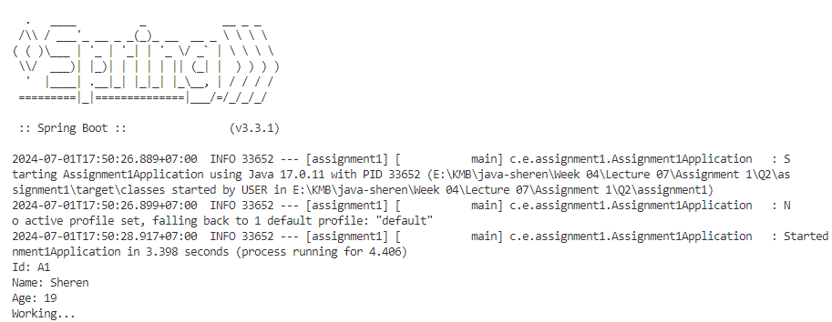

## 💡 Create Class Employee and Use Java Configuration using @Bean

Q: Create class Employee (id, name, age, ...) and convert bean declaration in xml to Java configuration using @Bean (with Constructor injection)

### 👩‍💻 How to Achieve That and the Explanation

1️⃣ Update the [`Employee.java`](http://Employee.java) class with some additional fields like id and age. In here, I added a new constructor which demonstrates dependency injection for `EmployeeWork`.

```java
public class Employee {
    private String id;
    private String name;
    private int age;
    private EmployeeWork employeeWork;

    public Employee(String name, EmployeeWork employeeWork) {
        this.name = name;
        this.employeeWork = employeeWork;
    }

    public Employee(String id, String name, int age, EmployeeWork employeeWork) {
        this.id = id;
        this.name = name;
        this.age = age;
        this.employeeWork = employeeWork;
    }

    public void working() {
        System.out.println("Id: " + id);
        System.out.println("Name: " + name);
        System.out.println("Age: " + age);
        employeeWork.work();
    }
```

For [`EmployeeWork.java`](http://EmployeeWork.java), it has a method which is `work`. This class acts as a dependency for the `Employee` class, and it is injected into the `Employee` class via the constructor or is known as **constructor injection**. So, when an `Employee` object is created, an `EmployeeWork` object is passed to its constructor. Therefore, `Employee` class does not create an instance of `EmployeeWork` itself but receives it from outside, promoting loose coupling and better testability.

```java
public class EmployeeWork {
    public void work() {
        System.out.println("Working...");
    }
}
```

---

2️⃣ In the provided codes, it uses XML configuration to do dependency injection.

```java
<bean id="employee" class="com.helen.demo.entity.Employee">
    <constructor-arg name="name" value="GL"/>
    <constructor-arg name="employeeWork">
        <bean class="com.helen.demo.EmployeeWork"/>
    </constructor-arg>
</bean>
```

In this codes, the `EmployeeWork` dependency is injected to the `Employee` bean through the `<constructor-arg>` element.

When converting this codes to Java configuration using `@Bean`, we define the beans.

```java
@Configuration
public class AppConfig {
    @Bean
    public EmployeeWork employeeWork() {
        return new EmployeeWork();
    }

    @Bean
    public Employee employee() {
        return new Employee("A1", "Sheren", 19, employeeWork());
    }   
}
```

This class uses `@Configuration` to indicate that it is a Spring configuration class. The `@Bean` methods define the beans that will be managed by the Spring container. The `employee()` bean method demonstrates constructor injection by calling the `Employee` constructor and passing the `employeeWork()` bean.

---

3️⃣ Previously, the main class used XML configuration.

```java
@SpringBootApplication
public class SimpleDemoApplication {

    public static void main(String[] args) {
        SpringApplication.run(SimpleDemoApplication.class, args);

        ApplicationContext context = new ClassPathXmlApplicationContext("beans.xml");
        Employee employee = context.getBean("employee", Employee.class);
        employee.working();
    }
}
```

We can update the main application class to use the Java-based configuration.

```java
@SpringBootApplication
public class Assignment1Application {

	public static void main(String[] args) {
		SpringApplication.run(Assignment1Application.class, args);

		ApplicationContext context = new AnnotationConfigApplicationContext(com.example.assignment1.config.AppConfig.class);
		Employee employee = context.getBean("employee", Employee.class);
		employee.working();
	}

}
```

In this class, we initializes the Spring application and uses `AnnotationConfigApplicationContext` to load the Java-based configuration class `AppConfig`. Then, it retrieves the `Employee` bean from the context and calls the `working()` method.

---

4️⃣ The result

