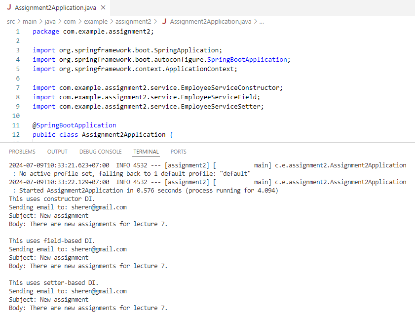
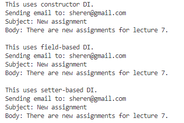

## 💡 Working with Annotations

Q: Working with annotations (ex: ComponentScan**,** Component, Qualifier, Service, …)

- Create EmailService interface and EmailServiceImpl, add method for sending email
- Create EmployeeService class and using EmailService with DI to send email to employee about their works, demo with 3 ways (constructor, field, setter)

---

### 1️⃣ Create EmailService interface class

The first step is creating EmailService interface class.

```java
public interface EmailService {
    void sendEmail(String to, String subject, String body);
}
```

This interface takes three parameters: `to` (the recipient's email address), `subject` (the subject of the email), and `body` (the body of the email).

---

### 2️⃣ Create EmailServiceImpl class

This class implements `sendEmail` method from `EmailService` interface.

```java
@Service
public class EmailServiceImpl implements EmailService{
    @Override
    public void sendEmail(String to, String subject, String body) {
        System.out.println("Sending email to: " + to);
        System.out.println("Subject: " + subject);
        System.out.println("Body: " + body);
    }
}
```

- Annotation `@Service` is a Spring stereotype annotation that indicates this class is a service component in the Spring context
- By marking the class with `@Service`, Spring will automatically detect it during component scanning and register it as a Spring bean. This allows for dependency injection into other Spring components.

---

### 3️⃣ Create EmployeeServiceConstructor class

In this codes, we create `EmployeeService` class and use constructor DI to send email to employee about their works.

```java
@Service
public class EmployeeServiceConstructor {
    private final EmailService emailService;

    public EmployeeServiceConstructor(EmailService emailService) {
        this.emailService = emailService;
    }

    public void notifyEmployee(String employeeEmail) {
        System.out.println("This uses constructor DI.");
        emailService.sendEmail(employeeEmail, "New assignment", "There are new assignments for lecture 7. \n");
    }
}
```

- `@Service` annotation marks the class as a Spring service component, allowing it to be discovered and managed by Spring
- As of Spring Framework 4.3, an `@Autowired` annotation on such a constructor is no longer necessary if the target bean defines only one constructor to begin with
- The constructor takes one parameter, `emailService`, which is of type `EmailService`. Spring will pass an instance of a class that implements `EmailService` (e.g., `EmailServiceImpl`) to this constructor
- `notifyEmployee` is a public method that takes a single parameter, `employeeEmail`, which is a `String`. The method calls the `sendEmail` method on the `emailService` instance, passing in the `employeeEmail`, a subject, and a body for the email. This simulates sending an email to the employee.

---

### 4️⃣ Create EmployeeServiceField class

In this codes, we create `EmployeeService` class and use field DI to send email to employee about their works.

```java
@Service
public class EmployeeServiceField {
    @Autowired
    private EmailService emailService;

    public void notifyEmployee(String employeeEmail) {
        System.out.println("This uses field-based DI.");
        emailService.sendEmail(employeeEmail, "New assignment", "There are new assignments for lecture 7.\n");
    }
}
```

- @Autowired annotation tells Spring to inject an `EmailService` bean into this field. Spring will automatically set this field with an instance of a class that implements `EmailService` (e.g., `EmailServiceImpl`)
- This is an example of field-based dependency injection, where the dependency is injected directly into the field.

---

### 5️⃣ Create EmployeeServiceSetter class

In this codes, we create `EmployeeService` class and use setter-based DI to send email to employee about their works.

```java
@Service
public class EmployeeServiceSetter {
    private EmailService emailService;

    @Autowired
    public void setEmailService(EmailService emailService) {
        this.emailService = emailService;
    }

    public void notifyEmployee(String employeeEmail) {
        System.out.println("This uses setter-based DI.");
        emailService.sendEmail(employeeEmail, "New assignment", "There are new assignments for lecture 7.\n");
    }
}
```

- Setter method `setEmailService` is a public method used to set the `emailService` field
- `@Autowired` annotation tells Spring to use this method for dependency injection. Spring will automatically inject an `EmailService` bean when calling this method.

---

### [BEFORE REVISION]

### 6️⃣ Create AppConfig class

```java
@Configuration
@ComponentScan(basePackages = "com.example.assignment2")
public class AppConfig {
}
```

- `Configuration` is a Spring annotation that indicates that the class can be used by the Spring IoC (Inversion of Control) container as a source of bean definitions. This annotation tells Spring that the class contains configuration information for the application
- Annotation `@ComponentScan` is a Spring annotation used to specify the base packages to scan for Spring components, such as `@Component`, `@Service`, `@Repository`, and `@Controller`.

---

### 7️⃣ Create the Assignment2Application class

```java
@SpringBootApplication
public class Assignment2Application {

	public static void main(String[] args) {
		SpringApplication.run(Assignment2Application.class, args);

		ApplicationContext context = new AnnotationConfigApplicationContext(com.example.assignment2.config.AppConfig.class);

		// Use constructor DI
		EmployeeServiceConstructor employeeServiceConstructor = context.getBean(EmployeeServiceConstructor.class);
        employeeServiceConstructor.notifyEmployee("sheren@gmail.com");

		// Use field DI
		EmployeeServiceField employeeServiceField = context.getBean(EmployeeServiceField.class);
        employeeServiceField.notifyEmployee("sheren@gmail.com");

		// Use setter DI
		EmployeeServiceSetter employeeServiceSetter =  context.getBean(EmployeeServiceSetter.class);
		employeeServiceSetter.notifyEmployee("sheren@gmail.com");
	}
}
```

- Annotation ****`@SpringBootApplication` marks the class as the entry point for a Spring Boot application, enabling auto-configuration and component scanning
- `ApplicationContext` is a central interface to provide configuration for an application
- `AnnotationConfigApplicationContext` is an implementation of `ApplicationContext` reads Spring configuration from Java-based configuration classes
- `context.getBean` method retrieves a bean from the Spring context (`EmployeeServiceConstructor`, `EmployeeServiceField`, `EmployeeServiceSetter`)
- `notifyEmployee` method is called on the retrieved bean, demonstrating each type of dependency injection.

### [AFTER REVISION]

Actually, we can skip `@ComponentScan`. `@SpringBootApplication` already includes component scanning by default for the package where the main application class resides and all its sub-packages. We just need to ensure our main application class is in the base package.

Therefore, since we are using Spring Boot, we don’t need an additional `@ComponentScan` or `@Configuration` in `AppConfig` if our classes are in the right packages. Therefore, we remove`AppConfig` as is not doing anything special.

**Main application:**

```java
@SpringBootApplication
public class Assignment2Application {

	public static void main(String[] args) {
		SpringApplication.run(Assignment2Application.class, args);

		// Remove this one as we don't need AppConfig:
		// ApplicationContext context = new AnnotationConfigApplicationContext(com.example.assignment2.config.AppConfig.class);
		ApplicationContext context = SpringApplication.run(Assignment2Application.class, args);

		// Use constructor DI
		EmployeeServiceConstructor employeeServiceConstructor = context.getBean(EmployeeServiceConstructor.class);
        employeeServiceConstructor.notifyEmployee("sheren@gmail.com");

		// Use field DI
		EmployeeServiceField employeeServiceField = context.getBean(EmployeeServiceField.class);
        employeeServiceField.notifyEmployee("sheren@gmail.com");

		// Use setter DI
		EmployeeServiceSetter employeeServiceSetter =  context.getBean(EmployeeServiceSetter.class);
		employeeServiceSetter.notifyEmployee("sheren@gmail.com");
	}
}
```

**Result:**



---

### 8️⃣ Result

