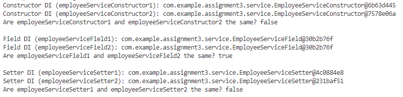

## 💡 Add Bean Scopes

Q: Add bean scopes (singleton, prototype) to Assignment 2, print output to see the scope of beans

### 👩‍🏫 Definition

Before we add bean scopes, let’s delve into the definition first. **Bean Scopes** refers to the lifecycle of Bean that means when the object of Bean will be instantiated, how long does that object live, and how many objects will be created for that bean throughout. Basically, it controls the instance creation of the bean and it is managed by the spring container.

- **Singleton scope (default):** Spring beans are singleton scoped by default, meaning only one instance is created and shared across the application context or for each request made for that bean
- **Prototype scope:** A new instance is created each time the bean is requested.

---

### 💻 Update Service Classes with Scope Annotations

By default, spring beans are singleton. However, we will add explicit scope annotations to service classes to differentiate between singleton and prototype scopes.

**1️⃣ EmailServiceImpl (Singleton)**

```java
@Service
@Scope("singleton")
public class EmailServiceImpl implements EmailService{
    @Override
    public void sendEmail(String to, String subject, String body) {
        System.out.println("Sending email to: " + to);
        System.out.println("Subject: " + subject);
        System.out.println("Body: " + body);
    }
}
```

This bean is declared with `@Service`, which by default is a singleton scope in Spring. Therefore, there will be only one instance of `EmailServiceImpl` created and shared throughout the application context.

**2️⃣ EmployeeServiceConstructor (Prototype)**

```java
@Service
@Scope("prototype")
public class EmployeeServiceConstructor {
    private final EmailService emailService;

    public EmployeeServiceConstructor(EmailService emailService) {
        this.emailService = emailService;
    }

    public void notifyEmployee(String employeeEmail) {
        System.out.println("This uses constructor DI.");
        emailService.sendEmail(employeeEmail, "New assignment", "There are new assignments for lecture 7. \n");
    }
}
```

This bean is explicitly declared with `@Scope("prototype")`. Therefore, every time we call `context.getBean(EmployeeServiceConstructor.class)`, a new instance of `EmployeeServiceConstructor` will be created.

**3️⃣ EmployeeServiceField (Singleton)**

```
@Service
@Scope("singleton")
public class EmployeeServiceField {
    @Autowired
    private EmailService emailService;

    public void notifyEmployee(String employeeEmail) {
        System.out.println("This uses field-based DI.");
        emailService.sendEmail(employeeEmail, "New assignment", "There are new assignments for lecture 7.\n");
    }
}
```

Similar to `EmailServiceImpl`, this bean is also a singleton because it is declared with `@Service` without any scope annotation. There will be only one instance of `EmployeeServiceField` shared across the application context.

**4️⃣ EmployeeServiceSetter (Prototype)**

```
@Service
@Scope("prototype")
public class EmployeeServiceSetter {
    private EmailService emailService;

    @Autowired
    public void setEmailService(EmailService emailService) {
        this.emailService = emailService;
    }

    public void notifyEmployee(String employeeEmail) {
        System.out.println("This uses setter-based DI.");
        emailService.sendEmail(employeeEmail, "New assignment", "There are new assignments for lecture 7.\n");
    }
}

```

Same like `EmployeeServiceConstructor`.

---

### 👩‍💻 Print Output to Observe Bean Scopes

In this step, we will add logging statements to print the memory addresses of the beans to demonstrate whether they refer to the same object or different objects.

**1️⃣ Assignment3Application**

```java
@SpringBootApplication
public class Assignment3Application {

	public static void main(String[] args) {
		SpringApplication.run(Assignment3Application.class, args);

		ApplicationContext context = new AnnotationConfigApplicationContext(com.example.assignment3.config.AppConfig.class);

		// Use constructor DI (Prototype scope)
		EmployeeServiceConstructor employeeServiceConstructor1 = context.getBean(EmployeeServiceConstructor.class);
		EmployeeServiceConstructor employeeServiceConstructor2 = context.getBean(EmployeeServiceConstructor.class);
        System.out.println("Constructor DI (employeeServiceConstructor1): " + employeeServiceConstructor1);
        System.out.println("Constructor DI (employeeServiceConstructor2): " + employeeServiceConstructor2);
        System.out.println("Are employeeServiceConstructor1 and employeeServiceConstructor2 the same? " +
				(employeeServiceConstructor1 == employeeServiceConstructor2) + "\n");

		// Use field DI (Singleton scope)
		EmployeeServiceField employeeServiceField1 = context.getBean(EmployeeServiceField.class);
        EmployeeServiceField employeeServiceField2 = context.getBean(EmployeeServiceField.class);
        System.out.println("Field DI (employeeServiceField1): " + employeeServiceField1);
        System.out.println("Field DI (employeeServiceField2): " + employeeServiceField2);
        System.out.println("Are employeeServiceField1 and employeeServiceField2 the same? " +
                (employeeServiceField1 == employeeServiceField2) + "\n");

		// Use setter DI (Prototype scope)
		EmployeeServiceSetter employeeServiceSetter1 = context.getBean(EmployeeServiceSetter.class);
        EmployeeServiceSetter employeeServiceSetter2 = context.getBean(EmployeeServiceSetter.class);
        System.out.println("Setter DI (employeeServiceSetter1): " + employeeServiceSetter1);
        System.out.println("Setter DI (employeeServiceSetter2): " + employeeServiceSetter2);
        System.out.println("Are employeeServiceSetter1 and employeeServiceSetter2 the same? " +
                (employeeServiceSetter1 == employeeServiceSetter2) + "\n");
	}
}
```

**2️⃣ The result**



- **EmployeeServiceConstructor (Prototype):**
    - Two different instances are created (`@15db9742` and `@6d06d69c`), showing that each call to `context.getBean(EmployeeServiceConstructor.class)` creates a new instance
    - The output confirms that these two instances are not the same (`false`).
- **EmployeeServiceField (Singleton):**
    - The same instance is returned both times (`@7852e922`), showing that only one instance is shared across the application context
    - The output confirms that these two instances are the same (`true`).
- **EmployeeServiceSetter (Prototype):**
    - Two different instances are created (`@4e25154f` and `@70dea4e`), showing that each call to `context.getBean(EmployeeServiceSetter.class)` creates a new instance
    - The output confirms that these two instances are not the same (`false`).