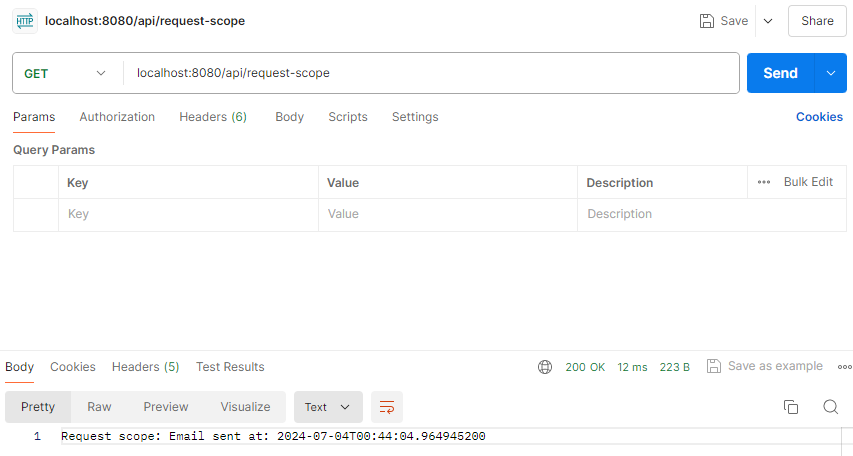

## 💡 Create Controller For Request Scope

Q: For request scope, create a controller and test it

### 👩‍🏫 Definition

The request scope creates a bean instance for a single HTTP request. To demonstrate the request scope in a Spring Boot application, we need to create a controller that handles HTTP requests and then define a bean with request scope. The request scope means that a new instance of the bean will be created for each HTTP request.

---

### 💻 Step by Step Implementation

**1️⃣ Add Spring Web dependency in `pom.xml` file**

```xml
<dependency>
			<groupId>org.springframework.boot</groupId>
			<artifactId>spring-boot-starter-web</artifactId>
</dependency>
```

**2️⃣ Define a request-scoped bean**

In here, we create a new service class.

```
@Service
@Scope(value = "request", proxyMode = ScopedProxyMode.TARGET_CLASS)
public class RequestScopeService {
    private final String id;

    public RequestScopeService() {
        this.id = java.util.UUID.randomUUID().toString();
    }

    public String getId() {
        return id;
    }
}
```

- `@Service` annotation marks the class as a Spring service, which is a type of Spring-managed bean
- `@Scope(value = "request", proxyMode = ScopedProxyMode.TARGET_CLASS)` annotation defines the scope of the bean
    - `value = "request"` specifies that the scope of this bean is a request scope. This means that a new instance of the bean will be created for each HTTP request
    - `proxyMode = ScopedProxyMode.TARGET_CLASS` The ****`proxyMode` attribute is necessary because at the moment of the instantiation of the web application context, there is no active request. Spring creates a proxy to be injected as a dependency, and instantiates the target bean when it is needed in a request.
- Each HTTP request will get a new instance of `RequestScopeService`, and each instance will have a unique ID generated using UUID.

**3️⃣ Create a controller to test the request-scoped bean**

In this code, we define a controller that injects the request-scoped bean and handles HTTP requests.

```
@RestController
@RequestMapping("/api")
public class RequestScopeController {
    @Autowired
    private RequestScopeService requestScopeService;

    @GetMapping("/request-scope")
    public String getRequestScope() {
        return "Request scoped bean ID: " + requestScopeService.getId();
    }
}
```

- `RequestScopeController` class is a REST controller that handles HTTP GET requests to the `/api/request-scope` endpoint
- It uses the `RequestScopeService` to demonstrate request-scoped beans in Spring. Each HTTP request to `/api/request-scope` will receive a new instance of `RequestScopeService`, and the controller will return the unique ID of that instance
- This shows how request-scoped beans provide a new instance for each HTTP request, which can be useful for handling request-specific data or logic.

**4️⃣ Update application.properties**

We need necessary configurations in our [`application.properties`](http://application.properties) file. We need to add this one:

```java
server.port=8080
```

---

### 💻 Test the Controller

**1️⃣ Run the application**

The first step that we need to do is start the Spring Boot application by running the `Assignment3q2Application` class

**2️⃣ Make HTTP requests**

In this step, I use Postman. In Postman, we can create a new request, set the request method to `GET`, and enter the URL `localhost:8080/api/request-scope`. After that, we can click `Send` button and view the response in the Postman interface.



**3️⃣ Observe the output**
Each time we make a request, we can see a different UUID in the response, indicating that a new instance of the `RequestScopedService` bean is created for each request.

Example output:

```
Request scoped bean ID: 73425331-b5e2-40e1-ac7f-411133e801c1
```

```
Request scoped bean ID: 99e91c85-f276-484e-bc5b-21f5cfe0e76a
```