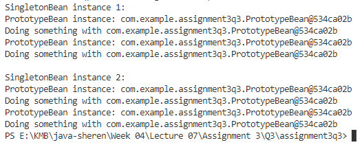

## 💡 Injecting Prototype Bean into Singleton Bean

### 👩‍🏫 Definition

In Spring, Spring context supports singleton and prototype bean scopes along with other scopes specific to the web context. **The singleton is the default bean scope.**

A common problem arises when we want to inject a prototype-scoped bean into a singleton-scoped bean. In this case, as the singleton bean is initialized only once per application context, we need to apply extra logic to initialize the prototype-scoped bean so that it is created every time. This problem is known as the **scoped bean injection problem**.

---

### 👩‍💻 Scoped Bean Injection Problem Example

When we inject a prototype-scoped bean into a singleton-scoped bean directly, Spring will only create and inject one instance of the prototype bean into the singleton bean. This happens because the singleton bean is created only once during the application context's lifecycle, and its dependencies are resolved at that time. Therefore, the injected prototype bean will not be re-created for each use. For example:

**1️⃣ SingletonBean**

```java
@Component
@Scope("singleton")
public class SingletonBean {
    @Autowired
    private PrototypeBean prototypeBean;

    public void performAction() {
        System.out.println("PrototypeBean instance: " + prototypeBean);
        prototypeBean.doSomething();
    }
}
```

**2️⃣ PrototypeBean**

```java
@Component
@Scope("prototype")
public class PrototypeBean {
    public void doSomething() {
        System.out.println("Doing something with " + this);
    }
}
```

**3️⃣ Assignment3q3Application**

```java
@SpringBootApplication
public class Assignment3q3Application {

	public static void main(String[] args) {
		SpringApplication.run(Assignment3q3Application.class, args);
	}

	@Bean
    public CommandLineRunner commandLineRunner(ApplicationContext ctx) {
        return args -> {
            SingletonBean singletonBean1 = ctx.getBean(SingletonBean.class);
            SingletonBean singletonBean2 = ctx.getBean(SingletonBean.class);

            System.out.println("SingletonBean instance 1:");
            singletonBean1.performAction();
            singletonBean1.performAction();

            System.out.println("\nSingletonBean instance 2:");
            singletonBean2.performAction();
            singletonBean2.performAction();
        };
    }
}
```

4️⃣ Output



- For SingletonBean instance 1, both calls to `performAction` print the same `PrototypeBean` instance (`PrototypeBean@5a07e868`)
- For SingletonBean instance 2, both calls to `performAction` print the same `PrototypeBean` instance (`PrototypeBean@5a07e868`).

The same prototype bean instance is used every time `performAction` is called on the singleton bean. This is not the desired behavior because the prototype bean should be re-created for each use.

---

### 💻 Solution

To solve this issue and ensure a new prototype bean instance is created each time, we can use one of the following methods:

1️⃣ Using `@Lookup`

```java
@Component
@Scope("singleton")
public class SingletonBean {
    @Lookup
    public PrototypeBean getPrototypeBean() {
        // Spring will override this method to return a new PrototypeBean instance
        return null;
    }

    public void performAction() {
        PrototypeBean prototypeBean = getPrototypeBean();
        System.out.println("PrototypeBean instance: " + prototypeBean);
        prototypeBean.doSomething();
    }
}
```

This method is simple but relies on Spring's dynamic method overriding.

2️⃣ Using `ObjectFactory`

```java
@Component
@Scope("singleton")
public class SingletonBean {
    @Autowired
    private ObjectFactory<PrototypeBean> prototypeBeanFactory;

    public void performAction() {
        PrototypeBean prototypeBean = prototypeBeanFactory.getObject();
        System.out.println("PrototypeBean instance: " + prototypeBean);
        prototypeBean.doSomething();
    }
}
```

This method is straightforward and uses Spring's `ObjectFactory` to retrieve the prototype bean.

By using one of those methods, we can get output like this:

```java
SingletonBean instance 1:
PrototypeBean instance: com.example.assignment3q3.PrototypeBean@69eb86b4
Doing something with com.example.assignment3q3.PrototypeBean@69eb86b4
PrototypeBean instance: com.example.assignment3q3.PrototypeBean@585ac855
Doing something with com.example.assignment3q3.PrototypeBean@585ac855

SingletonBean instance 2:
PrototypeBean instance: com.example.assignment3q3.PrototypeBean@5bb8f9e2
Doing something with com.example.assignment3q3.PrototypeBean@5bb8f9e2
PrototypeBean instance: com.example.assignment3q3.PrototypeBean@6a933be2
Doing something with com.example.assignment3q3.PrototypeBean@6a933be2
PS E:\KMB\java-sheren\Week 04\Lecture 07\Assignment 3\Q3\assignment3q3>
```

In here, a new `PrototypeBean` instance is created for each use, which is the desired behavior for prototype-scoped beans.