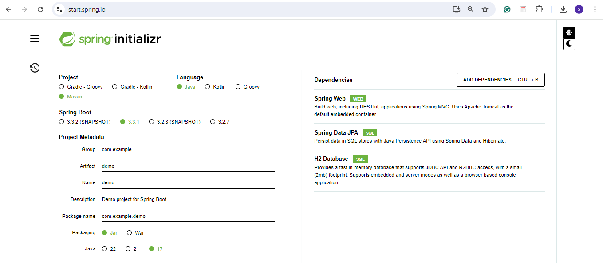

## 💡 Create Spring Boot Project

**1️⃣ Using Spring Initializr Website**

Here, we use **https://start.spring.io/** to start new project development. This website is a Spring Boot Initializr with web interface.



**2️⃣ Project Configuration**

- **Project:** In here, we can choose between `gradle` project or `maven` project. For this project, let’s create `maven` project, so we choose `Maven`
- **Language:** Here, we choose `Java` by default
- **Spring Boot:** We can choose Spring Boot version we want to use. For this project, we choose `version 3.3.1`
- **Group**: It is for the `package` name
- **Artifact:** It is for the `Application` name
- **Name:** Same as artifact
- **Description:** We can write a description of the project
- **Package name:** Similar with `Group` name but also with the artifact
- **Packaging:** We can select the packing of the project, either `Jar` or `War`. In this project, we choose `Jar`
- **Java:** We can select the Java version that we want to use. For this project, we choose `17` version.

**3️⃣ Dependencies**

We can add dependencies that we want to use in this section. For this project, we add:

- **Spring Web**: This dependency is used for for Spring’s web services functionality
- **Spring Data JPA**: This dependency is used for data access
- **H2 Database:** This dependency is used for in-memory database.

**4️⃣ Generate the project**

We can generate the project by clicking `generate`. Here, the project will be generated as `zip` file

**5️⃣ Extract the project**

We can extract the project to desired folder.

**6️⃣ Add test controller**

Here, we add a controller to demonstrate if the database is already connected or not.

```java
@RestController
@RequestMapping(value ="test")
public class TestController {
    @GetMapping
    public String test() {
        return "Database connected.";
    }
}
```

- `@RestController` is used to create RESTful web services using Spring MVC
- `@RequestMapping(value = "test")` will handle requests sent to `/test`
- `@GetMapping` is used to map HTTP GET requests. In this case, it maps to the `test` method

**7️⃣ Test in Postman**

Here, we use Postman to test it.

