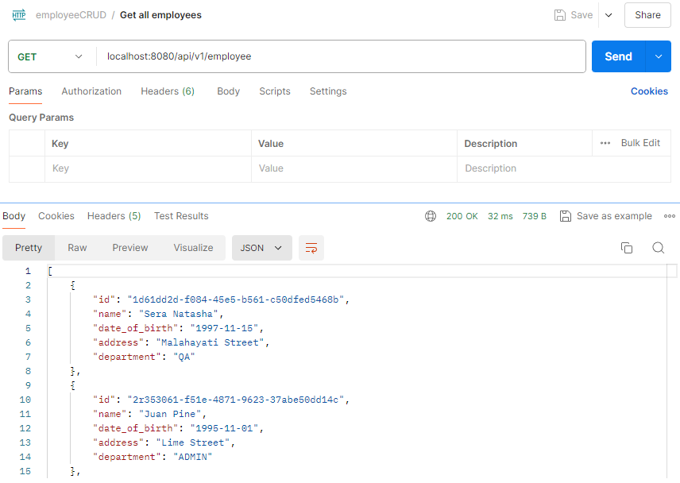
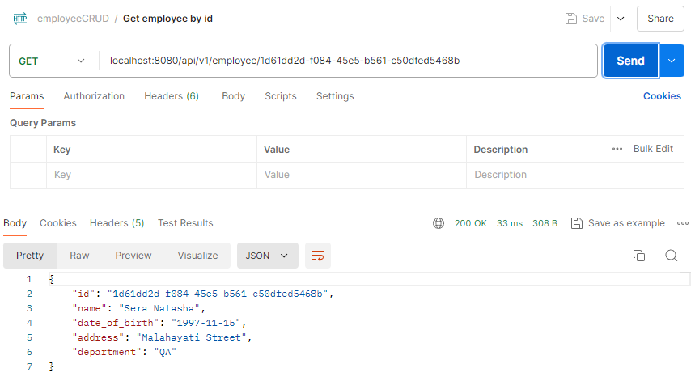
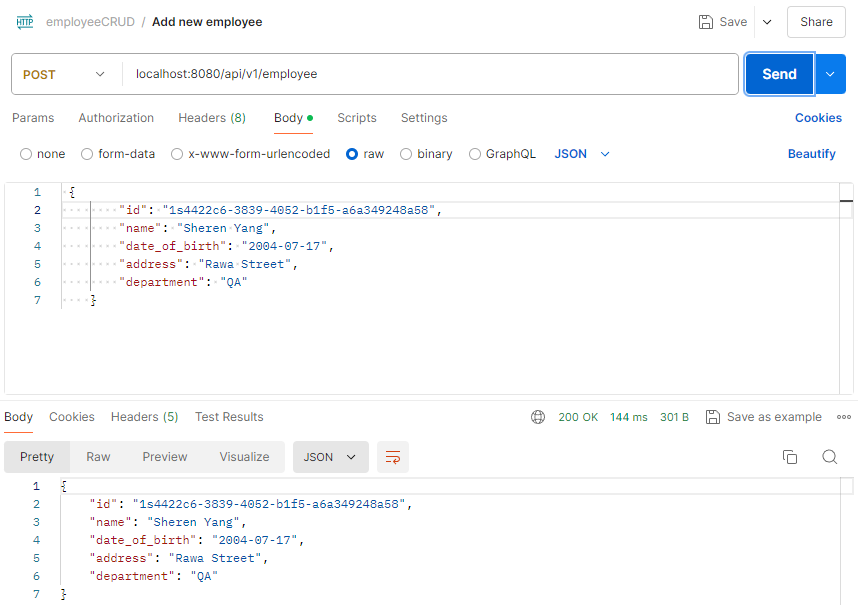
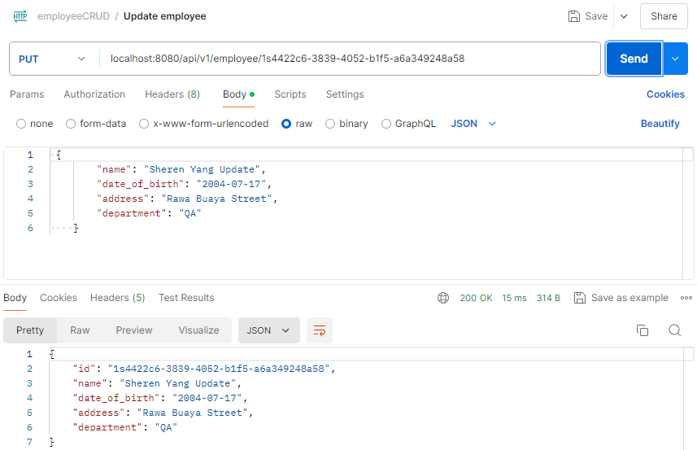
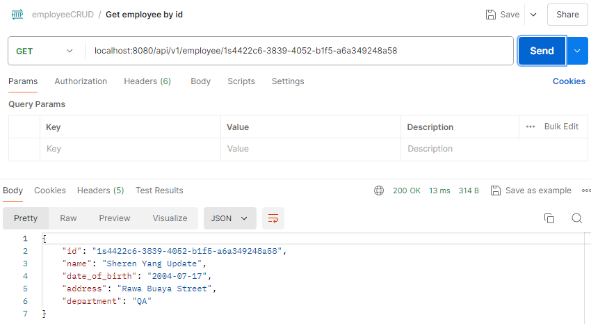
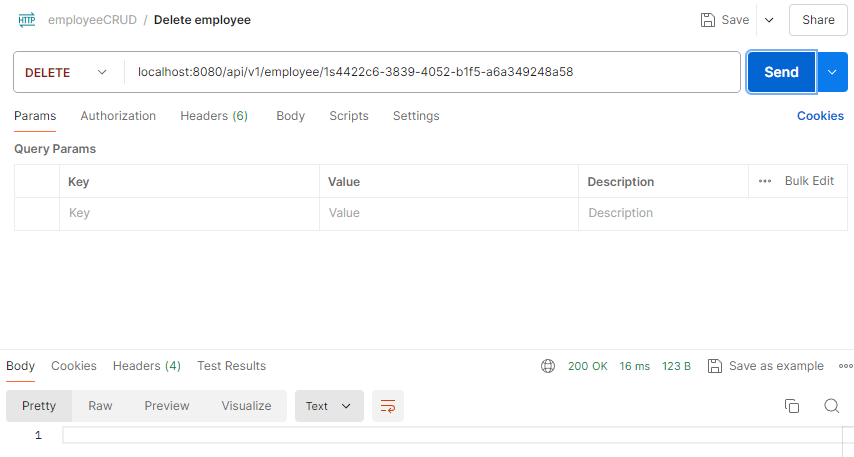

## 💡 Employee CRUD Spring Boot Project Using JDBC

### 👩‍🏫 Create Employee Table

First, we create a new database `week4_employee` . Then, we create employee table with basic information.

```sql
CREATE TABLE `employee` (
    `id` varchar(50) NOT NULL,
    `name` varchar(100) COLLATE utf8mb4_unicode_ci NOT NULL,
    `date_of_birth` date NOT NULL,
    `address` varchar(255) NOT NULL,
    `department` varchar(100) NOT NULL,
    PRIMARY KEY (`id`)
) ENGINE=InnoDB DEFAULT CHARSET=utf8mb4 COLLATE=utf8mb4_unicode_ci;
```

Next, we insert some mocked data.

```sql
INSERT INTO `employee` (`id`, `name`, `date_of_birth`, `address`, `department`) VALUES
('1d61dd2d-f084-45e5-b561-c50dfed5468b', 'Sera Natasha', '1997-11-15', 'Malahayati Street', 'QA'),
('2r353061-f51e-4871-9623-37abe50dd14c', 'Juan Pine', '1995-11-01', 'Lime Street', 'ADMIN'),
('3j4422c6-3839-4052-b1f5-a6a349248a58', 'Lana Melanie', '1994-11-01', 'Northwest Alley', 'SYSTEM'),
('4d36942d-94e6-4f70-9106-8bd88c445585', 'Ricardo Dave', '1990-11-01', 'Liazo Plaza', 'MOBILE');
```

---

### 👩‍🏫 Create Simple CRUD Using JDBC

**1️⃣ Employee class**

```java
@Getter
@Setter
@Entity
public class Employee implements Serializable {

    private static final long serialVersionUID = 1L;

    @Id
    private String id;
    private String name;
    private LocalDate date_of_birth;
    private String address;
    private String department;
}
```

This is a model class representing the employee entity. `@Id` specifies the primary key of the entity. For getter and setter methods, we use Lombok.

**2️⃣ EmployeeMapper class**

```java
public class EmployeeMapper implements RowMapper<Employee> {
    @Override
    public Employee mapRow(ResultSet rs, int rowNum) throws SQLException {
        Employee emp = new Employee();
        emp.setId(rs.getString("id"));
        emp.setName(rs.getString("name"));
        emp.setDate_of_birth(rs.getDate("date_of_birth").toLocalDate());
        emp.setAddress(rs.getString("address"));
        emp.setDepartment(rs.getString("department"));
        return emp;
    }
}
```

This class implements the `RowMapper` interface and maps rows of a result set to instances of the `Employee` class. In another words, it maps rows from the database to `Employee` objects.

**3️⃣ EmployeeDaoImpl class**

```java
@Repository
public class EmployeeDaoImpl {
    @Autowired
    private JdbcTemplate jdbcTemplate;

    public void setTemplate(JdbcTemplate template) {
        this.jdbcTemplate = template;
    }

    // See all employees
    public List<Employee> listEmployee() {
        String sql = "SELECT * FROM employee";
        return jdbcTemplate.query(sql, new EmployeeMapper());
    }

    // Get employee by id
    public Employee getEmployee(String id) {
        String sql = "SELECT * FROM `employee` WHERE `id` = ?";
        return jdbcTemplate.queryForObject(sql, new EmployeeMapper(), id);
    }

    // Add employee
    public void addEmployee(Employee employee) {
        String sql = "INSERT INTO `employee` (`id`, `name`, `date_of_birth`, `address`, `department`) VALUES (?,?,?,?,?)";
        jdbcTemplate.update(sql, employee.getId(), employee.getName(), employee.getDate_of_birth(), employee.getAddress(), employee.getDepartment());
    }

    // Update employee
    public void updateEmployee(Employee employee) {
        String sql = "UPDATE employee SET name = ?, date_of_birth = ?, address = ?, department = ? WHERE id = ?";
        jdbcTemplate.update(sql, employee.getName(), employee.getDate_of_birth(), employee.getAddress(), employee.getDepartment(), employee.getId());
    }

    // Delete employee
    public void deleteEmployee(Employee employee) {
        String sql = "DELETE FROM employee WHERE id = ?";
        jdbcTemplate.update(sql, employee.getId());
    }
}
```

This `EmployeeDaoImpl` class is a Data Access Object (DAO) implementation that uses `JdbcTemplate` to interact with the database. It contains methods to perform CRUD operations.

- `JdbcTemplate`: A Spring Framework class that simplifies the use of JDBC. It helps with executing SQL queries and updating statements
- `listEmployee`: Executes the SQL query to retrieve all employees. It uses `EmployeeMapper` to convert each row of the result set into an `Employee` object
- `getEmployee`: To retrieve a specific employee by id. The `queryForObject` is used when the query is expected to return a single object
- `addEmployee`: To insert a new employee into the database
- `updateEmployee`: To update an existing employee in the database
- `deleteEmployee`: To delete an employee from the database by id.

**3️⃣ EmployeeController class**

```java
@RestController
@RequestMapping("/api/v1/employee")
@AllArgsConstructor
public class EmployeeController {

    @Autowired
    EmployeeDaoImpl employeeDao;

    // Get all employees
    @GetMapping
    public ResponseEntity<List<Employee>> listAllEmployee(){
        List<Employee> listEmployee= employeeDao.listEmployee();
        if(listEmployee.isEmpty()) {
            return ResponseEntity.noContent().build();
        }
        return ResponseEntity.ok(listEmployee);
    }

    // Get employee detail by id
    @GetMapping(value = "/{id}")
    public ResponseEntity<Employee> findEmployee(@PathVariable("id") String id) {
            return ResponseEntity.ok(employeeDao.getEmployee(id));
    }

    // Create new employee
    @PostMapping
    public ResponseEntity<Employee> saveEmployee(@RequestBody Employee employee) {
        employeeDao.addEmployee(employee);
        return ResponseEntity.ok(employee);
    }

    // Update employee by id
    @PutMapping(value = "/{id}")
    public ResponseEntity<Employee> updateEmployee(@PathVariable("id") String id, @RequestBody Employee employee) {
        Employee existingEmployee = employeeDao.getEmployee(id);
        if (existingEmployee == null) {
            return ResponseEntity.notFound().build();
        }
        employee.setId(id);
        employeeDao.updateEmployee(employee);
        return ResponseEntity.ok(employee);
    }

    // Delete employee by id
    @DeleteMapping(value = "/{id}")
    public ResponseEntity<Void> deleteEmployee(@PathVariable("id") String id) {
        Employee employee = employeeDao.getEmployee(id);
        if (employee == null) {
            return ResponseEntity.notFound().build();
        }
        employeeDao.deleteEmployee(employee);
        return ResponseEntity.ok().build();
    }
    
}
```

This class is a REST controller that handles HTTP requests for managing employees. It uses the `EmployeeDaoImpl` to perform CRUD operations.

- `@RestController`: Indicates that this class is a REST controller where each method returns a `ResponseEntity` object, which represents an HTTP response
- `@RequestMapping`: Specifies the base URL for all the request mappings in this controller
- `Autowired`: Injects the `EmployeeDaoImpl` dependency
- `listAllEmployee`: Handles GET requests to the base URL. It retrieves all employees using `employeeDao.listEmployee()`
- `findEmployee`: Handles GET requests to `/api/v1/employee/{id}`. It retrieves a specific employee by ID
- `saveEmployee`: Handles POST requests to the base URL. It adds a new employee using `employeeDao.addEmployee(employee)`
- `updateEmployee`: Handles PUT requests to `/api/v1/employee/{id}`. It updates an existing employee by ID
- `deleteEmployee`: Handles DELETE requests to `/api/v1/employee/{id}`. It deletes an employee by ID.

**4️⃣ CrudEmployeeApplication**

```java
@SpringBootApplication
public class CrudEmployeeApplication {

	public static void main(String[] args) {
		SpringApplication.run(CrudEmployeeApplication.class, args);
	}

}
```

The `@SpringBootApplication` annotation denotes a configuration class that declares one or more `@Bean` methods and triggers auto-configuration and component scanning. This class is the entry point for the Spring Boot application.

**5️⃣ Postman Collection** 

[Postman Collection]()

We can use this Postman Collection to test the codes in Postman.

**6️⃣ Result**

- **Get all employees (GET localhost:8080/api/v1/employee)**
    
    
    
- **Get employee detail by id (GET localhost:8080/api/v1/employee/1d61dd2d-f084-45e5-b561-c50dfed5468b)**
    
    
    
- **Create new employee (POST localhost:8080/api/v1/employee)**
    
    
    
- **Update employee by id (PUT localhost:8080/api/v1/employee/1s4422c6-3839-4052-b1f5-a6a349248a58)**
    
    
    
    The data is already updated.
    
    
    
- **Delete employee by id (DELETE localhost:8080/api/v1/employee/8m4422c6-3839-4052-b1f5-a6a349248a58)**
    
    
    

---

### 👩‍🏫 Using Data Source with Properties File

In `application.properties` codes, we will have like this:

```
spring.application.name=crud_employee

spring.datasource.url=jdbc:mysql://localhost:3306/week4_employee
spring.datasource.username=root
spring.datasource.password=
spring.datasource.driver-class-name=com.mysql.cj.jdbc.Driver

spring.jpa.hibernate.ddl-auto=update
spring.jpa.show-sql=true
```

- `spring.application.name`: Specifies the name of the Spring Boot application. Here, `crud_employee` sets the application name to "crud_employee"
- `spring.datasource.url`: Defines the JDBC URL to connect to the database
- `spring.datasource.username`: Specifies the username for the database connection
- `spring.datasource.password`: Specifies the password for the database connection
- `spring.datasource.driver-class-name`: Defines the fully qualified name of the JDBC driver class. Here, `com.mysql.cj.jdbc.Driver` specifies the MySQL JDBC driver class.