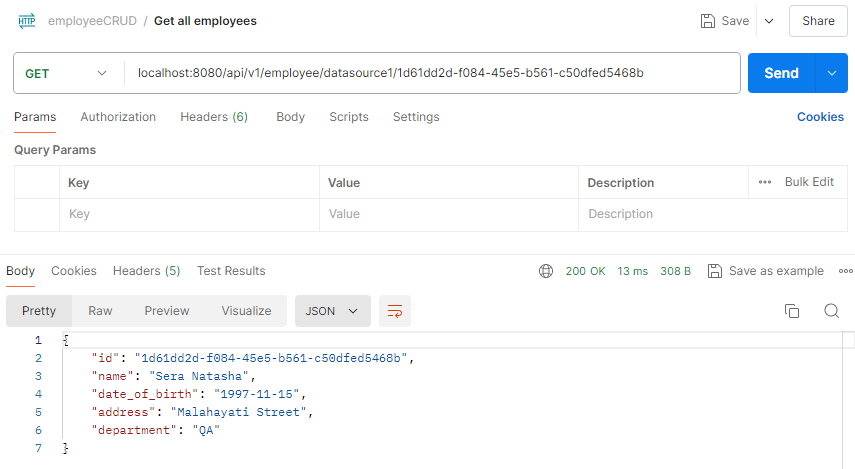

## 💡 Create Datasource Using Bean (Multiple Datasource)

Q: Change assignment 2 to create datasource using bean, not application properties (research multiple datasource)

**1️⃣ Create week4_employeeclone database**

To make sure our project can retrieve data from multiple data sources, let’s add another data source. Here, we create `week4_employeeclone` database. It is basically the clone of our first database.

**2️⃣ Create DataSourceConfig**

We can use bean to create datasource. Therefore, our `application.properties` right now is only like this:

```java
spring.application.name=crud_employee
```

Here, we add `DataSourceConfig` file to manage the datasource using bean.

```java
package com.example.crud_employee.config;

import javax.sql.DataSource;

import org.springframework.beans.factory.annotation.Qualifier;
import org.springframework.context.annotation.Bean;
import org.springframework.context.annotation.Configuration;
import org.springframework.jdbc.core.JdbcTemplate;
import org.springframework.jdbc.datasource.DataSourceTransactionManager;
import org.springframework.transaction.PlatformTransactionManager;
import org.springframework.boot.jdbc.DataSourceBuilder;

@Configuration
public class DataSourceConfig {

    @Bean(name = "dataSource1")
    public DataSource dataSource1() {
        return DataSourceBuilder.create()
                .url("jdbc:mysql://localhost:3306/week4_employee")
                .username("root")
                .password("")
                .driverClassName("com.mysql.cj.jdbc.Driver")
                .build();
    }

    @Bean(name = "jdbcTemplate1")
    public JdbcTemplate jdbcTemplate1(@Qualifier("dataSource1") DataSource dataSource1) {
        return new JdbcTemplate(dataSource1);
    }

    @Bean(name = "dataSource2")
    public DataSource dataSource2() {
        return DataSourceBuilder.create()
                .url("jdbc:mysql://localhost:3306/week4_employeeclone")
                .username("root")
                .password("")
                .driverClassName("com.mysql.cj.jdbc.Driver")
                .build();
    }

    @Bean(name = "jdbcTemplate2")
    public JdbcTemplate jdbcTemplate2(@Qualifier("dataSource2") DataSource dataSource2) {
        return new JdbcTemplate(dataSource2);
    }

}
```

- **`dataSource1()` and `dataSource2()` methods**: These methods use `DataSourceBuilder.create()` to construct `DataSource` instances directly within the method. The properties (`url`, `username`, `password`, `driverClassName`) are specified directly in the method calls rather than being read from `application.properties`
- **`jdbcTemplate1()` and `jdbcTemplate2()` methods**: These methods create `JdbcTemplate` beans for each `DataSource`. The `@Qualifier` annotation is used to specify which `DataSource` bean (`dataSource1` or `dataSource2`) should be injected into the corresponding `JdbcTemplate`.

**3️⃣ Update EmployeeDaoImpl**

```java
@Repository
public class EmployeeDaoImpl {

    @Autowired
    @Qualifier("jdbcTemplate1")
    private JdbcTemplate jdbcTemplate1;

    @Autowired
    @Qualifier("jdbcTemplate2")
    private JdbcTemplate jdbcTemplate2;

    // Methods for datasource 1
    public List<Employee> listEmployee1() {
        String sql = "SELECT * FROM employee";
        return jdbcTemplate1.query(sql, new EmployeeMapper());
    }

    public Employee getEmployee1(String id) {
        String sql = "SELECT * FROM employee WHERE id = ?";
        return jdbcTemplate1.queryForObject(sql, new EmployeeMapper(), id);
    }

    public void addEmployee1(Employee employee) {
        String sql = "INSERT INTO employee (id, name, date_of_birth, address, department) VALUES (?,?,?,?,?)";
        jdbcTemplate1.update(sql, employee.getId(), employee.getName(), employee.getDate_of_birth(), employee.getAddress(), employee.getDepartment());
    }

    public void updateEmployee1(Employee employee) {
        String sql = "UPDATE employee SET name = ?, date_of_birth = ?, address = ?, department = ? WHERE id = ?";
        jdbcTemplate1.update(sql, employee.getName(), employee.getDate_of_birth(), employee.getAddress(), employee.getDepartment(), employee.getId());
    }

    public void deleteEmployee1(String id) {
        String sql = "DELETE FROM employee WHERE id = ?";
        jdbcTemplate1.update(sql, id);
    }

    // Methods for datasource 2
    public List<Employee> listEmployee2() {
        String sql = "SELECT * FROM employee";
        return jdbcTemplate2.query(sql, new EmployeeMapper());
    }

    public Employee getEmployee2(String id) {
        String sql = "SELECT * FROM employee WHERE id = ?";
        return jdbcTemplate2.queryForObject(sql, new EmployeeMapper(), id);
    }

    public void addEmployee2(Employee employee) {
        String sql = "INSERT INTO employee (id, name, date_of_birth, address, department) VALUES (?,?,?,?,?)";
        jdbcTemplate2.update(sql, employee.getId(), employee.getName(), employee.getDate_of_birth(), employee.getAddress(), employee.getDepartment());
    }
    public void updateEmployee2(Employee employee) {
        String sql = "UPDATE employee SET name = ?, date_of_birth = ?, address = ?, department = ? WHERE id = ?";
        jdbcTemplate2.update(sql, employee.getName(), employee.getDate_of_birth(), employee.getAddress(), employee.getDepartment(), employee.getId());
    }
    
    public void deleteEmployee2(String id) {
        String sql = "DELETE FROM employee WHERE id = ?";
        jdbcTemplate2.update(sql, id);
    }
}
```

- **`@Autowired` and `@Qualifier`**: Inject the correct `JdbcTemplate` instance (`jdbcTemplate1` and `jdbcTemplate2`) based on the `@Qualifier` annotation.

**3️⃣ Update EmployeeController**

```java
@RestController
@RequestMapping("/api/v1/employee")
public class EmployeeController {

    @Autowired
    EmployeeDaoImpl employeeDao;

    // Methods for datasource 1
    @GetMapping("/datasource1")
    public ResponseEntity<List<Employee>> listAllEmployee1() {
        List<Employee> listEmployee = employeeDao.listEmployee1();
        if (listEmployee.isEmpty()) {
            return ResponseEntity.noContent().build();
        }
        return ResponseEntity.ok(listEmployee);
    }

    @GetMapping(value = "/datasource1/{id}")
    public ResponseEntity<Employee> findEmployee1(@PathVariable("id") String id) {
        Employee employee = employeeDao.getEmployee1(id);
        if (employee == null) {
            return ResponseEntity.notFound().build();
        }
        return ResponseEntity.ok(employee);
    }

    @PostMapping("/datasource1")
    public ResponseEntity<Employee> saveEmployee1(@RequestBody Employee employee) {
        employeeDao.addEmployee1(employee);
        return ResponseEntity.ok(employee);
    }

    @PutMapping("/datasource1/{id}")
    public ResponseEntity<Employee> updateEmployee1(@PathVariable("id") String id, @RequestBody Employee employee) {
        Employee existingEmployee = employeeDao.getEmployee1(id);
        if (existingEmployee == null) {
            return ResponseEntity.notFound().build();
        }
        employee.setId(id); // Ensure the ID is set correctly
        employeeDao.updateEmployee1(employee);
        return ResponseEntity.ok(employee);
    }

    @DeleteMapping("/datasource1/{id}")
    public ResponseEntity<Void> deleteEmployee1(@PathVariable("id") String id) {
        employeeDao.deleteEmployee1(id);
        return ResponseEntity.ok().build();
    }

    // Methods for datasource 2
    @GetMapping("/datasource2")
    public ResponseEntity<List<Employee>> listAllEmployee2() {
        List<Employee> listEmployee = employeeDao.listEmployee2();
        if (listEmployee.isEmpty()) {
            return ResponseEntity.noContent().build();
        }
        return ResponseEntity.ok(listEmployee);
    }

    @GetMapping(value = "/datasource2/{id}")
    public ResponseEntity<Employee> findEmployee2(@PathVariable("id") String id) {
        Employee employee = employeeDao.getEmployee2(id);
        if (employee == null) {
            return ResponseEntity.notFound().build();
        }
        return ResponseEntity.ok(employee);
    }

    @PostMapping("/datasource2")
    public ResponseEntity<Employee> saveEmployee2(@RequestBody Employee employee) {
        employeeDao.addEmployee2(employee);
        return ResponseEntity.ok(employee);
    }

    @PutMapping("/datasource2/{id}")
    public ResponseEntity<Employee> updateEmployee2(@PathVariable("id") String id, @RequestBody Employee employee) {
        Employee existingEmployee = employeeDao.getEmployee2(id);
        if (existingEmployee == null) {
            return ResponseEntity.notFound().build();
        }
        employee.setId(id); // Ensure the ID is set correctly
        employeeDao.updateEmployee2(employee);
        return ResponseEntity.ok(employee);
    }

    @DeleteMapping("/datasource2/{id}")
    public ResponseEntity<Void> deleteEmployee2(@PathVariable("id") String id) {
        employeeDao.deleteEmployee2(id);
        return ResponseEntity.ok().build();
    }
}

```

- **Separate methods for each datasource**: Here, each CRUD operation is duplicated for both datasources (`datasource1` and `datasource2`).

**4️⃣ Result**

Let’s try it on Postman.

- Get all employees from datasource 1
    
    
    
- Get all employees from datasource 2
    
    
    
- Get all employees by id from datasource 1
    
    
    
- Get all employees by id from datasource 2
    
    
    
- Add employee to datasource 1
    
    
    
- Add employee to datasource 2
    
    
    
- Update employee in datasource 1
    
    
    
- Update employee in datasource 2
    
    
    
- Delete employee in datasource 1
    
    
    
- Delete employee in datasource 2
    
    
    

---

## 💡 Handle Transaction When Insert/Update Data

### ❔ What is a Transaction?

A transaction is a sequence of operations performed as a single logical unit of work. Transactions ensure that all operations within the unit either succeed together (commit) or fail together (rollback), maintaining the database in a consistent state.

---

### 👩‍🏫 Key Concepts

**ACID Properties:**

- **Atomicity**: Transactions are atomic, meaning they either complete entirely or have no effect at all
- **Consistency**: Transactions ensure that the database remains in a valid state before and after the transaction
- **Isolation**: Transactions should operate independently of each other, as if they were executed serially
- **Durability**: Once a transaction is committed, changes made by the transaction are persistent and survive system failures.

**Transaction Boundaries**:

- Transactions begin when a method annotated with `@Transactional` starts executing
- They end when the method completes:
    - If the method completes successfully, changes are committed to the database
    - If an exception is thrown within the method, changes are rolled back (undone).

---

### 💻 Step by Step Implementation

To handle transaction when insert/update data, we can:

**1️⃣  Annotate service or DAO methods with `@Transactional` from `org.springframework.transaction.annotation.Transactional`**

Here, we annotate it in `EmployeeDaoImpl`.

```java
@Repository
public class EmployeeDaoImpl {

    @Autowired
    @Qualifier("jdbcTemplate1")
    private JdbcTemplate jdbcTemplate1;

    @Autowired
    @Qualifier("jdbcTemplate2")
    private JdbcTemplate jdbcTemplate2;

    // Methods for datasource 1
    public List<Employee> listEmployee1() {
        String sql = "SELECT * FROM employee";
        return jdbcTemplate1.query(sql, new EmployeeMapper());
    }

    public Employee getEmployee1(String id) {
        String sql = "SELECT * FROM employee WHERE id = ?";
        return jdbcTemplate1.queryForObject(sql, new EmployeeMapper(), id);
    }

    @Transactional(transactionManager = "dataSource1TransactionManager")
    public void addEmployee1(Employee employee) {
        String sql = "INSERT INTO employee (id, name, date_of_birth, address, department) VALUES (?,?,?,?,?)";
        jdbcTemplate1.update(sql, employee.getId(), employee.getName(), employee.getDate_of_birth(), employee.getAddress(), employee.getDepartment());
    }

    @Transactional(transactionManager = "dataSource1TransactionManager")
    public void updateEmployee1(Employee employee) {
        String sql = "UPDATE employee SET name = ?, date_of_birth = ?, address = ?, department = ? WHERE id = ?";
        jdbcTemplate1.update(sql, employee.getName(), employee.getDate_of_birth(), employee.getAddress(), employee.getDepartment(), employee.getId());
    }

    @Transactional(transactionManager = "dataSource1TransactionManager")
    public void deleteEmployee1(String id) {
        String sql = "DELETE FROM employee WHERE id = ?";
        jdbcTemplate1.update(sql, id);
    }

    // Methods for datasource 2
    public List<Employee> listEmployee2() {
        String sql = "SELECT * FROM employee";
        return jdbcTemplate2.query(sql, new EmployeeMapper());
    }

    public Employee getEmployee2(String id) {
        String sql = "SELECT * FROM employee WHERE id = ?";
        return jdbcTemplate2.queryForObject(sql, new EmployeeMapper(), id);
    }

    @Transactional(transactionManager = "dataSource2TransactionManager")
    public void addEmployee2(Employee employee) {
        String sql = "INSERT INTO employee (id, name, date_of_birth, address, department) VALUES (?,?,?,?,?)";
        jdbcTemplate2.update(sql, employee.getId(), employee.getName(), employee.getDate_of_birth(), employee.getAddress(), employee.getDepartment());
    }

    @Transactional(transactionManager = "dataSource2TransactionManager")
    public void updateEmployee2(Employee employee) {
        String sql = "UPDATE employee SET name = ?, date_of_birth = ?, address = ?, department = ? WHERE id = ?";
        jdbcTemplate2.update(sql, employee.getName(), employee.getDate_of_birth(), employee.getAddress(), employee.getDepartment(), employee.getId());
    }

    @Transactional(transactionManager = "dataSource2TransactionManager")
    public void deleteEmployee2(String id) {
        String sql = "DELETE FROM employee WHERE id = ?";
        jdbcTemplate2.update(sql, id);
    }
}

```

- We use `@Transactional` annotation to method that performs database operations, such as `addEmployee`, `updateEmployee`, and `deleteEmployee`
    - `transactionManager = "dataSource1TransactionManager"` specifies the transaction manager to use for the methods using `dataSource1`
    - `transactionManager = "dataSource2TransactionManager"` specifies the transaction manager for the methods using `dataSource2`
- Transactional management: When a method annotated with `@Transactional` is called:
    - A transaction is automatically started before the method executes
    - The transaction commits if the method completes without exceptions
    - If an exception occurs, the transaction rolls back, ensuring data consistency.

**2️⃣ Configuration of transaction managers**

Here, we add configuration in `DataSourceConfig`.

```java
@Bean(name = "dataSource1TransactionManager")
public PlatformTransactionManager dataSource1TransactionManager(@Qualifier("dataSource1") DataSource dataSource1) {
    return new DataSourceTransactionManager(dataSource1);
}

@Bean(name = "dataSource2TransactionManager")
public PlatformTransactionManager dataSource2TransactionManager(@Qualifier("dataSource2") DataSource dataSource2) {
    return new DataSourceTransactionManager(dataSource2);
}
```

- `@Bean` methods: `dataSource1TransactionManager` and `dataSource2TransactionManager` define `DataSourceTransactionManager` beans explicitly for `dataSource1` and `dataSource2`, respectively
- Transaction management: These beans manage transactions for their corresponding data sources. They handle transaction lifecycle operations (begin, commit, rollback) when annotated methods are executed.

**3️⃣ Insert operation scenario**

- If the insertion operation succeeds, Spring will proceed normally, and we will receive a response confirming the addition of the employee
- If the insertion operation fails (for example, in this case a duplicate ID), Spring detects this and throws a `RuntimeException`
- If encountering a `RuntimeException`, Spring's transaction management rolls back the ongoing transaction
- This ensures that any partial changes made during the transaction (such as inserting the employee) are undone, maintaining data integrity.


**3️⃣ Update operation scenario**

Same with add scenario,

- If the update operation succeeds, Spring will proceed normally, and we will receive a response with the updated employee data
- If the update operation fails (in this case, a non-existent employee ID), Spring's transaction management will detect this and throw a `RuntimeException`. Spring will automatically roll back the ongoing transaction when a `RuntimeException` occurs during a transactional method (like `updateEmployee`).


---

## 💡 Lombok Library

Q: Research Lombok and add to project   

### ❔ What is Lombok Library?

Project Lombok is a Java library that automatically plugs into our editor and build tools. Using this, we never write another getter or equals method again. This helps reduce boilerplate code by generating common methods like `getters`, `setters`, `equals`, `hashCode`, and `toString` at compile time. It uses annotations to automatically create these methods, making our code cleaner and easier to maintain.

---

### 👩‍🏫 Key Features of Lombok

- **Automatic getters and setters:** `@Getter` and `@Setter` annotations automatically generate getter and setter methods for class fields
- **Constructors:** `@NoArgsConstructor`, `@AllArgsConstructor`, and `@RequiredArgsConstructor` annotations generate constructors
- **ToString, Equals, and HashCode**: `@ToString`, `@EqualsAndHashCode` annotations generate `toString()`, `equals()`, and `hashCode()` methods
- **Builder pattern**: `@Builder` annotation provides a builder pattern for object creation.

---

### 💻 Add Lombok to the Project

Previously, we have added Lombok to our project. We have implemented this before in `Employee.java`.

```java
package com.example.crud_employee.model;

import java.io.Serializable;
import java.time.LocalDate;

import jakarta.persistence.Entity;
import jakarta.persistence.Id;
import lombok.Getter;
import lombok.Setter;

@Getter
@Setter
@Entity
public class Employee implements Serializable {

    private static final long serialVersionUID = 1L;

    @Id
    private String id;
    private String name;
    private LocalDate date_of_birth;
    private String address;
    private String department;
}
```

Here, we need not to write setter and getter method again. We just need to use `@Getter` and `@Setter` annotation to automatically create these methods. Therefore, it reduces boilerplate code and make our code easy to maintain.