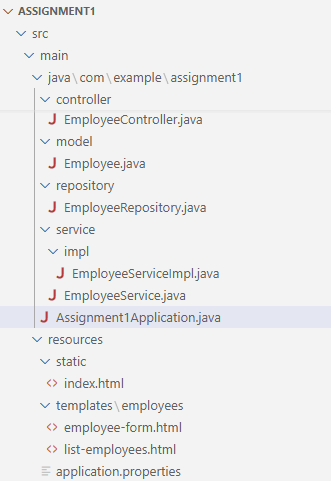
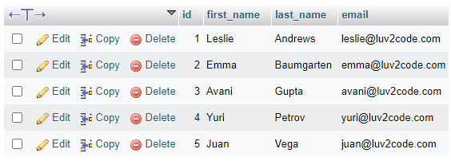
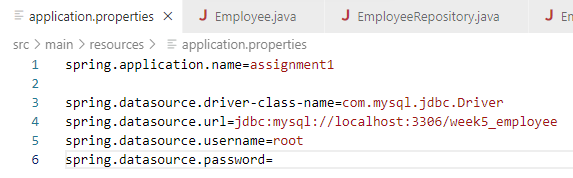
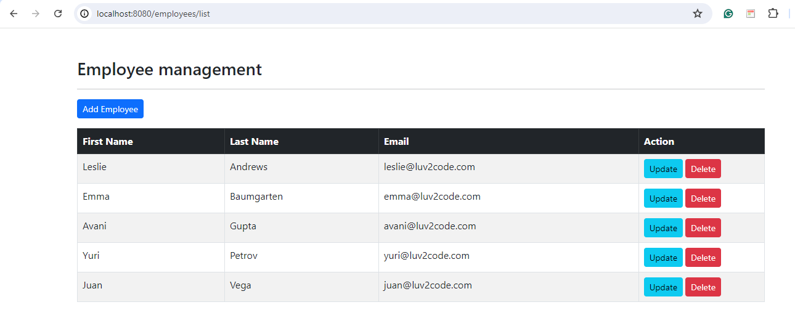
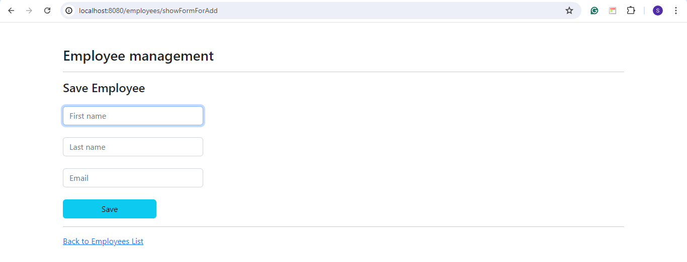
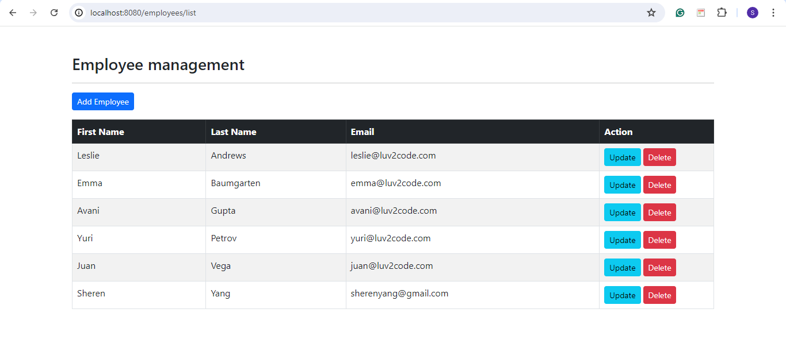
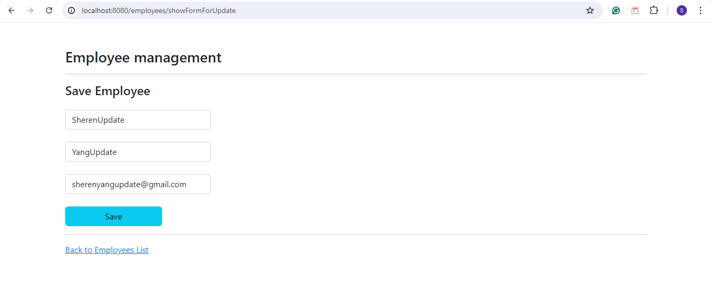
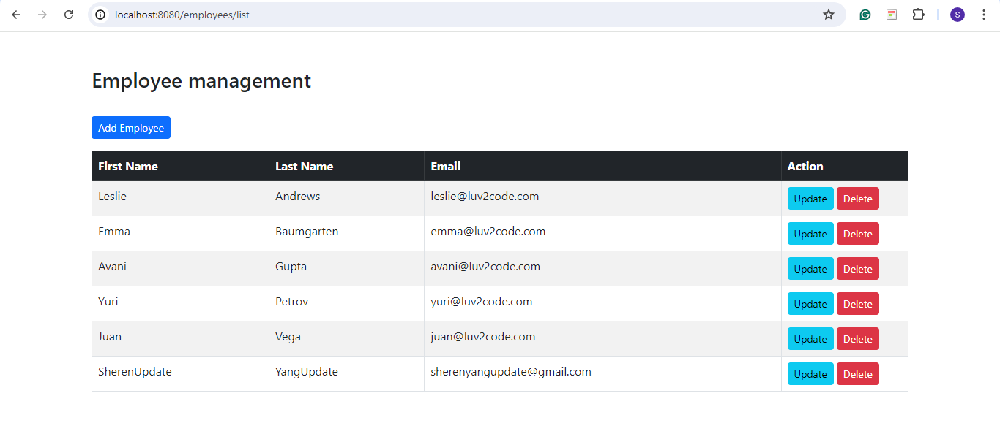
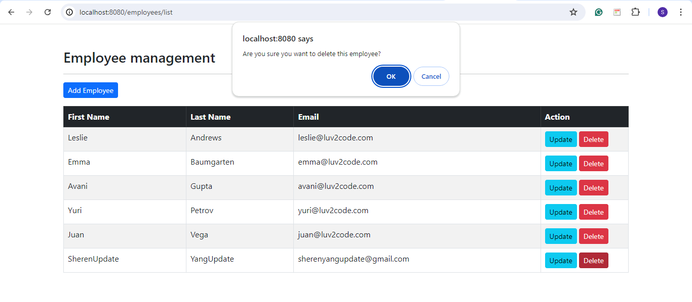
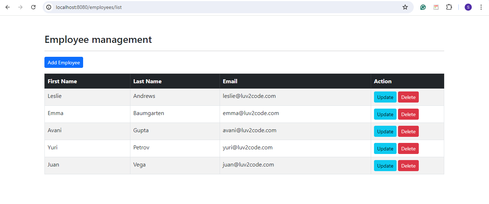

## 💡 Recreate Spring MVC Project

**1️⃣ Project structure**



---

**2️⃣ Add maven dependencies**

Add maven dependencies in [pom.xml](https://github.com/affandyfandy/java-sheren/blob/week_05/Week%2005/Lecture%2009/Assignment%2001/assignment1/pom.xml) in the project.

---

**3️⃣ Init database**

Create database `week5_employee` and add employee table.

```sql
CREATE TABLE `employee` (
		`id` int NOT NULL AUTO_INCREMENT,
	  `first_name` varchar(45) DEFAULT NULL,
	  `last_name` varchar(45) DEFAULT NULL,
	  `email` varchar(45) DEFAULT NULL,
	  PRIMARY KEY (`id`)
) ENGINE=InnoDB AUTO_INCREMENT=1 DEFAULT CHARSET=latin1;
```

Insert data for table `employee`.

```sql
INSERT INTO `employee` VALUES
     (1,'Leslie','Andrews','leslie@luv2code.com'),
     (2,'Emma','Baumgarten','emma@luv2code.com'),
     (3,'Avani','Gupta','avani@luv2code.com'),
     (4,'Yuri','Petrov','yuri@luv2code.com'),
     (5,'Juan','Vega','juan@luv2code.com');
```

Table `employee` in the database:



---

**4️⃣ Configure properties**

Configure properties in `application.resources`.



---

**5️⃣ Create model**

Create `Employee` model in the model folder.

[Employee.java](https://github.com/affandyfandy/java-sheren/blob/week_05/Week%2005/Lecture%2009/Assignment%2001/assignment1/src/main/java/com/example/assignment1/model/Employee.java)

---

**6️⃣ Create jpa repository**

Create `EmployeeRepository` in the repository folder.

[EmployeeRepository.java](https://github.com/affandyfandy/java-sheren/blob/week_05/Week%2005/Lecture%2009/Assignment%2001/assignment1/src/main/java/com/example/assignment1/repository/EmployeeRepository.java)

---

**7️⃣ Create service**

Create `EmployeeService` in the service folder.

[EmployeeService.java](https://github.com/affandyfandy/java-sheren/blob/week_05/Week%2005/Lecture%2009/Assignment%2001/assignment1/src/main/java/com/example/assignment1/service/EmployeeService.java)

Then, create `EmployeeServiceImpl` in the `service\impl` folder.

[EmployeeServiceImpl.java](https://github.com/affandyfandy/java-sheren/blob/week_05/Week%2005/Lecture%2009/Assignment%2001/assignment1/src/main/java/com/example/assignment1/service/impl/EmployeeServiceImpl.java)

---

**8️⃣ Create controller**

Create `Controller` in the controller folder.

[EmployeeController.java](https://github.com/affandyfandy/java-sheren/blob/week_05/Week%2005/Lecture%2009/Assignment%2001/assignment1/src/main/java/com/example/assignment1/controller/EmployeeController.java)

---

**9️⃣ Implement HTML**

Implement HTML in:

- [index.html](https://github.com/affandyfandy/java-sheren/blob/week_05/Week%2005/Lecture%2009/Assignment%2001/assignment1/src/main/resources/static/index.html) in `resources\static`
- [employee-form.html](https://github.com/affandyfandy/java-sheren/blob/week_05/Week%2005/Lecture%2009/Assignment%2001/assignment1/src/main/resources/templates/employees/employee-form.html) in `resources\templates\employees`
- [list-employees.html](https://github.com/affandyfandy/java-sheren/blob/week_05/Week%2005/Lecture%2009/Assignment%2001/assignment1/src/main/resources/templates/employees/list-employees.html) in `resources\templates\employees`.

---

**🔟 Run app and the result**

We can run the program and open it in browser: `localhost:8080`.

**Employee list**



**Add employee**



Result:



**Update employee**



Result:



**Delete employee**



Result:

