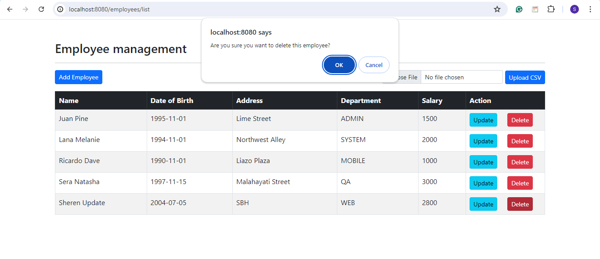

## 💡 Spring MVC Employee CRUD Project (CSV)

- Make your own CRUD project to manage employees with the data follow given csv
- Add new button to upload csv file, and store to database.

### 🌳 **Project structure**

```sql
assignment2
│   pom.xml
├───.mvn
├───.vscode
├───src
    ├───main
        ├───java
        │   └───com
        │       └───example
        │           └───assignment2
        │               │   Assignment2Application.java
        │               │
        │               ├───controller
        │               │       EmployeeController.java
        │               │
        │               ├───data
        │               │       csvData.csv
        │               │
        │               ├───model
        │               │       Employee.java
        │               │
        │               ├───repository
        │               │       EmployeeRepository.java
        │               │
        │               ├───service
        │               │   │   EmployeeService.java
        │               │   │
        │               │   └───impl
        │               │           EmployeeServiceImpl.java
        │               │
        │               └───utils
        │                       DateUtils.java
        │                       FileUtils.java
        │
        └───resources
            │   application.properties
            │
            ├───static
            │       index.html
            │
            └───templates
                └───employees
                        employee-form.html
                        list-employees.html

```

---

### 💻 **Add maven dependencies**

Add maven dependencies in [pom.xml](https://github.com/affandyfandy/java-sheren/blob/week_05/Week%2005/Lecture%2009/Assignment%2002/assignment2/pom.xml) in the project.

---

### 🗒️ **Init database**

Create database `week5_employeelab2` and add `employee` table.

```sql
CREATE TABLE `employee` (
    `id` varchar(50) NOT NULL,
    `name` varchar(100) COLLATE utf8mb4_unicode_ci NOT NULL,
    `date_of_birth` date NOT NULL,
    `address` varchar(255) NOT NULL,
    `department` varchar(100) NOT NULL,
    `salary` int,
    PRIMARY KEY (`id`)
) ENGINE=InnoDB DEFAULT CHARSET=utf8mb4 COLLATE=utf8mb4_unicode_ci;
```

Insert data for table `employee`.

```sql
INSERT INTO `employee` (`id`, `name`, `date_of_birth`, `address`, `department`, `salary`) VALUES
('DEF_1', 'Sera Natasha', '1997-11-15', 'Malahayati Street', 'QA', 3000),
('DEF_2', 'Juan Pine', '1995-11-01', 'Lime Street', 'ADMIN', 1500),
('DEF_3', 'Lana Melanie', '1994-11-01', 'Northwest Alley', 'SYSTEM', 2000),
('DEF_4', 'Ricardo Dave', '1990-11-01', 'Liazo Plaza', 'MOBILE', 1000);
```

---

### 👩‍🏫 **Configure properties**

Configure properties in `application.resources`.

```java
spring.application.name=assignment2

spring.datasource.driver-class-name=com.mysql.jdbc.Driver
spring.datasource.url=jdbc:mysql://localhost:3306/week5_employeelab2
spring.datasource.username=root
spring.datasource.password=
```

---

### 1️⃣ **Create model**

Create `Employee` model in the model folder.

```java
@Entity
@Table(name="employee")
@Getter
@Setter
public class Employee {
    // Define fields

    @Id
    @Column(name="id")
    private String id;

    @Column(name="name")
    private String name;

    @Column(name="date_of_birth")
    @DateTimeFormat(pattern = "yyyy-MM-dd")
    private LocalDate date_of_birth;

    @Column(name="address")
    private String address;

    @Column(name="department")
    private String department;

    @Column(name="salary")
    private int salary;
}
```

- This class defines the `Employee` entity, representing an employee record in the database
- `@Entity` and `@Table`: Mark this class as a JPA entity mapped to the `employee` table
- `@Id` and `@Column`: Specify the primary key and the columns in the table
- `@DateTimeFormat`: Format the `date_of_birth` field
- `@Getter` and `@Setter`: Generate getter and setter methods for all fields using Lombok.

---

### 2️⃣ **Create jpa repository**

Create `EmployeeRepository` in the repository folder.

```java
@Repository
public interface EmployeeRepository extends JpaRepository<Employee, String> {
    List<Employee> findAllByOrderByNameAsc();
}
```

- This provides CRUD operations for `Employee` entities
- `@Repository`: Indicates that this interface is a repository
- `findAllByOrderByNameAsc()`: Custom method to find all employees and order them by name in ascending order.

---

### 3️⃣ **Create service**

Create `EmployeeService` in the service folder.

```java
public interface EmployeeService {
    List<Employee> findAll();

    Employee findById(String theId);

    void save(Employee theEmployee);

    void deleteById(String theId);

    void saveAll(List<Employee> employees);
}
```

- This defines the service layer interface for `Employee` operations.

Then, create `EmployeeServiceImpl` in the `service\impl` folder.

```java
@Service
@AllArgsConstructor
public class EmployeeServiceImpl implements EmployeeService {

    private final EmployeeRepository employeeRepository;

    @Override
    public List<Employee> findAll() {
        return employeeRepository.findAllByOrderByNameAsc();
    }

    @Override
    public Employee findById(String theId) {
        return employeeRepository.findById(theId).orElseThrow();
    }

    @Override
    public void save(Employee theEmployee) {
        employeeRepository.save(theEmployee);
    }

    @Override
    public void deleteById(String theId) {
        employeeRepository.deleteById(theId);
    }

    @Override
    public void saveAll(List<Employee> employees) {
        employeeRepository.saveAll(employees);
    }
    
}
```

- Implements the `EmployeeService` interface.

---

### 4️⃣ Create DateUtils

```java
public class DateUtils {
    static final DateTimeFormatter DATE_FORMATTER = DateTimeFormatter.ofPattern("d/M/yyyy");

    public static LocalDate parseDate(String dateString) {
        return LocalDate.parse(dateString, DATE_FORMATTER);
    }

    public static String formatDate(LocalDate date) {
        return date.format(DATE_FORMATTER);
    }
}
```

- This class provides utility methods for parsing and formatting dates.

---

### 5️⃣ Create FileUtils

```java
public class FileUtils {
    public static boolean hasCsvFormat(MultipartFile file) {
        String fileName = file.getOriginalFilename();
        if (fileName != null && !fileName.isEmpty()) {
            String fileExtension = fileName.substring(fileName.lastIndexOf("."));
            return fileExtension.equalsIgnoreCase(".csv");
        }
        return false;
    }

    public static List<Employee> readEmployeesFromCSV(InputStream is) {
        List<Employee> employees = new ArrayList<>();
        try(BufferedReader br = new BufferedReader(new InputStreamReader(is))) {
            String line;
            boolean isFirstLine = true; // To skip the first line (header)
            while ((line = br.readLine()) != null) {
                if (isFirstLine) {
                    isFirstLine = false;
                    continue; // Skip header line
                }
                String[] data = line.split(",");
                if (data.length > 0) {
                    Employee employee = new Employee();
                    employee.setId(data[0]);
                    employee.setName(data[1]);
                    employee.setDate_of_birth(LocalDate.parse(data[2], DateUtils.DATE_FORMATTER));
                    employee.setAddress(data[3]);
                    employee.setDepartment(data[4]);
                    employee.setSalary(Integer.parseInt(data[5]));
                    employees.add(employee);
                }
            }
        } catch (IOException e) {
            System.err.println("Error reading the CSV file: " + e.getMessage());
        } 
        return employees;
    }
}
```

- This class provides utility methods for handling file operations.
- `hasCsvFormat(MultipartFile)`: Checks if a file has a CSV format
- `readEmployeesFromCSV(InputStream)`: Reads employees from a CSV file and returns a list of `Employee` objects.

---

### 6️⃣ **Create controller**

Create `Controller` in the controller folder.

```java
@AllArgsConstructor
@Controller
@RequestMapping("/employees")
public class EmployeeController {
    
    private final EmployeeService employeeService;
    
    @GetMapping("/list")
    public String listEmployees(Model theModel) {

        // Get the employees from db
        List<Employee> theEmployees = employeeService.findAll();

        // Add to the spring model
        theModel.addAttribute("employees", theEmployees);

        return "employees/list-employees";
    }

    @GetMapping("/showFormForAdd")
    public String showFromForAdd(Model theModel) {

        //Create model attribute to bind form data
        Employee theEmployee = new Employee();

        theModel.addAttribute("employee", theEmployee);

        return "employees/employee-form";
    }

    @PostMapping("/showFormForUpdate")
    public String showFormForUpdate(@RequestParam("employeeId") String id,
                                    Model theModel) {

        // Get the employee from the service
        Employee theEmployee = employeeService.findById(id);

        // Set employee as a model attribute to pre-populate the form
        theModel.addAttribute("employee", theEmployee);

        // Send over to our form
        return "employees/employee-form";
    }

    @PostMapping("/save")
    public String saveEmployee(@ModelAttribute("employee") Employee theEmployee) {

        // Save the employee
        employeeService.save(theEmployee);

        // Use redirect to prevent duplicate submissions
        return "redirect:/employees/list";
    }

    @PostMapping("/delete")
    public String delete(@RequestParam("employeeId") String id) {

        // Delete the employee
        employeeService.deleteById(id);

        // Redirect to /employees/list"
        return "redirect:/employees/list";
    }

    @GetMapping("/uploadCsv")
    public String uploadCsvForm(Model theModel) {
        return "employees/upload-csv";
    }

    @PostMapping("/uploadCsv")
    public String uploadCsvFile(@RequestParam("csvFile") MultipartFile file) {
        if (FileUtils.hasCsvFormat(file)) {
            try {
                List<Employee> employees = FileUtils.readEmployeesFromCSV(file.getInputStream());
                employeeService.saveAll(employees);
                return "redirect:/employees/list";
            } catch (IOException e) {
                System.out.println("Error uploading CSV file!");
            }
        }
        System.out.println("Invalid file format or no file selected.");
        return "redirect:/employees/list";
    }
}
```

- This class handles HTTP requests related to `Employee` operations
- `@Controller`: Marks this class as a Spring MVC controller
- `@RequestMapping("/employees")`: Maps requests to `/employees` to this controller.

---

### 7️⃣ **Implement HTML**

Implement HTML in:

- index.html in `resources\static`
    
    ```html
    <meta http-equiv="refresh"
        content="0; URL='employees/list'">
    ```
    
- [list-employees.html](https://github.com/affandyfandy/java-sheren/blob/week_05/Week%2005/Lecture%2009/Assignment%2002/assignment2/src/main/resources/templates/employees/list-employees.html) in `resources\templates\employees`
- [employee-form.html](https://github.com/affandyfandy/java-sheren/blob/week_05/Week%2005/Lecture%2009/Assignment%2002/assignment2/src/main/resources/templates/employees/employee-form.html) in `resources\templates\employees`.

---

### 8️⃣ **Run app and the result**

We can run the program and open it in browser: `localhost:8080`.

**Previously, we have inserted some data in the database.**

**Employee list**


**Add employee**


Result:


**Update employee**


Result:


**Delete employee**



Result:


**Now, let’s we add new data from CSV file. We can do it by clicking choose file button, choose CSV file we want to add, and click upload CSV. Here, we try to add `csvData.csv`.**


Now, all the data from CSV is already inserted in the database and we can view it in the website.

