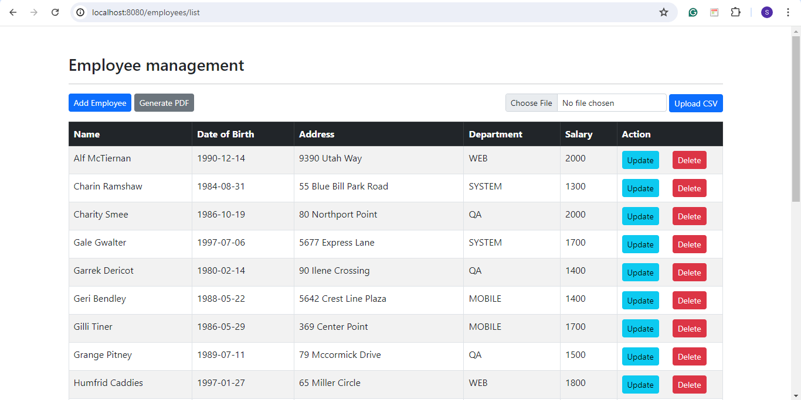
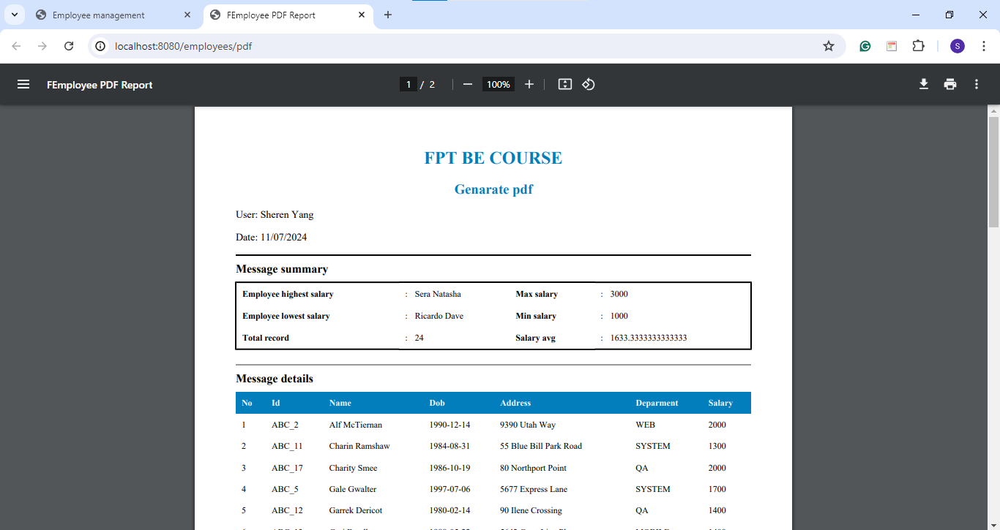
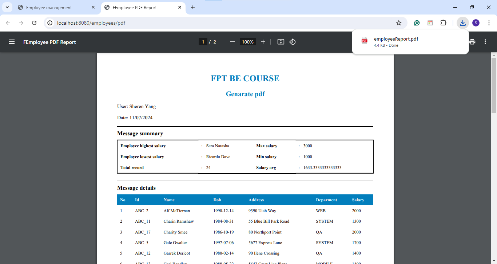

## 💡 Generate PDF

- Gen pdf from given html template file, csv data
- Calculate and bind data from csv data.

Basically, this project is the continuity from the previous assignment. Now, we need to generate pdf, calculate, and bind data.

### 🌳 **Project structure**

```sql
assignment3
│   pom.xml
├───.mvn
├───.vscode
├───src
    ├───main
        ├───java
        │   └───com
        │       └───example
        │           └───assignment2
        │               │   Assignment2Application.java
        │               │
        │               ├───controller
        │               │       EmployeeController.java
        │               │
        │               ├───data
        │               │       csvData.csv
        │               │
        │               ├───model
        │               │       Employee.java
        │               │
        │               ├───repository
        │               │       EmployeeRepository.java
        │               │
        │               ├───service
        │               │   │   EmployeeService.java
        │               │   │
        │               │   └───impl
        │               │           EmployeeServiceImpl.java
        │               │
        │               └───utils
        │                       DateUtils.java
        │                       FileUtils.java
        │
        └───resources
            │   application.properties
            │
            ├───static
            │       index.html
            │
            └───templates
                └───employees
                        employee-form.html
                        list-employees.html
                        pdf-template.html

```

---

### 💻 **Add maven dependencies**

See all maven dependencies in [pom.xml](https://github.com/affandyfandy/java-sheren/blob/week_05/Week%2005/Lecture%2009/Assignment%2003/assignment3/pom.xml) in the project. In this project, we add two more dependencies.

```xml
    <dependency>
        <groupId>com.lowagie</groupId>
        <artifactId>itext</artifactId>
        <version>2.1.7</version>
    </dependency>

    <dependency>
        <groupId>org.xhtmlrenderer</groupId>
        <artifactId>flying-saucer-pdf-openpdf</artifactId>
        <version>9.1.20</version>
    </dependency>
```

---

### 1️⃣ Add new button in list-employees.html

We create a new button for generate PDF button.

```java
  <div class="d-flex justify-content-between mb-3">
      <div>
          <!-- Add an "Add Employee" button -->
          <a th:href="@{/employees/showFormForAdd}" class="btn btn-primary btn-sm">Add Employee</a>

          <!-- Add a "Generate PDF" button -->
          <form action="#" method="POST" th:action="@{/employees/pdf}" target="_blank" style="display: inline;">
              <button type="submit" class="btn btn-secondary btn-sm">Generate PDF</button>
          </form>
      </div>

      <div>
          <!-- Upload CSV File input -->
          <form action="#" method="POST" enctype="multipart/form-data" th:action="@{/employees/uploadCsv}">
              <div>
                  <input type="file" name="csvFile" id="csvFile" accept=".csv" class="form-control form-control-sm d-inline-block" style="width: auto;">
                  <button type="submit" class="btn btn-primary btn-sm">Upload CSV</a>
              </div>
          </form>
      </div>
  </div>
```

---

### 2️⃣ **Create PdfService**

Create `PdfService` in the service folder.

```java
@Service
public class PdfService {
    
    @Autowired
    private TemplateEngine templateEngine;

    public InputStream generatePdf(List<Employee> employees) throws Exception {
        Map<String, Object> data = new HashMap<>();
        data.put("employees", employees);

        Employee highestSalaryEmployee = employees.stream().max(Comparator.comparingInt(Employee::getSalary)).orElse(null);
        Employee lowestSalaryEmployee = employees.stream().min(Comparator.comparingInt(Employee::getSalary)).orElse(null);
        int totalEmployees = employees.size();
        double avgSalary = employees.stream().mapToInt(Employee::getSalary).average().orElse(0.0);

        data.put("highestSalaryEmployee", highestSalaryEmployee);
        data.put("lowestSalaryEmployee", lowestSalaryEmployee);
        data.put("totalEmployees", totalEmployees);
        data.put("avgSalary", avgSalary);
        data.put("userName", "Sheren Yang");

        String currentDate = LocalDate.now().format(DateTimeFormatter.ofPattern("dd/MM/yyyy"));
        data.put("currentDate", currentDate);
        
        Context context = new Context();
        context.setVariables(data);

        String htmlContent = templateEngine.process("employees/pdf-template", context);
        ByteArrayOutputStream outputStream = new ByteArrayOutputStream();

        ITextRenderer renderer = new ITextRenderer();
        renderer.setDocumentFromString(htmlContent);
        renderer.layout();
        renderer.createPDF(outputStream, false);
        renderer.finishPDF();

        return new ByteArrayInputStream(outputStream.toByteArray());
    }
}
```

- This service generates a PDF report from employee data
- `TemplateEngine`: Injected to process `Thymeleaf` templates
- generatePdf method: Generates a PDF using employee data. It calculates the highest and lowest salary, total employees, and average salary, and then uses these along with employee details to generate an HTML content. This HTML content is converted to a PDF using `ITextRenderer`.

---

### 3️⃣ Update EmployeeController

Add new endpoint in `EmployeeController`.

```java
  @PostMapping("/pdf")
  public StreamingResponseBody generatePdf() throws Exception {
      List<Employee> employees = employeeService.findAll();
      return outputStream -> {
          try (InputStream is = pdfService.generatePdf(employees)) {
              byte[] buffer = new byte[2048];
              int bytesRead;
              while ((bytesRead = is.read(buffer)) != -1) {
                  outputStream.write(buffer, 0, bytesRead);
              }
          } catch (Exception ex) {
          }
      };
  }
```

- This controller method handles the generation of the PDF report
- `PostMapping("/pdf")`: Maps POST requests to `/employees/pdf` to this method
- `generatePdf` method: Calls `PdfService` to generate the PDF and streams it back to the client. The `StreamingResponseBody` is used to write the PDF content to the response output stream.

---

### 4️⃣ Create pdf-template.html

```java
<!DOCTYPE html>
<html lang="en" xmlns:th="http://www.thymeleaf.org">
  <head>
    <meta charset="UTF-8" />
    <meta name="viewport" content="width=device-width, initial-scale=1.0" />
    <title>FEmployee PDF Report</title>
    <style>
      body {
        font-family: "Roboto";
      }
      table {
        width: 100%;
        border-collapse: collapse;
      }
      p {
        font-size: 14px;
        white-space: nowrap;
        text-wrap: nowrap;
        flex-wrap: nowrap;
        word-wrap: nowrap;
      }
      th,
      td {
        padding: 8px;
        text-align: left;
        font-size: 12px;
      }
      th {
        word-wrap: break-word;
        white-space: normal;
      }
      .customer-info {
        display: flex;
        width: 100%;
      }
      h3,
      h2 {
        text-align: center;
        color: #027ebc;
      }
      h4 {
        margin: 0 0 10px 0;
      }
      .account-info {
        width: 100%;
        border-collapse: collapse;
        margin-bottom: 20px;
        border: 2px solid black;
      }
      .account-info th,
      .account-info td {
        padding: 8px;
        text-align: left;
      }
      .account-info td::before {
        content: ":";
        padding-right: 10px;
      }
      .message-details th {
        background-color: #027ebc;
        color: #fff;
      }
      hr {
        border: none;
        height: 2px;
        background-color: black;
      }
      @media print {
        .page-break {
          page-break-before: always;
        }
      }
    </style>
  </head>
  <body>
    <h2>FPT BE COURSE</h2>
    <h3>Genarate pdf</h3>
    <div>
      <div class="customer-info">
        <p>User: <span th:text="${userName}"></span></p>
        <p style="width: 100%"></p>
        <p>Date: <span th:text="${currentDate}"></span></p>
      </div>
    </div>
    <hr />
    <h4>Message summary</h4>
    <table class="account-info">
      <tbody>
        <tr>
          <th>Employee highest salary</th>
          <td><span th:text="${highestSalaryEmployee.name}"></span></td>
          <th>Max salary</th>
          <td><span th:text="${highestSalaryEmployee.salary}"></span></td>
        </tr>
        <tr>
          <th>Employee lowest salary</th>
          <td><span th:text="${lowestSalaryEmployee.name}"></span></td>
          <th>Min salary</th>
          <td><span th:text="${lowestSalaryEmployee.salary}"></span></td>          
        </tr>
        <tr>
          <th>Total record</th>
          <td><span th:text="${totalEmployees}"></span></td>
          <th>Salary avg</th>
          <td><span th:text="${avgSalary}"></span></td>          
        </tr>
      </tbody>
    </table>
    <hr style="background-color: #999" />
    <h4>Message details</h4>
    <table class="message-details">
      <tbody>
        <tr>
          <th>No</th>
          <th>Id</th>
          <th>Name</th>
          <th>Dob</th>
          <th>Address</th>
          <th>Deparment</th>
          <th>Salary</th>
        </tr>
        <tr th:each="employee, iterStat : ${employees}">
          <td th:text="${iterStat.index + 1}" />
          <td th:text="${employee.id}" />
          <td th:text="${employee.name}" />
          <td th:text="${employee.date_of_birth}" />
          <td th:text="${employee.address}" />
          <td th:text="${employee.department}" />
          <td th:text="${employee.salary}" />
        </tr>
      </tbody>
    </table>
  </body>
</html>
```

- This `Thymeleaf` template is used to generate the HTML content for the PDF report
- Thymeleaf expressions: Used to dynamically insert data into the template (e.g., `${userName}`, `${currentDate}`, `${highestSalaryEmployee.name}`).

---

### 5️⃣ **Run app and the result**

We can run the program and open it in browser: `localhost:8080`.



We can click the `Generate PDF` button to generate the pdf from the data.



In this pdf, there are already user name, date when we generate the pdf, the calculation result, and the data. We can also download the pdf file by clicking the download button.

