## 💡 CRUD Employee Management

- Similar to lecture5 - assignment2
- Add field: email, phone
- Project structure follow standard
- Use id by uuid
- Use dto and mapstruct
- Handle exception
- Validate email, name (notnull, only text), phone as your country format phone

### 🌳 **Project structure**

```java
employee_crud
├───src
│   └───main
│       ├───java
│       │   └───com
│       │       └───example
│       │           └───employeecrud
│       │               │   EmployeeCrudApplication.java
│       │               │
│       │               ├───controller
│       │               │       EmployeeController.java
│       │               │
│       │               ├───dto
│       │               │       EmployeeDTO.java
│       │               │
│       │               ├───exception
│       │               │       CsvProcessingException.java
│       │               │       InvalidInputException.java
│       │               │       ResourceNotFoundException.java
│       │               │
│       │               ├───handler
│       │               │       GlobalExceptionHandler.java
│       │               │
│       │               ├───mapper
│       │               │       EmployeeMapper.java
│       │               │
│       │               ├───model
│       │               │       Employee.java
│       │               │
│       │               └───repository
│       │                       EmployeeRepository.java
│       │
│       └───resources
│           └───application.properties
│
├───.mvn
│   └───wrapper
│           maven-wrapper.properties
│
├───.gitignore
├───mvnw
├───mvnw.cmd
└───pom.xml
```

The project structure is already following the standard.

---

### 💻 **Add maven dependencies**

See all maven dependencies in [pom.xml]() in the project.

---

### 🗒️ **Init database**

Create database `week5_lecture10` and add employee table.

```sql
CREATE TABLE `employee` (
    `id` varchar(50) NOT NULL,
    `name` varchar(100) COLLATE utf8mb4_unicode_ci NOT NULL,
    `date_of_birth` date NOT NULL,
    `address` varchar(255) NOT NULL,
    `department` varchar(100) NOT NULL,
    `email` VARCHAR(100) NOT NULL,
    `phone` VARCHAR(20) NOT NULL,
    PRIMARY KEY (`id`)
) ENGINE=InnoDB DEFAULT CHARSET=utf8mb4 COLLATE=utf8mb4_unicode_ci;
```

Insert data for table `employee`.

```java

INSERT INTO `employee` (`id`, `name`, `date_of_birth`, `address`, `department`, `email`, `phone`) VALUES
('1d61dd2d-f084-45e5-b561-c50dfed5468b', 'Sera Natasha', '1997-11-15', 'Malahayati Street', 'QA', 'sera@gmail.com', '+628523747435'),
('2r353061-f51e-4871-9623-37abe50dd14c', 'Juan Pine', '1995-11-01', 'Lime Street', 'ADMIN', 'juan@gmail.com', '+628523120439'),
('3j4422c6-3839-4052-b1f5-a6a349248a58', 'Lana Melanie', '1994-11-01', 'Northwest Alley', 'SYSTEM', 'lana@gmail.com', '+628513237430'),
('4d36942d-94e6-4f70-9106-8bd88c445585', 'Ricardo Dave', '1990-11-01', 'Liazo Plaza', 'MOBILE', 'ricardo@gmail.com', '+628523740489');
```

---

### 👩‍🏫 Improve lecture 05 - assignment 02

Basically, in this project we improve the previous employee CRUD project. In this project, we add two fields which are email and phone, validate email, name (not null, only text), phone as our country format phone, use id by UUID, use dto and mapstruct, and handle exception.

---

### 1️⃣ Employee

```java
@Getter
@Setter
@Entity
public class Employee implements Serializable {

    private static final long serialVersionUID = 1L;

    @Id
    private String id;

    @NotBlank(message = "Name cannot be blank")
    @Pattern(regexp = "^[A-Za-z\\s]+$", message = "Name must contain only letters and spaces")
    private String name;

    private LocalDate dateOfBirth;
    private String address;
    private String department;

    @Email(message = "Email should be valid")
    @NotBlank(message = "Email cannot be blank")
    private String email;

    @Pattern(regexp = "^\\+62\\d{9,13}$", message = "Phone must be a valid Indonesian number starting with +62")
    private String phone;

    @PrePersist protected void onCreate() {
        if(this.id == null) {
            this.id = UUID.randomUUID().toString();
        }
    }
}
```

Here, we create a `@PrePersist` method to generate a unique ID before the entity is saved to the database, add email and phone fields, and add validation constraints.

---

### 2️⃣ EmployeeDTO

```java
@Getter
@Setter
public class EmployeeDTO {
    private String id;

    @NotBlank(message = "Name cannot be blank")
    @Pattern(regexp = "^[A-Za-z\\s]+$", message = "Name must contain only letters and spaces")
    private String name;
    private LocalDate dateOfBirth;
    private String address;
    private String department;

    @Email(message = "Email should be valid")
    @NotBlank(message = "Email cannot be blank")
    private String email;

    @Pattern(regexp = "^\\+62\\d{9,13}$", message = "Phone must be a valid Indonesian number starting with +62")
    private String phone;
}
```

- `EmployeeDTO` serves as a simplified object for transferring employee data between different layers of the application. It includes validation annotations to ensure that the data is in the correct format before it is processed or saved.

---

### 3️⃣ EmployeeMapper

```java
@Mapper
public interface EmployeeMapper {

    EmployeeMapper INSTANCE = Mappers.getMapper(EmployeeMapper.class);

    EmployeeDTO employeeToEmployeeDTO(Employee employee);

    Employee employeeDTOToEmployee(EmployeeDTO employeeDTO);
    
}
```

- `EmployeeMapper` provides a clean and simple way to convert between `Employee` entities and `EmployeeDTO` objects. This is useful in scenarios where we need to transfer data between different layers of the application.

---

### 4️⃣ Handle exception

**InvalidInputException** 

```java
public class InvalidInputException extends RuntimeException {
    public InvalidInputException(String message) {
        super(message);
    }
}
```

This custom exception class is used to indicate that the input provided by the user is invalid.

**ResourceNotFoundException**

```java
public class InvalidInputException extends RuntimeException {
    public InvalidInputException(String message) {
        super(message);
    }
}
```

This custom exception class is used to indicate that a requested resource (e.g., an employee) was not found.

**CsvProcessingException**

```java
public class InvalidInputException extends RuntimeException {
    public InvalidInputException(String message) {
        super(message);
    }
}
```

This custom exception class is used to indicate an error during CSV processing.

**GlobalExceptionHandler**

```java
@ControllerAdvice
public class GlobalExceptionHandler {
    
    @ExceptionHandler(ResourceNotFoundException.class)
    public ResponseEntity<Object> handleResourceNotFOundException(ResourceNotFoundException ex) {
        Map<String, Object> body = new HashMap<>();
        body.put("timestamp", LocalDateTime.now());
        body.put("message", ex.getMessage());

        return new ResponseEntity<>(body, HttpStatus.NOT_FOUND);
    }

    @ExceptionHandler(InvalidInputException.class)
    public ResponseEntity<Object> handleInvalidInputException(InvalidInputException ex) {
        Map<String, Object> body = new HashMap<>();
        body.put("timestamp", LocalDateTime.now());
        body.put("message", ex.getMessage());

        return new ResponseEntity<>(body, HttpStatus.BAD_REQUEST);
    }

    @ExceptionHandler(CsvProcessingException.class)
    public ResponseEntity<Object> handleCsvProcessingException(CsvProcessingException ex, WebRequest request) {
        Map<String, Object> body = new HashMap<>();
        body.put("timestamp", LocalDateTime.now());
        body.put("message", ex.getMessage());

        return new ResponseEntity<>(body, HttpStatus.INTERNAL_SERVER_ERROR);
    }

    @ExceptionHandler(MethodArgumentNotValidException.class)
    public ResponseEntity<Map<String, String>> handleValidationExceptions(MethodArgumentNotValidException ex) {
        Map<String, String> errors = new HashMap<>();
        ex.getBindingResult().getAllErrors().forEach((error) -> {
            String fieldName = ((FieldError) error).getField();
            String errorMessage = error.getDefaultMessage();
            errors.put(fieldName, errorMessage);
        });
        return new ResponseEntity<>(errors, HttpStatus.BAD_REQUEST);
    }

    @ExceptionHandler(ConstraintViolationException.class)
    public ResponseEntity<Map<String, String>> handleConstraintViolationException(ConstraintViolationException ex) {
        Map<String, String> errors = new HashMap<>();
        ex.getConstraintViolations().forEach(violation -> {
            String fieldName = violation.getPropertyPath().toString();
            String errorMessage = violation.getMessage();
            errors.put(fieldName, errorMessage);
        });
        return new ResponseEntity<>(errors, HttpStatus.BAD_REQUEST);
    }
    
    @ExceptionHandler(Exception.class)
    public ResponseEntity<Object> handleGeneralException(Exception ex) {
        Map<String, Object> body = new HashMap<>();
        body.put("timestamp", LocalDateTime.now());
        body.put("message", "An unexpected error occurred");
        body.put("details", ex.getMessage());

        return new ResponseEntity<>(body, HttpStatus.INTERNAL_SERVER_ERROR);
    }
}
```

This class handles exceptions globally across all controllers in our application. 

- `handleResourceNotFoundException`: Handles `ResourceNotFoundException`
- `handleInvalidInputException`: Handles `InvalidInputException`
- `handleCsvProcessingException`: Handles `CsvProcessingException`
- `handleValidationExceptions`: Handles `MethodArgumentNotValidException`, commonly thrown when validation fails on method arguments annotated with `@Valid`
- `handleConstraintViolationException`: Handles `ConstraintViolationException`, typically thrown when bean validation constraints are violated
- `handleGeneralException`: Catches all other exceptions (`Exception` class).

---

### 5️⃣ EmployeeController

```java
@RestController
@RequestMapping("/api/v1/employee")
@AllArgsConstructor
public class EmployeeController {

    private final EmployeeRepository employeeRepository;

    @GetMapping
    public ResponseEntity<List<EmployeeDTO>> listAllEmployee() {
        List<Employee> listEmployee = employeeRepository.findAll();
        List<EmployeeDTO> employeeDTOs = listEmployee.stream()
                .map(EmployeeMapper.INSTANCE::employeeToEmployeeDTO)
                .collect(Collectors.toList());

        if(employeeDTOs.isEmpty()) {
            throw new ResourceNotFoundException("No employees found");
        }
        return ResponseEntity.ok(employeeDTOs);
    }

    // Get employee detail by id
    @GetMapping(value = "/{id}")
    public ResponseEntity<EmployeeDTO> findEmployee(@PathVariable("id") String id) {
        Optional<Employee> employeeOpt= employeeRepository.findById(id);
        if(employeeOpt.isPresent()) {
            EmployeeDTO employeeDTO = EmployeeMapper.INSTANCE.employeeToEmployeeDTO(employeeOpt.get());
            return ResponseEntity.ok(employeeDTO);
        }
        throw new ResourceNotFoundException("Employee not found with id: " + id);
    }

    // Create new employee
    @PostMapping
    public ResponseEntity<EmployeeDTO> saveEmployee(@Valid @RequestBody EmployeeDTO employeeDTO) {
        if (employeeDTO.getDateOfBirth() == null) {
            throw new InvalidInputException("Date of birth cannot be null");
        }
        if (employeeDTO.getAddress() == null || employeeDTO.getAddress().isEmpty()) {
            throw new InvalidInputException("Address cannot be null or empty");
        }
        if (employeeDTO.getDepartment() == null || employeeDTO.getDepartment().isEmpty()) {
            throw new InvalidInputException("Department cannot be null or empty");
        }

        Employee employee = EmployeeMapper.INSTANCE.employeeDTOToEmployee(employeeDTO);
        Employee savedEmployee = employeeRepository.save(employee);
        EmployeeDTO savedEmployeeDTO = EmployeeMapper.INSTANCE.employeeToEmployeeDTO(savedEmployee);
        return ResponseEntity.ok(savedEmployeeDTO);
    }

    // Update employee by id
    @PutMapping(value = "/{id}")
    public ResponseEntity<EmployeeDTO> updateEmployee(@PathVariable(value = "id") String id,
                                                      @Valid @RequestBody EmployeeDTO employeeDTO) {
        Optional<Employee> employeeOpt = employeeRepository.findById(id);
        if(employeeOpt.isPresent()) {
            Employee employeeToUpdate = EmployeeMapper.INSTANCE.employeeDTOToEmployee(employeeDTO);
            employeeToUpdate.setId(id);
            Employee updatedEmployee = employeeRepository.save(employeeToUpdate);
            EmployeeDTO updatedEmployeeDTO = EmployeeMapper.INSTANCE.employeeToEmployeeDTO(updatedEmployee);
            return ResponseEntity.ok(updatedEmployeeDTO);
        }
        throw new ResourceNotFoundException("Employee not found with id: " + id);
    }

    // Delete employee by id
    @DeleteMapping(value = "/{id}")
    public ResponseEntity<Void> deleteEmployee(@PathVariable(value = "id") String id) {
        Optional<Employee> employeeOpt = employeeRepository.findById(id);
        if(employeeOpt.isPresent()) {
            employeeRepository.delete(employeeOpt.get());
            return ResponseEntity.ok().build();

        }
        throw new ResourceNotFoundException("Employee not found with id: " + id);
    }

    // Input csv file
    @PostMapping("/upload-csv")
    public ResponseEntity<List<EmployeeDTO>> uploadCsvFile(@RequestParam("file") MultipartFile file) {
        List<EmployeeDTO> employeeDTOs = new ArrayList<>();
        DateTimeFormatter dateFormatter = DateTimeFormatter.ofPattern("d/M/yyyy");

        try (BufferedReader reader = new BufferedReader(new InputStreamReader(file.getInputStream()));
             CSVParser csvParser = new CSVParser(reader, CSVFormat.Builder.create().setHeader().setSkipHeaderRecord(true).build())) {

            for (CSVRecord csvRecord : csvParser) {
                EmployeeDTO employeeDTO = new EmployeeDTO();
                employeeDTO.setName(csvRecord.get("Name"));
                employeeDTO.setDateOfBirth(LocalDate.parse(csvRecord.get("DateOfBirth"), dateFormatter));
                employeeDTO.setAddress(csvRecord.get("Address"));
                employeeDTO.setDepartment(csvRecord.get("Department"));
                employeeDTO.setEmail(csvRecord.get("Email"));
                employeeDTO.setPhone(csvRecord.get("Phone"));

                employeeDTOs.add(employeeDTO);
            }

            List<Employee> employees = employeeDTOs.stream()
                    .map(EmployeeMapper.INSTANCE::employeeDTOToEmployee)
                    .collect(Collectors.toList());

            List<Employee> savedEmployees = employeeRepository.saveAll(employees);

            List<EmployeeDTO> savedEmployeeDTOs = savedEmployees.stream()
                    .map(EmployeeMapper.INSTANCE::employeeToEmployeeDTO)
                    .collect(Collectors.toList());

            return ResponseEntity.ok(savedEmployeeDTOs);

        } catch (IOException e) {
            throw new CsvProcessingException("Error processing CSV file", e);
        }
    }

    // Return employees by department
    @GetMapping("/department")
    public ResponseEntity<List<EmployeeDTO>> getEmployeesByDepartment(@RequestParam("department") String department) {
        List<Employee> employees = employeeRepository.findByDepartment(department);
        List<EmployeeDTO> employeeDTOs = employees.stream()
                .map(EmployeeMapper.INSTANCE::employeeToEmployeeDTO)
                .collect(Collectors.toList());

        if (!employeeDTOs.isEmpty()) {
            return ResponseEntity.ok(employeeDTOs);
        }
        throw new ResourceNotFoundException("Employee not found with department: " + department);
    }
}
```

This class is a REST controller in a Spring Boot application designed to manage CRUD operations for employees, handle CSV file uploads, and retrieve employees by department.

- The class is annotated with `@RestController` to indicate it handles HTTP requests and returns JSON responses
- The controller uses custom exceptions (`ResourceNotFoundException`, `InvalidInputException`, `CsvProcessingException`) to handle specific error scenarios, providing meaningful error messages and appropriate HTTP status codes
- It utilizes `EmployeeMapper` (`EmployeeMapper.INSTANCE`) to convert between `Employee` and `EmployeeDTO`.

---

### 6️⃣ **Run app and the result**

We can run the program and test it in postman. This is the postman collection to demonstrate API functionality:

[Postman Collection]()

1. **Get all employees (GET localhost:8080/api/v1/employee)**
    
    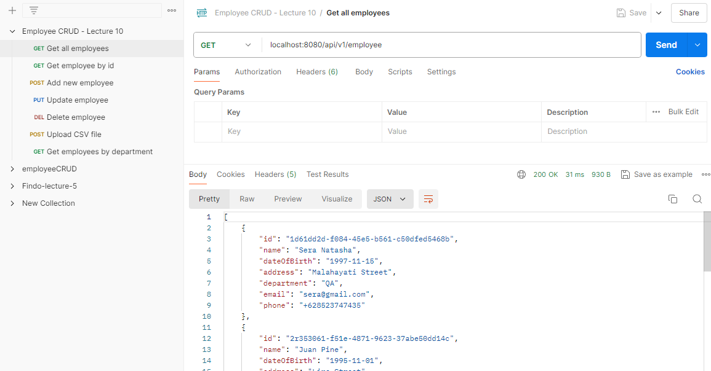
    
2. **Get employee detail by id (GET localhost:8080/api/v1/employee/1d61dd2d-f084-45e5-b561-c50dfed5468b)**
    
    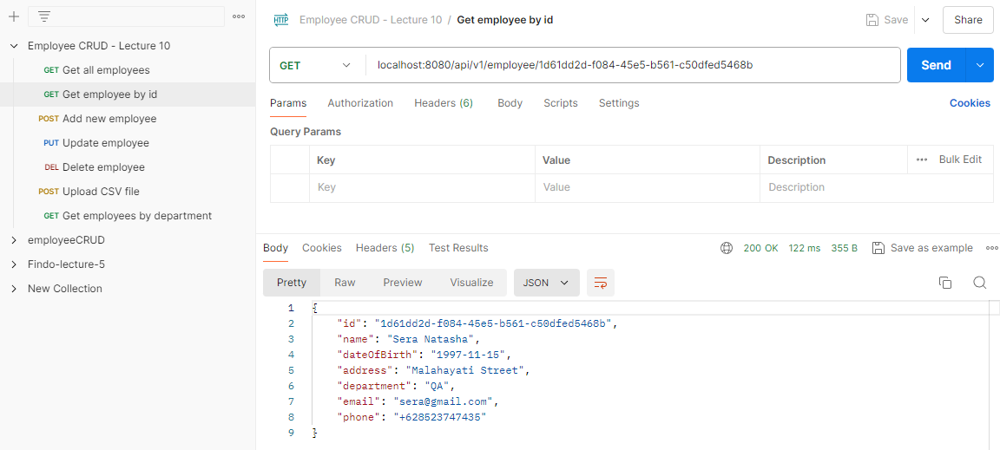
    

1. **Create new employee (POST localhost:8080/api/v1/employee)**
    
    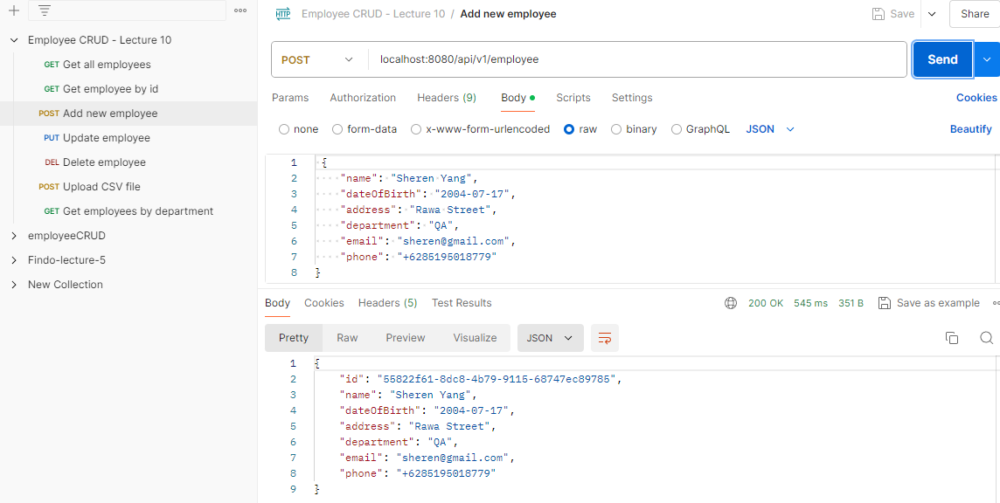
    
2. **Update employee by id**
    
    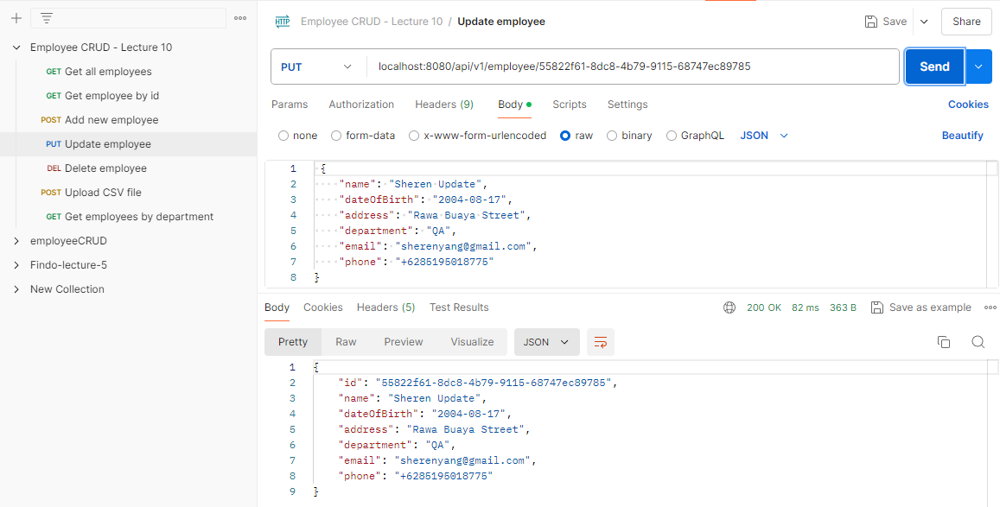
    
3. **Delete employee by id**
    
    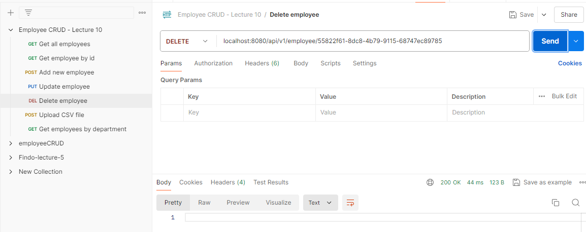
    
    Result and exception handling:
    
    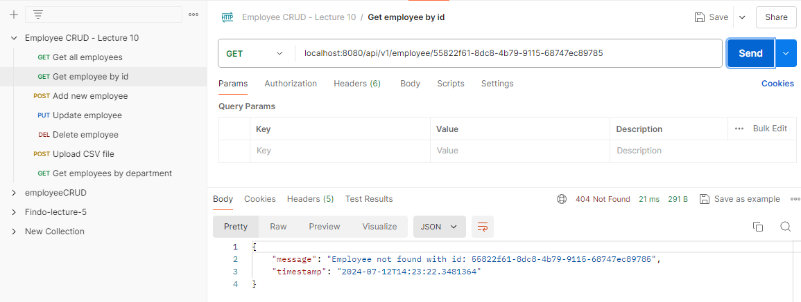
    
4. **Input CSV file (localhost:8080/api/v1/employee/upload-csv)**
    
    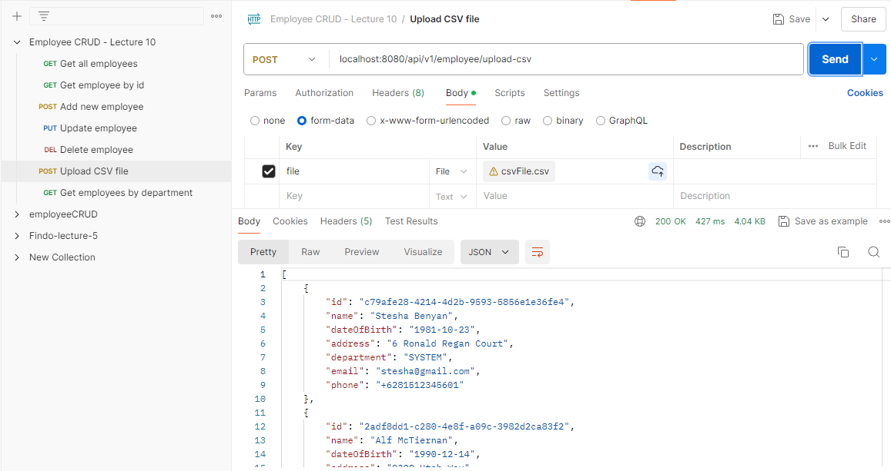
    
    Result:
    
    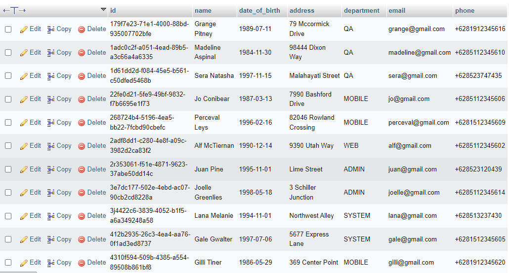
    
5. **Return employees by department (localhost:8080/api/v1/employee/department?department=MOBILE)**
    
    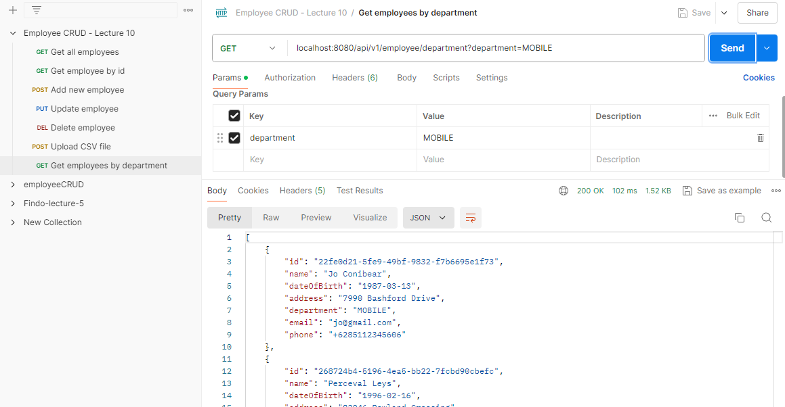
    
6. **Validation**
    
    **Name validation**
    
    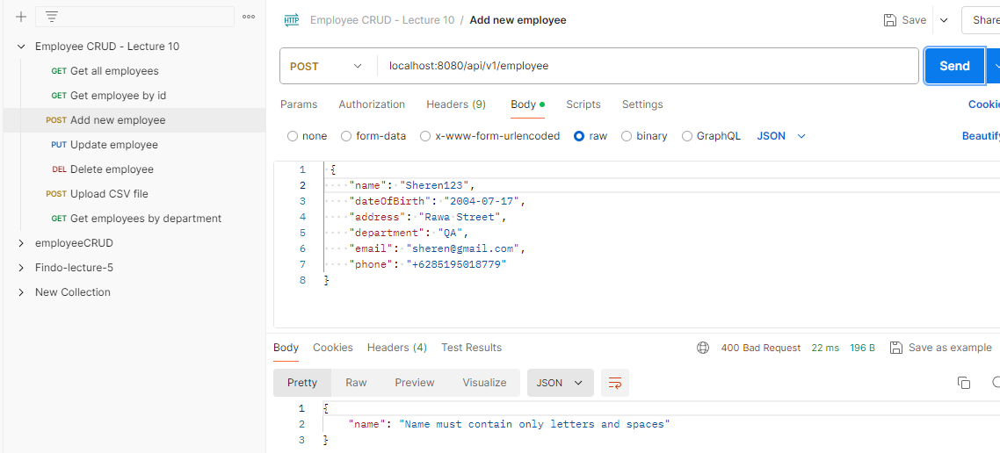
    
    **Email validation**
    
    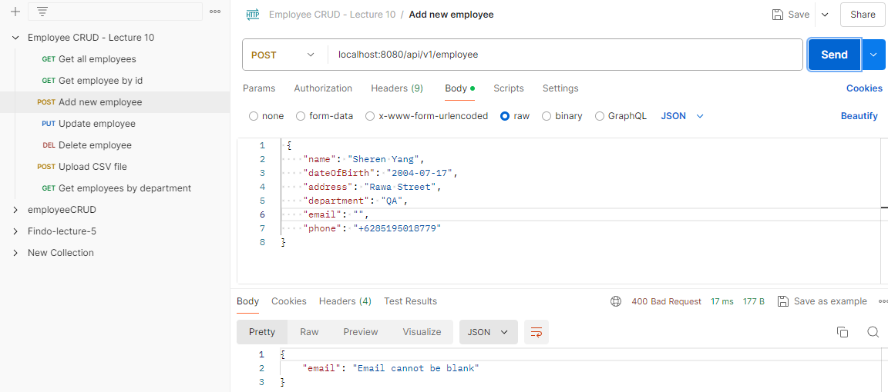
    
    **Phone validation**
    
    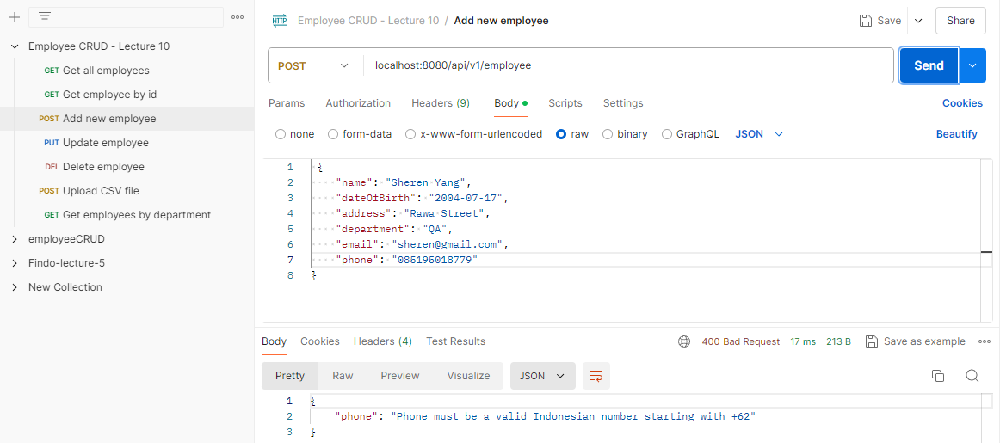
    

1. **Exception**
    
    **Date of birth exception**
    
    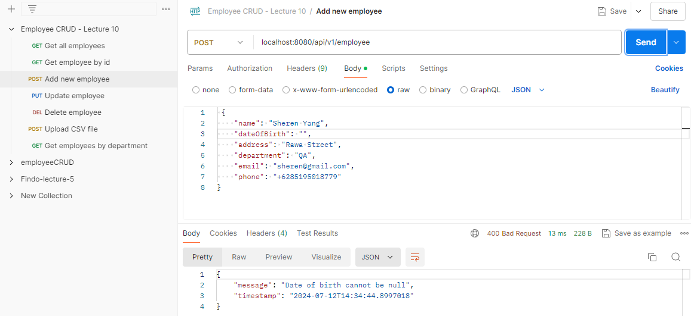
    
    **Update wrong id exception**
    
    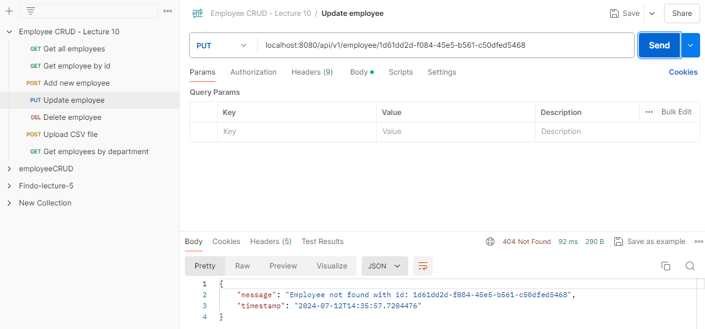
    
    **Delete wrong id exception**
    
    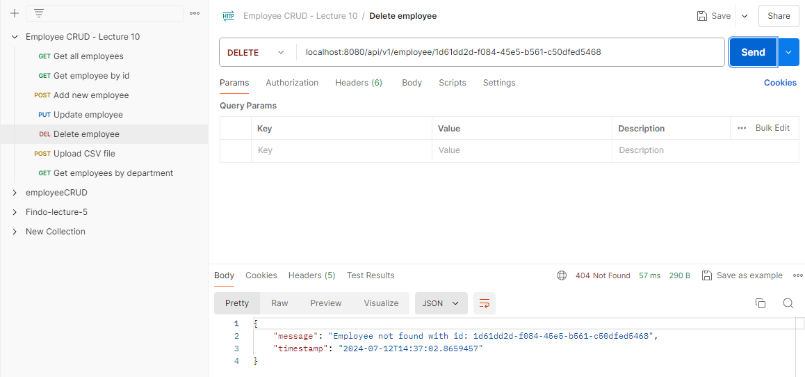