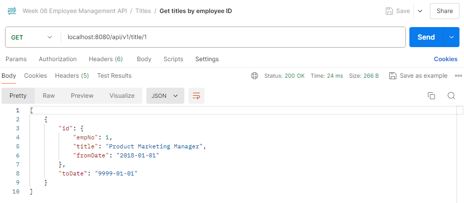

## 👩‍💼 Employee Management Using Spring Data JPA

- Q: Research about Hibernate cache
    
    See the answer here: [Hibernate Cache]()
    
- Create entities as a ERD
- Design REST API with below functions
    - Manage employee (show list of employee with paging, add/update/delete emp)
    - Manage departments
    - Update/Add salary, title change for employee
    - Search employee info with dynamic criteria
- Note: composite key – research in Data JPA.

---

### 🌳 **Project structure**

```java
employee_crud
├───src
│   └───main
│       ├───java
│       │   └───com
│       │       └───example
│       │           └───employee_management
│       │               │   EmployeeManagementApplication.java
│       │               │
│       │               ├───controller
│       │               │       DepartmentController.java
│       │               │       EmployeeController.java
│       │               │       SalaryController.java
│       │               │       TitleController.java
│       │               │
│       │               ├───dto
│       │               │       SearchCriteriaDTO.java
│       │               │
│       │               ├───exception
│       │               │   │   DepartmentAlreadyExistsException..java
│       │               │   │   EmployeeAlreadyExistsException.java
│       │               │   │   ResourceNotFoundException.java
│       │               │   │
│		    │               │   └───handler
│		    │               │           GlobalExceptionHandler.java
│       │               │
│       │               ├───model
│       │               │       Department.java
│       │               │       DeptEmp.java
│       │               │       DeptManager.java
│       │               │       Employee.java
│       │               │       Salary.java
│       │               │       Title.java
│       │               │
│       │               ├───repository
│       │               │       DepartmentRepository.java
│       │               │       EmployeeRepository.java
│       │               │       SalaryRepository.java
│       │               │       TitleRepository.java
│       │               │ 
│		    │               ├───service
│		    │               │   │   DepartmentService.java
│		    │               │   │   EmployeeService.java
│		    │               │   │   SalaryService.java
│		    │               │   │   TitleService.java
│		    │               │   │
│		    │               │   └───impl
│		    │               │           DepartmentServiceImpl.java
│		    │               │           EmployeeServiceImpl.java
│		    │               │           SalaryServiceImpl.java
│		    │               │           TitleServiceImpl.java
│		    │               │
│		    │               └───specification
│		    │                       EmployeeSpecification.java
│		    │                       EmployeeSpecificationBuilder.java
│		    │                       SearchCriteria.java
│       │
│       └───resources
│           └───application.properties
│
├───.mvn
│   └───wrapper
│           maven-wrapper.properties
│
├───.gitignore
├───mvnw
├───mvnw.cmd
└───pom.xml
```

---

### 💻 **Add maven dependencies**

See all maven dependencies in [pom.xml]() in the project.

---

### 🗒️ **Init database**

Create database `week6_employeejpa` and add the tables.

```sql
CREATE TABLE departments (
    dept_no CHAR(4) PRIMARY KEY,
    dept_name VARCHAR(40) NOT NULL
);

CREATE TABLE employees (
    emp_no INT AUTO_INCREMENT PRIMARY KEY,
    birth_date DATE NOT NULL,
    first_name VARCHAR(14) NOT NULL,
    last_name VARCHAR(16) NOT NULL,
    gender ENUM('M', 'F') NOT NULL,
    hire_date DATE NOT NULL
);

CREATE TABLE dept_emp (
    emp_no INT NOT NULL,
    dept_no CHAR(4) NOT NULL,
    from_date DATE NOT NULL,
    to_date DATE NOT NULL,
    PRIMARY KEY (emp_no, dept_no),
    FOREIGN KEY (emp_no) REFERENCES employees(emp_no),
    FOREIGN KEY (dept_no) REFERENCES departments(dept_no)
);

CREATE TABLE salaries (
    emp_no INT NOT NULL,
    salary INT NOT NULL,
    from_date DATE NOT NULL,
    to_date DATE NOT NULL,
    PRIMARY KEY (emp_no, from_date),
    FOREIGN KEY (emp_no) REFERENCES employees(emp_no)
);

CREATE TABLE titles (
    emp_no INT NOT NULL,
    title VARCHAR(50) NOT NULL,
    from_date DATE NOT NULL,
    to_date DATE NOT NULL,
    PRIMARY KEY (emp_no, title, from_date),
    FOREIGN KEY (emp_no) REFERENCES employees(emp_no)
);

CREATE TABLE dept_manager (
    emp_no INT NOT NULL,
    dept_no CHAR(4) NOT NULL,
    from_date DATE NOT NULL,
    to_date DATE NOT NULL,
    PRIMARY KEY (emp_no, dept_no),
    FOREIGN KEY (emp_no) REFERENCES employees(emp_no),
    FOREIGN KEY (dept_no) REFERENCES departments(dept_no)
);
```

Insert data for the tables.

```java
-- Insert into departments
INSERT INTO departments (dept_no, dept_name) VALUES
('d001', 'Marketing'),
('d002', 'Finance'),
('d003', 'IT'),
('d004', 'Engineering');

-- Insert into employees
INSERT INTO employees (birth_date, first_name, last_name, gender, hire_date) VALUES
('1997-11-15', 'Sera', 'Natasha', 'F', '2018-01-01'),
('1995-11-01', 'Juan', 'Pine', 'M', '2020-02-02'),
('1994-11-01', 'Lana', 'Melanie', 'F', '2017-03-03'),
('1990-11-01', 'Ricardo', 'Dave', 'M', '2015-04-04');

-- Insert into dept_emp 
INSERT INTO dept_emp (emp_no, dept_no, from_date, to_date) VALUES
(1, 'd001', '2018-01-01', '9999-01-01'),
(2, 'd002', '2020-02-02', '9999-01-01'),
(3, 'd003', '2017-03-03', '9999-01-01'),
(4, 'd004', '2015-04-04', '9999-01-01');

-- Insert into salaries 
INSERT INTO salaries (emp_no, salary, from_date, to_date) VALUES
(1, 50000, '2018-01-01', '2019-01-01'),
(1, 60000, '2019-01-02', '9999-01-01'),
(2, 55000, '2020-02-02', '9999-01-01'),
(3, 60000, '2017-03-03', '9999-01-01'),
(4, 65000, '2015-04-04', '9999-01-01');

-- Insert into titles 
INSERT INTO titles (emp_no, title, from_date, to_date) VALUES
(1, 'Product Marketing Manager', '2018-01-01', '9999-01-01'),
(2, 'Accounting Manager', '2020-02-02', '9999-01-01'),
(3, 'Developer', '2017-03-03', '2018-03-03'),
(3, 'Data Analytics Manager', '2018-03-04', '9999-01-01'),
(4, 'Engineering Manager', '2015-04-04', '9999-01-01');

-- Insert into dept_manager
INSERT INTO dept_manager (emp_no, dept_no, from_date, to_date) VALUES
(1, 'd001', '2018-01-01', '9999-01-01'),
(2, 'd002', '2020-02-02', '9999-01-01'),
(3, 'd003', '2018-03-04', '9999-01-01'),
(4, 'd004', '2015-04-04', '9999-01-01');
```

---

### 👩‍🏫 Create entities as a ERD and composite key

Previously, we have created tables in the database based on the ERD.


From that, we create entities for Employee, Department, DeptEmp, DeptManager, Salary, and Title.

- [Employee Codes]()
- [Department Codes]()
- [DeptEmp Codes]()
    - **Composite key class (`DeptEmpId`)**: This class is marked with `@Embeddable`, indicating it can be embedded in another entity. It contains `empNo` and `deptNo` which together form the composite key
    - **Entity class (`DeptEmp`)**: The `@EmbeddedId` annotation tells JPA that the composite key is defined in the `DeptEmpId` class. The `DeptEmp` entity uses `DeptEmpId` to represent its primary key.
- [DeptManager Codes]()
Similar to `DeptEmp`, `DeptManager` uses a composite key class `DeptManagerId` annotated with `@Embeddable`. This composite key includes `empNo` and `deptNo`.
- [Salary Codes]()
    - `Salary` uses a composite key `SalaryId` consisting of `empNo` and `fromDate`
    - The `SalaryId` class is annotated with `@Embeddable`
    - The `Salary` entity uses `@EmbeddedId` to indicate the use of `SalaryId` as the primary key.
- [Title Codes]()
    - `Title` uses a composite key `TitleId` that consists of `empNo`, `title`, and `fromDate`
    - `@EmbeddedId` is used to indicate that `TitleId` is the composite key.
    

> Each entity uses an embedded composite key class (e.g., `DeptEmpId`, `DeptManagerId`, `SalaryId`, `TitleId`) to define its primary key. The entity uses `@EmbeddedId` to specify that the primary key consists of multiple fields defined in the composite key class.
> 

---

### 👩‍💻 **Run app and the result (R**est API)

We can run the program and test it in postman. This is the postman collection to demonstrate API functionality:

[Postman Collection]()

### 1️⃣ Employee

1. **Get paginated employees (GET localhost:8080/api/v1/employee/paginated?page=0&size=3)**
    
    
    

1. **Get all employees (GET localhost:8080/api/v1/employee)**
    
    
    
2. **Get employee detail by id (GET localhost:8080/api/v1/employee/1)**
    
    
    

1. **Create new employee (POST localhost:8080/api/v1/employee)**
    
    
    
2. **Update employee by id (PUT localhost:8080/api/v1/employee/5)**
    
    
    
3. **Delete employee by id (DELETE localhost:8080/api/v1/employee/5)**
    
    
    

---

### 2️⃣ Department

1. **Get all departments (GET localhost:8080/api/v1/department)**
    
    
    
2. **Get department detail by id (GET localhost:8080/api/v1/department/d001)**
    
    
    

1. **Create new department (POST localhost:8080/api/v1/department)**
    
    
    
2. **Update department by id (PUT localhost:8080/api/v1/department/d005)**
    
    
    
3. **Delete department by id (DELETE localhost:8080/api/v1/department/d005)**
    
    
    

---

### 3️⃣ Salary

1. **Get all salaries (GET localhost:8080/api/v1/salary)**
    
    
    
2. **Get salary detail by employee id (GET localhost:8080/api/v1/salary/1)**
    
    
    

1. **Get salary detail by employee id and from date (GET localhost:8080/api/v1/salary/1/2018-01-01)**
    
    
    

1. **Create new salary (POST localhost:8080/api/v1/salary)**
    
    
    
2. **Update salary by employee id and from date(PUT localhost:8080/api/v1/salary/4/2021-01-01)**
    
    
    
3. **Delete salary by employee id and from date (DELETE localhost:8080/api/v1/salary/4/2021-01-01)**
    
    
    

---

### 4️⃣ Title

1. **Get all titles (GET localhost:8080/api/v1/title)**
    
    
    
2. **Get title detail by employee id (GET localhost:8080/api/v1/title/1)**
    
    
    

1. **Create new title (POST localhost:8080/api/v1/title)**
    
    
    
2. **Update title by employee id and from date (PUT localhost:8080/api/v1/title/2/Accounting%20Staff/2018-01-01)**
    
    
    
3. **Delete title by employee id and from date (DELETE localhost:8080/api/v1/title/2/Accounting%20Staff/2018-01-01)**
    
    
    

---

### 5️⃣ Search employee with dynamic criteria

- Create `SearchCriteria`
    
    [SearchCriteria]()
    
    This class holds the search criteria details:
    
    - `key`: The field name to be searched
    - `operation`: The type of operation to be performed (e.g., equality, like)
    - `value`: The value to be matched against the field.
- Create `SearchCriteriaDTO`
    
    [SearchCriteriaDTO]()
    
    This Data Transfer Object (DTO) is used to transfer search criteria data between layers:
    
    - Similar to `SearchCriteria`, but the `value` is a string for easier transfer and handling.
- Create `EmployeeSpecification`
    
    [EmployeeSpecification]()
    
    This class implements `Specification<Employee>` to build the predicates for queries based on search criteria:
    
    - Uses `CriteriaBuilder` to construct the query predicates.
- Create `EmployeeSpecificationBuilder`
    
    [EmployeeSpecificationBuilder]()
    
    This builder class aggregates multiple `EmployeeSpecification` instances to create a combined `Specification<Employee>`:
    
    - Collects multiple search criteria and builds a composite specification using `and` conditions.
- Update `EmployeeService` and `EmployeeServiceImpl`
    
    ```java
    @Override
        public Page<Employee> searchEmployees(Specification<Employee> spec, Pageable pageable) {
            return employeeRepository.findAll(spec, pageable);
        }
    ```
    
    Service class method to search for employees using the specification:
    
    - Calls `employeeRepository.findAll` with the constructed specification and pagination information.
- Update `EmployeeController`
    
    ```java
    @GetMapping("/search")
        public ResponseEntity<Page<Employee>> searchEmployees(
                @RequestParam Map<String, String> searchParams,
                Pageable pageable) {
            
            List<SearchCriteriaDTO> searchCriteriaDTOList = new ArrayList<>();
            searchParams.forEach((key, value) -> {
                SearchCriteriaDTO dto = new SearchCriteriaDTO(key, ":", value);
                searchCriteriaDTOList.add(dto);
            });
    
            EmployeeSpecificationBuilder builder = new EmployeeSpecificationBuilder();
            searchCriteriaDTOList.forEach(dto -> {
                builder.with(dto.getKey(), dto.getOperation(), dto.getValue());
            });
    
            Page<Employee> employeesPage = employeeService.searchEmployees(builder.build(), pageable);
            return ResponseEntity.ok(employeesPage);
        }
    ```
    
    Controller method to handle HTTP GET requests for searching employees:
    
    - Converts the request parameters into `SearchCriteriaDTO` instances
    - Uses `EmployeeSpecificationBuilder` to create the specification
    - Calls the service method to get the results and returns them in the response.

**📒 Some of the results**

**GET localhost:8080/api/v1/employee/search?firstName=Ricardo**


**GET localhost:8080/api/v1/employee/search?firstName=Sera&lastName=Natasha&hireDate=2018-01-01**


**GET localhost:8080/api/v1/employee/search?firstName=Sera&lastName=Natasha&hireDate=2018-01-01**

