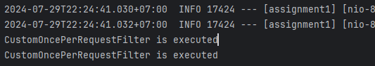

## 💡 Research onceperrequestfilter

### 👩‍🏫 Definition

Filter can be called either before or after servlet execution. When a request is dispatched to a servlet, the `RequestDispatcher` may forward it to another servlet. There is a possibility that the other servlet also has the same filter which means the same filter gets invoked multiple times.

We might want to ensure that a specific filter is invoked only once per request. A common use case is when working with Spring Security. When a request goes through the filter chain, we might want some of the authentication actions to happen only once for the request. For this, we can extend the `OncePerRequestFilter` in such situations. Spring guarantees that the `OncePerRequestFilter` is executed only once for a given request.

---

### 🔑 Key Points

- **Single execution:** It ensures that the filter logic is executed only once per request, avoiding redundant operations
- **Template method pattern:** It follows the Template Method design pattern where the actual filtering logic is implemented in a subclass by overriding the `doFilterInternal` method
- **Integration with Spring**: It can be easily integrated into the Spring Security filter chain or any other filter chain in a Spring-based application.

---

### 💻 Example

To use `OncePerRequestFilter`, we need to extend it and implement the `doFilterInternal` method.

**Filter implementation**

```java
public class CustomOncePerRequestFilter extends OncePerRequestFilter {

    @Override
    protected void doFilterInternal(HttpServletRequest request, HttpServletResponse response, FilterChain filterChain)
            throws IOException {
        System.out.println("CustomOncePerRequestFilter is executed");

        try {
            filterChain.doFilter(request, response);
        } catch (ServletException e) {
            throw new RuntimeException(e);
        }
    }
}
```

- `CustomOncePerRequestFilter` class extending `OncePerRequestFilter`, meaning this filter will only execute once per request
- `doFilterInternal` method is overridden to provide custom filtering logic
- `filterChain.doFilter(request, response);`: This continues the filter chain, allowing the request to proceed to the next filter or the target resource.

**Filter configuration**

```java
@Configuration
public class FilterConfig {

    @Bean
    public OncePerRequestFilter customOncePerRequestFilter() {
        return new CustomOncePerRequestFilter();
    }
}
```

- `@Bean` annotation indicates that this method returns a bean to be managed by the Spring container
- `customOncePerRequestFilter` method returns an instance of `CustomOncePerRequestFilter`.

**Controller implementation**

```java
@RestController
public class HelloController {

    @GetMapping("/hello")
    public String sayHello() {
        return "Hello, World!";
    }
    
    @GetMapping("/test")
    public String test() {
        return "Test filter.";
    }
}
```

When a request is made to any endpoint, `CustomOncePerRequestFilter` will be executed once per request.

**Result**


The filter will print `CustomOncePerRequestFilter is executed` to the console every time a request is processed, ensuring that the filter is applied correctly.

---

### 👩‍💻 Benefits

- **Ensures single execution:**
    - **Avoids multiple executions:** In complex web applications, the same request might pass through multiple filters or the same filter multiple times. `OncePerRequestFilter` guarantees that our filter logic is executed only once per request, preventing redundant processing and potential side effects
    - **Simplifies logic:** By ensuring single execution, the filter simplifies the logic we need to implement. We don't have to worry about checking if the filter has already been applied within the same request
- **Thread safety:**
    - **Consistency:** Ensures that the state and operations within the filter remain consistent throughout the processing of a single request. This is crucial for maintaining the integrity of request handling in multi-threaded web applications
- **Performance:**
    - **Efficiency:** By avoiding multiple executions of the same filter, we can improve the overall performance of the web application. Redundant filter execution can be avoided, which can be resource-intensive and impact response times.

---

### 🗒️ Use Cases

- **Security filters**: Ensure that security checks (e.g., authentication, authorization) are performed once per request, reducing the risk of security vulnerabilities due to multiple executions
- **Logging and auditing**: Perform logging, auditing, or monitoring actions once per request to capture accurate request handling metrics and logs
- **Request modifications**: Apply modifications to request headers or parameters once per request to ensure consistent request data processing
- **Performance monitoring**: Collect and report performance metrics (e.g., request processing time) without redundant calculations.