## 💡 Simple Filter

- Make a simple crud project
- Store api key in database
- Verify all requests into system having header “api-key” that is configured in database, if not return error
- All response return to client including header “source” : “fpt-software”.

---

### 🌳 **Project structure**

```java
assignment2
├───src
│   └───main
│       ├───java
│       │   └───com
│       │       └───example
│       │           └───assignment2
│       │               │   Assignment2Application.java
│       │               │
│       │               ├───config
│       │               │       FilterConfig.java
│       │               │
│       │               ├───controller
│       │               │       DepartmentController.java
│       │               │
│       │               ├───entity
│       │               │       ApiKey.java
│       │               │       Department.java
│       │               │
│       │               ├───filter
│       │               │       ApiKeyFilter.java
│       │               │
│       │               ├───repository
│       │               │       ApiKeyepository.java
│       │               │       DepartmentRepository.java
│       │               │ 
│       │               └───service
│       │                   DepartmentService.java
│       │
│       └───resources
│           └───application.properties
│
├───.mvn
│   └───wrapper
│           maven-wrapper.properties
│
├───.gitignore
├───mvnw
├───mvnw.cmd
└───pom.xml
```

---

### 💻 **Add maven dependencies**

See all maven dependencies in [pom.xml](https://github.com/affandyfandy/java-sheren/blob/week_08/Week%2008/Lecture%2015/Assignment%2002/assignment2/pom.xml) in the project.

---

### 1️⃣ Create simple CRUD

Here, I created a simple CRUD for department management where we can get all departments, get department by id, create department, update department, and delete department.

---

### 2️⃣ Store api key in database

Add an api key in the database.

```java
INSERT INTO api_key (key) VALUES ('fpt');
```

---

### 3️⃣ Create ApiKey entity

This class represents the API key entity stored in the database.

```java
@Entity
@Table(name = "api")
@Data
public class ApiKey {

    @Id
    @GeneratedValue(strategy = GenerationType.IDENTITY)
    @Column(name = "id")
    private Integer id;

    @Column(name = "api_key")
    private String key;

}
```

---

### 4️⃣ Create ApiKeyRepository

This repository handles the data access.

```java
@Repository
public interface ApiKeyRepository extends JpaRepository<ApiKey, Integer> {
    Optional<ApiKey> findByKey(String key);
}
```

---

### 5️⃣ Create ApiKeyFilter

This filter checks for the presence of a valid `api-key` header in incoming requests.

```java
public class ApiKeyFilter extends OncePerRequestFilter {

    private final ApiKeyRepository apiKeyRepository;

    @Autowired
    public ApiKeyFilter(ApiKeyRepository apiKeyRepository) {
        this.apiKeyRepository = apiKeyRepository;
    }

    @Override
    protected void doFilterInternal(HttpServletRequest request, HttpServletResponse response, FilterChain filterChain)
            throws ServletException, IOException {
        String apiKeyHeader = request.getHeader("api-key");

        boolean isValidApiKey = apiKeyRepository.findByKey(apiKeyHeader).isPresent();

        if (apiKeyHeader == null || !isValidApiKey) {
            response.sendError(HttpServletResponse.SC_UNAUTHORIZED, "Invalid API key");
            return;
        }

        response.addHeader("source", "fpt-software");

        filterChain.doFilter(request, response);

    }
}
```

`doFilterInternal` checks the `api-key` header. If the key is invalid, it responds with a 401 Unauthorized error. If valid, it adds a `source` header and proceeds with the filter chain.

---

### 6️⃣ Create FilterConfig

This configuration class registers the `ApiKeyFilter`.

```java
@Configuration
public class FilterConfig {

    @Bean
    public FilterRegistrationBean<ApiKeyFilter> apiKeyFilter(ApiKeyRepository apiKeyRepository) {
        FilterRegistrationBean<ApiKeyFilter> registrationBean = new FilterRegistrationBean<>();
        registrationBean.setFilter(new ApiKeyFilter(apiKeyRepository));
        registrationBean.addUrlPatterns("/api/*");
        return registrationBean;
    }
}
```

- `@Configuration` indicates that this is a configuration class
- `@Bean` registers the `ApiKeyFilter` bean with the `FilterRegistrationBean`
- `apiKeyFilter(ApiKeyRepository apiKeyRepository)` configures the `ApiKeyFilter` to apply to all URLs matching `/api/*`.

---

### 👩‍💻 **Run app and the result**

We can run the program and test it in postman.

**1️⃣ Get all departments**

1. Invalid API key
    
    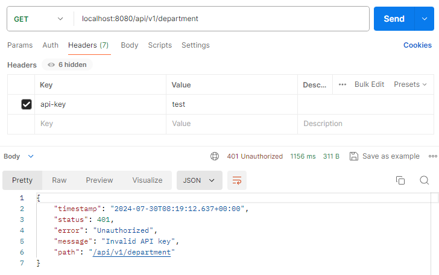
    
    It returns error as the `test` API key is not configured in the database.
    
2. Valid API key
    
    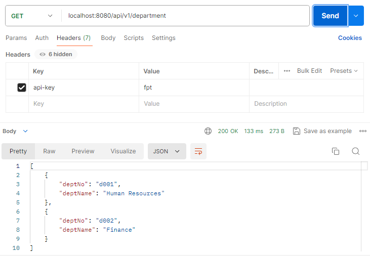
    

1. Header response
    
    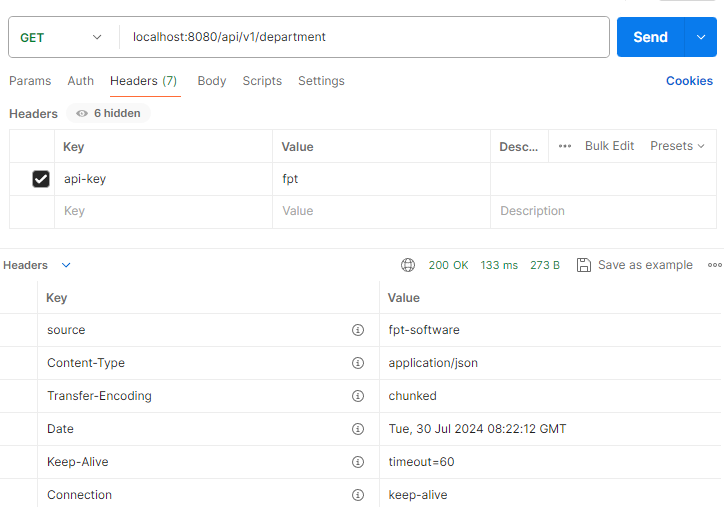
    
    It returns header response for client, that is `source: fpt-software`.
    

**2️⃣ Get department by ID**

1. Invalid API key
    
    
    
    It returns error as the `testing` API key is not configured in the database.
    
2. Valid API key
    
    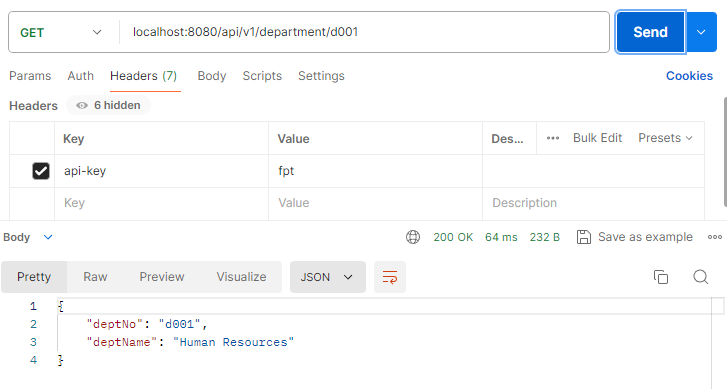
    

1. Header response
    
    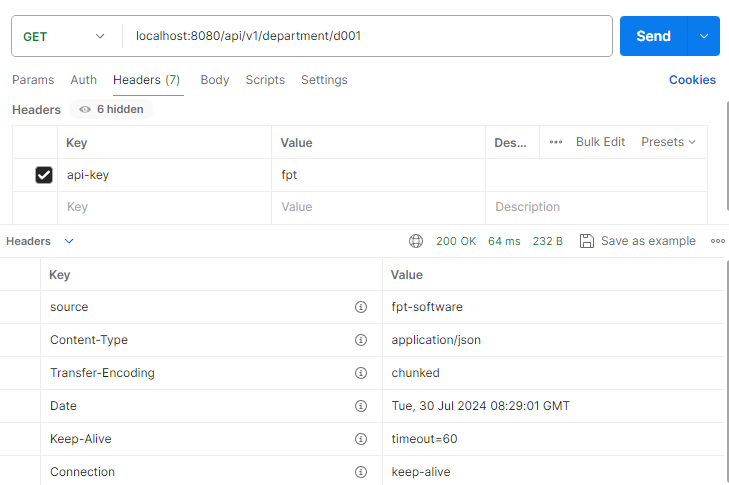
    
    It returns header response for client, that is `source: fpt-software`.
    

**3️⃣ Create department**

1. Invalid API key
    
    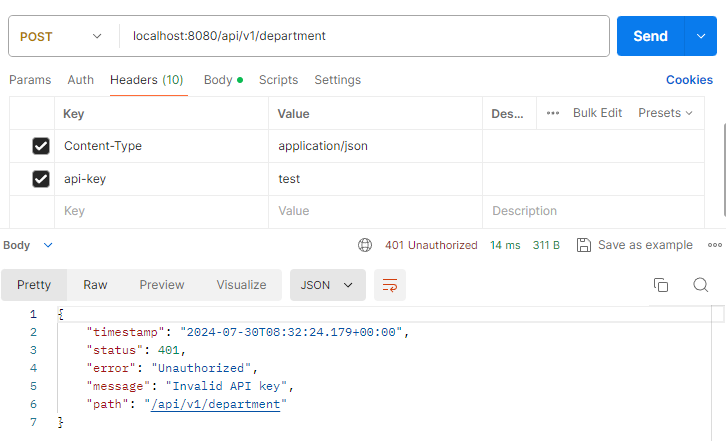
    
    It returns error as the `test` API key is not configured in the database.
    
2. Valid API key
    
    
    

1. Header response
    
    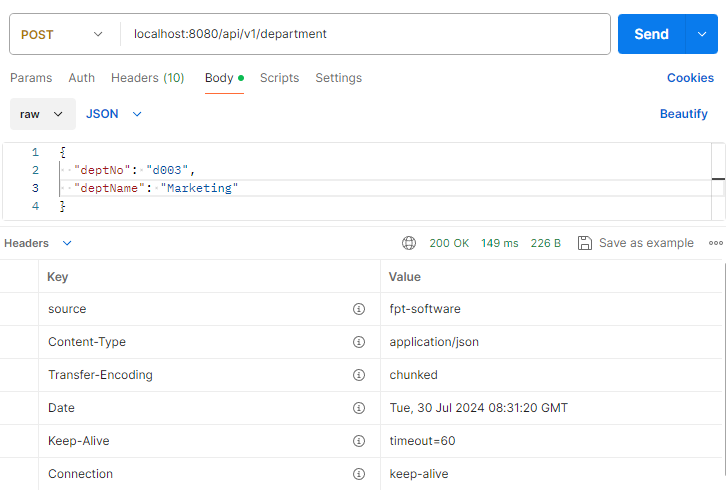
    
    It returns header response for client, that is `source: fpt-software`.
    

**4️⃣ Update department**

1. Invalid API key
    
    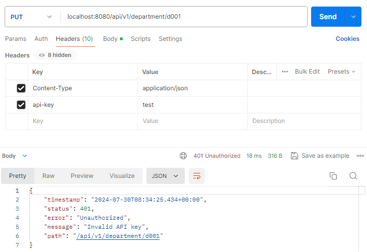
    
    It returns error as the `test` API key is not configured in the database.
    
2. Valid API key
    
    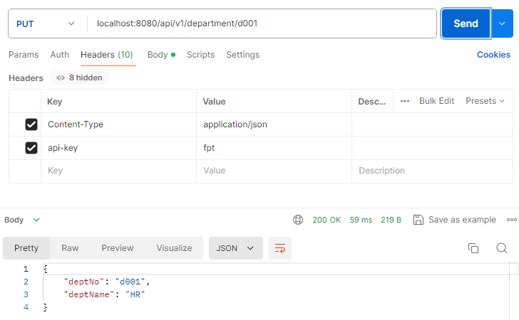
    

1. Header response
    
    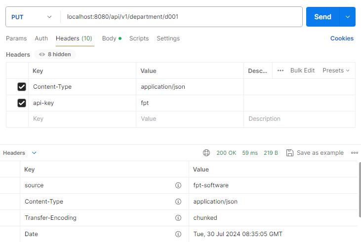
    
    It returns header response for client, that is `source: fpt-software`.
    

**5️⃣ Delete department**

1. Invalid API key
    
    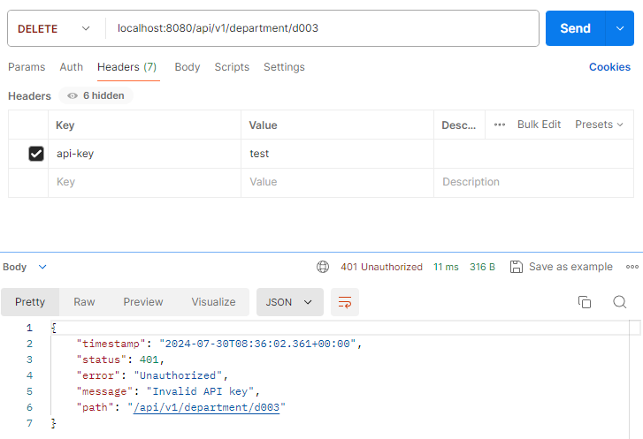
    
    It returns error as the `test` API key is not configured in the database.
    
2. Valid API key
    
    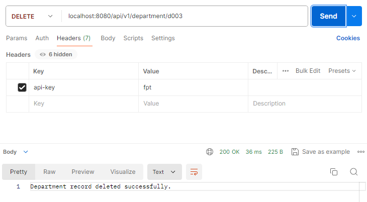
    

1. Header response
    
    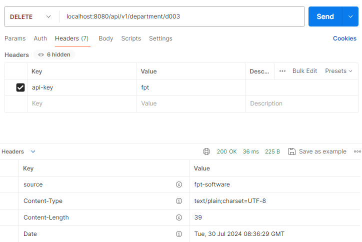
    
    It returns header response for client, that is `source: fpt-software`.