## 💡 Simple Interceptor

- Store username for each api-key, add the username to header and print it in a function in controller
- All response return to client including header “timestamp” : {{current time}}
- Store the last time the api-key was used.

---

### 🌳 **Project structure**

```java
assignment3
├───src
│   └───main
│       ├───java
│       │   └───com
│       │       └───example
│       │           └───assignment3
│       │               │   Assignment3Application.java
│       │               │
│       │               ├───config
│       │               │       FilterConfig.java
│       │               │       InterceptorConfig.java
│       │               │
│       │               ├───controller
│       │               │       DepartmentController.java
│       │               │
│       │               ├───entity
│       │               │       ApiKey.java
│       │               │       Department.java
│       │               │
│       │               ├───filter
│       │               │       ApiKeyFilter.java
│       │               │
│       │               ├───interceptor
│       │               │       ApiKeyInterceptor.java
│       │               │
│       │               ├───repository
│       │               │       ApiKeyepository.java
│       │               │       DepartmentRepository.java
│       │               │
│       │               ├───response
│       │               │       DeleteResponse.java
│       │               │       DepartmentResponse.java
│       │               │
│       │               └───service
│       │                   DepartmentService.java
│       │
│       └───resources
│           └───application.properties
│
├───.mvn
│   └───wrapper
│           maven-wrapper.properties
│
├───.gitignore
├───mvnw
├───mvnw.cmd
└───pom.xml
```

---

### 1️⃣ Update ApiKey entity

Here, we update `ApiKey` entity to include username and last usage.

```java
@Entity
@Table(name = "api")
@Data
public class ApiKey {

    @Id
    @GeneratedValue(strategy = GenerationType.IDENTITY)
    @Column(name = "id")
    private Integer id;

    @Column(name = "api_key")
    private String key;

    @Column(name = "username")
    private String username;

    @Column(name = "last_used")
    private LocalDateTime lastUsed;

}
```

---

### 2️⃣ Create ApiKeyInterceptor

In this codes, we create an interceptor to handle adding the username and timestamp to the headers and updating the last usage time of the API key.

```java
@Component
public class ApiKeyInterceptor implements HandlerInterceptor {

    private final ApiKeyRepository apiKeyRepository;

    @Autowired
    public ApiKeyInterceptor(ApiKeyRepository apiKeyRepository) {
        this.apiKeyRepository = apiKeyRepository;
    }

    @Override
    public boolean preHandle(HttpServletRequest request, HttpServletResponse response, Object handler) throws Exception {
        String apiKeyHeader = request.getHeader("api-key");

        Optional<ApiKey> apiKeyOptional = apiKeyRepository.findByKey(apiKeyHeader);
        if (apiKeyHeader == null || apiKeyOptional.isEmpty()) {
            response.sendError(HttpServletResponse.SC_UNAUTHORIZED, "Invalid API key");
            return false;
        }

        ApiKey apiKey = apiKeyOptional.get();
        apiKey.setLastUsed(LocalDateTime.now());
        apiKeyRepository.save(apiKey);

        response.addHeader("username", apiKey.getUsername());

        String timestamp = LocalDateTime.now().format(DateTimeFormatter.ISO_LOCAL_DATE_TIME);
        response.addHeader("timestamp", timestamp);

        request.setAttribute("username", apiKey.getUsername());
        request.setAttribute("timestamp", timestamp);

        return true;

    }
}
```

- `@Component` makes this class a Spring bean
- `ApiKeyRepository` is injected to interact with the database
- `preHandle` method is overridden to intercept requests before they reach the controller
    - It retrieves the `api-key` from the request header
    - It validates the API key against the database
    - If valid, it updates the `lastUsed` timestamp and saves it
    - It adds `username` and `timestamp` headers to the response
    - It sets the `username` and `timestamp` as request attributes for later use in the controller.

---

### 3️⃣ Create InterceptorConfig

This class registers the interceptor with Spring MVC.

```java
@Configuration
public class InterceptorConfig implements WebMvcConfigurer {

    @Autowired
    private ApiKeyInterceptor apiKeyInterceptor;

    @Override
    public void addInterceptors(InterceptorRegistry registry) {
        registry.addInterceptor(apiKeyInterceptor).addPathPatterns("/api/**");
    }
}
```

- `@Configuration` indicates that this class contains Spring configuration
- `WebMvcConfigurer` interface allows customization of Spring MVC configuration
- `addInterceptors` method registers the `ApiKeyInterceptor` to intercept requests to `/api/**` paths.

---

### 4️⃣ Modify controller

Here, we modify the controller to print the username and timestamp from the headers.

[Controller Codes]()

Each method retrieves `username` and `timestamp` from the request attributes (set by the interceptor) and includes them in the response.

---

### 👩‍💻 **Run app and the result**

We can run the program and test it in postman.

**1️⃣ Get all departments**

1. Response body
    
    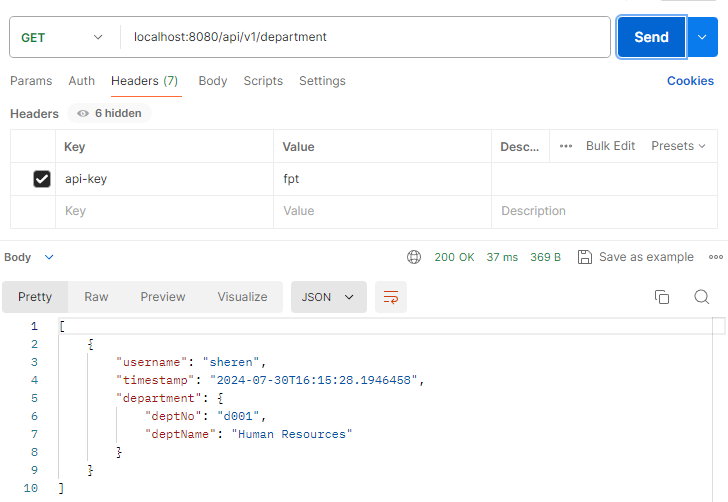
    
2. Response headers
    
    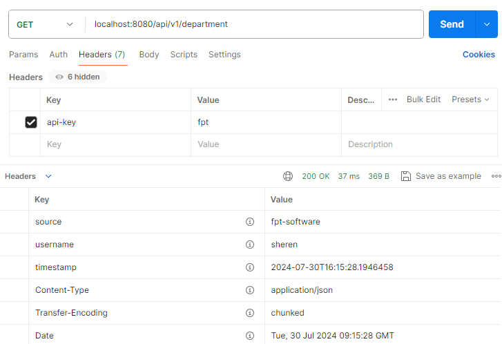
    

1. Store last time API was used
    
    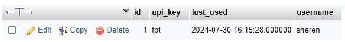
    

**2️⃣ Get department by ID**

1. Response body
    
    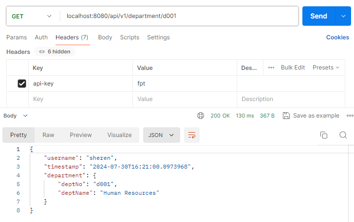
    
2. Response headers
    
    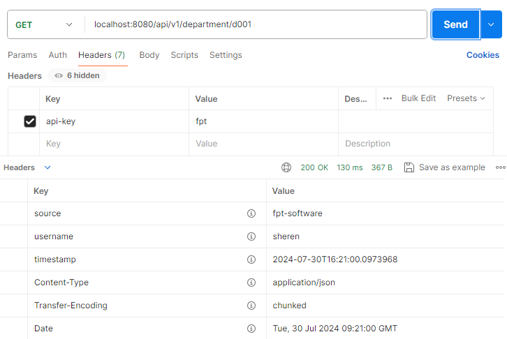
    

1. Store last time API was used
    
    
    

**3️⃣ Create department**

Let’s add new api key, here we add `fptkey` and the username is `renata`.

1. Response body
    
    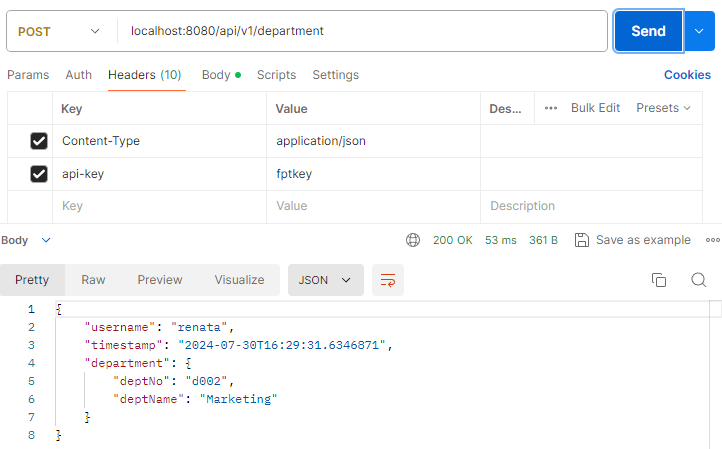
    
2. Response headers
    
    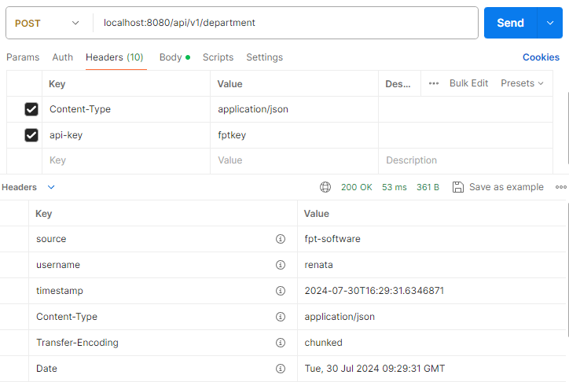
    

1. Store last time API was used
    
    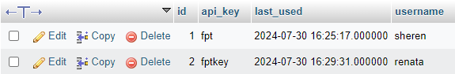
    

**4️⃣ Update department**

1. Response body
    
    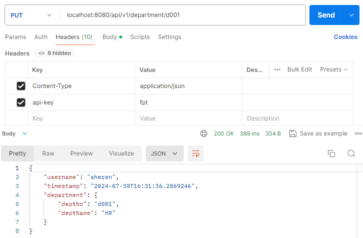
    
2. Response headers
    
    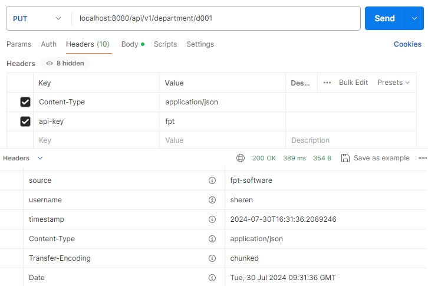
    

1. Store last time API was used
    
    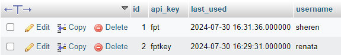
    

**5️⃣ Delete department**

1. Response body
    
    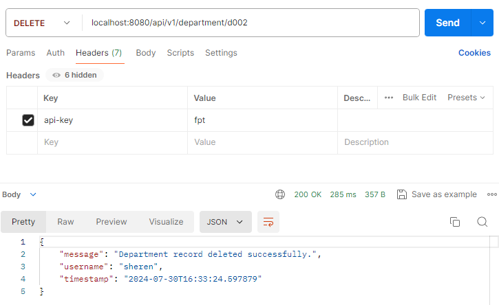
    
2. Response headers
    
    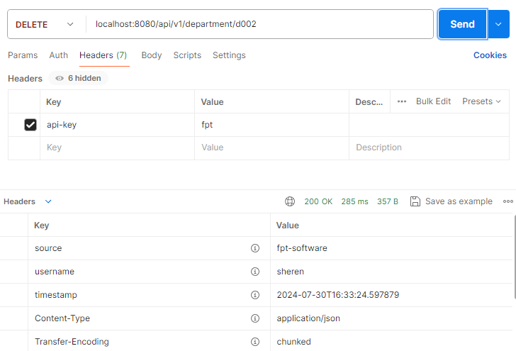
    

1. Store last time API was used
    
    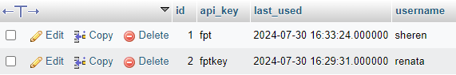