## 💡 FeignClient, RestTemplate, WebClient

### ☁️ FeignClient

**FeignClient** is a declarative web service client from Spring Cloud. It simplifies HTTP API clients by using annotations. We define an interface, and Feign handles the implementation.

**Features:**

- Declarative interface: Define methods and annotate them to specify HTTP operations (GET, POST, etc.)
- Integration with Spring Cloud: Works seamlessly with Spring Cloud components like Eureka for service discovery, Ribbon for client-side load balancing, and Hystrix for circuit breaker
- Simplifies HTTP requests: Automatically handles URL construction, request/response serialization, and error handling.

**Use cases:**

- Microservices communication: Ideal for making calls between microservices in a Spring Cloud environment
- When we prefer a declarative approach to making HTTP requests
- When we want to integrate seamlessly with other Spring Cloud features like load balancing and circuit breakers.

**Example implementation:**

[FeignClient Codes](https://github.com/affandyfandy/java-sheren/tree/week_08/Week%2008/Lecture%2016/FeignClient%20Demo/feignClient)

Article source:

[Baeldung Spring Cloud OpenFeign](https://www.baeldung.com/spring-cloud-openfeign)

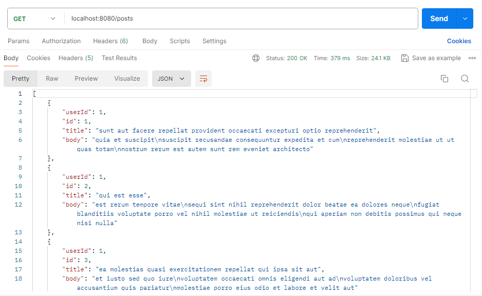

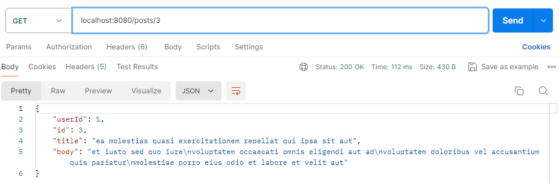

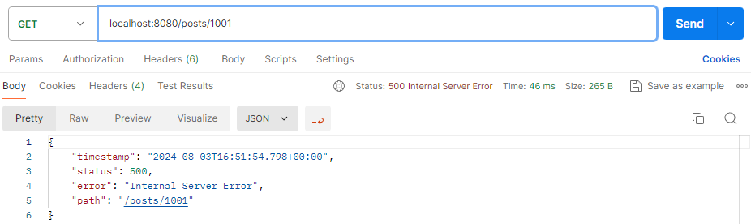

---

### 🗓️ RestTemplate

**RestTemplate** is a synchronous client to perform HTTP requests in Spring. It has been around for a long time and provides a straightforward way to interact with RESTful web services.

**Features:**

- Easy to use: Provides a simple API for performing HTTP operations
- Supports various HTTP methods (GET, POST, PUT, DELETE) and handles request/response conversion
- Interceptors and error handling: Allows customization of request processing through interceptors and provides mechanisms for error handling.

**Use cases:**

- Simple, synchronous HTTP calls: Ideal for applications that do not require non-blocking I/O or reactive programming
- Legacy projects: Suitable for maintaining and extending existing synchronous applications
- If we have complex logic and need to modify something, sometimes we need to use the rest template.

**Example implementation:**

[RestTemplate Codes](https://github.com/affandyfandy/java-sheren/tree/week_08/Week%2008/Lecture%2016/RestTemplate%20Demo/restTemplate)

Article source:

[Baeldung RestTemplate](https://www.baeldung.com/rest-template)

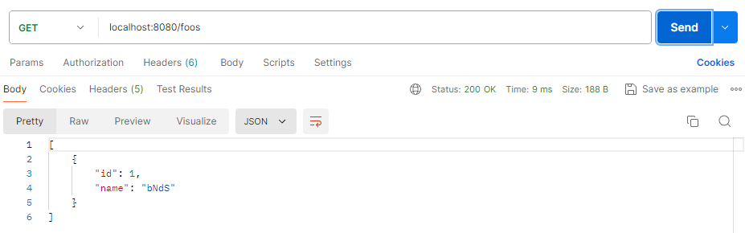

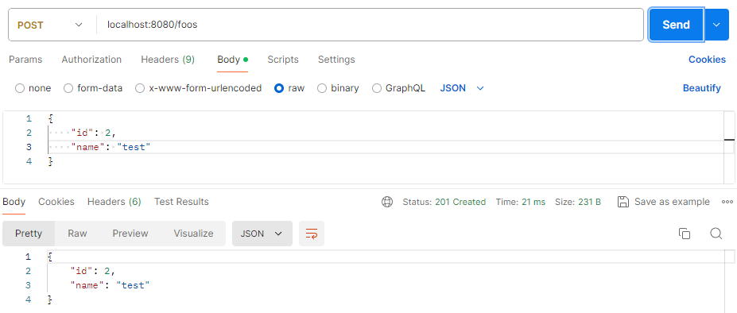

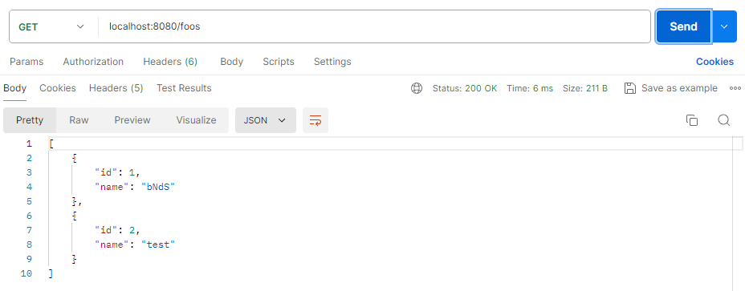

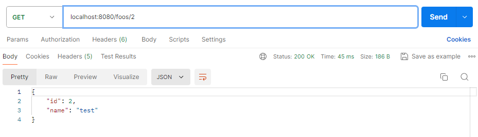

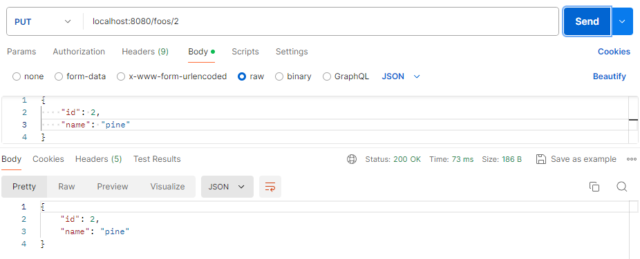

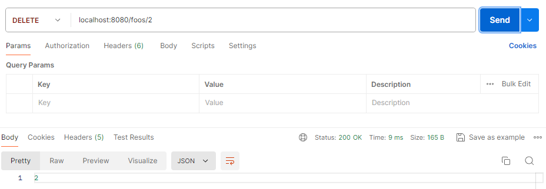

---

### 🌐 WebClient

**WebClient** is a non-blocking, reactive HTTP client introduced in Spring 5 as part of the WebFlux framework. It supports both synchronous and asynchronous operations and is designed for reactive programming.

**Features:**

- Reactive and non-blocking: Built for high concurrency and efficient resource utilization
- Flexible and powerful: Supports a wide range of HTTP methods and advanced configurations
- Integration with reactive streams: Works seamlessly with Project Reactor, providing backpressure support and efficient stream processing.

**Use cases:**

- When we need non-blocking, asynchronous communication
- When we are building reactive applications with Spring WebFlux
- When we need to handle a large number of concurrent connections efficiently.

**Example implementation:**

[WebClient Codes](https://github.com/affandyfandy/java-sheren/tree/week_08/Week%2008/Lecture%2016/WebClient%20Demo/webClient)

Article sources:

[Baeldung Spring 5 WebClient](https://www.baeldung.com/spring-5-webclient)

[Baeldung Spring WebClient JSON List](https://www.baeldung.com/spring-webclient-json-list)

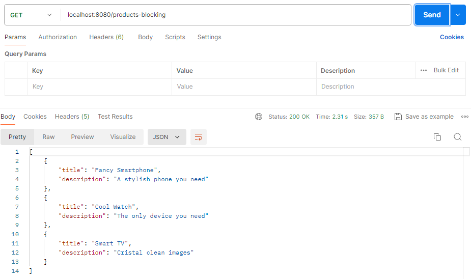

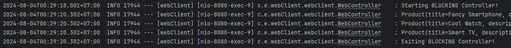

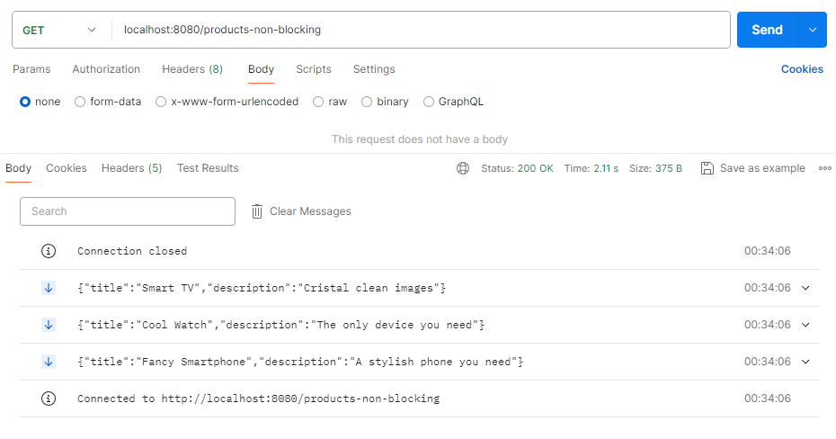

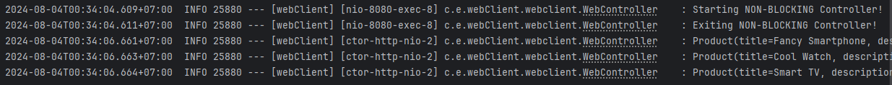

---

### 🔑 Comparison

| Feature | FeignClient | RestTemplate | WebClient |
| --- | --- | --- | --- |
| Approach | Declarative | Imperative | Reactive |
| Synchronous | No (it's inherently asynchronous) | Yes | Yes (supports both synchronous and async) |
| Asynchronous | Yes (integrates well with Spring Cloud) | No | Yes (designed for reactive programming) |
| Ease of Use | Easy (requires minimal configuration) | Moderate (manual handling of HTTP calls) | Moderate (requires understanding of reactive paradigms) |
| Integration | Excellent with Spring Cloud | Good (standard Spring) | Excellent with Spring WebFlux |
| Performance | Good for most use cases | Suitable for straightforward tasks | High performance for concurrent tasks |

---

### 🗒️ Summary

- **FeignClient** is ideal for microservice communication in Spring Cloud, offering a declarative approach that simplifies HTTP calls
- **RestTemplate** is suitable for simple, synchronous HTTP requests, especially in traditional and legacy Spring applications
- **WebClient** is the preferred choice for reactive, non-blocking HTTP communication, excelling in high-concurrency and asynchronous scenarios, particularly with Spring WebFlux.