## 💡 FeignClient, RestTemplate, WebClient

### ☁️ FeignClient

**FeignClient** is a declarative web service client from Spring Cloud. It simplifies HTTP API clients by using annotations. We define an interface, and Feign handles the implementation.

**Features:**

- Declarative interface: Define methods and annotate them to specify HTTP operations (GET, POST, etc.)
- Integration with Spring Cloud: Works seamlessly with Spring Cloud components like Eureka for service discovery, Ribbon for client-side load balancing, and Hystrix for circuit breaker
- Simplifies HTTP requests: Automatically handles URL construction, request/response serialization, and error handling.

**Use cases:**

- Microservices communication: Ideal for making calls between microservices in a Spring Cloud environment
- When we prefer a declarative approach to making HTTP requests
- When we want to integrate seamlessly with other Spring Cloud features like load balancing and circuit breakers.

**Example implementation:**

[FeignClient Codes](https://github.com/affandyfandy/java-sheren/tree/week_08/Week%2008/Lecture%2016/FeignClient%20Demo/feignClient)

Article source:

[Baeldung Spring Cloud OpenFeign](https://www.baeldung.com/spring-cloud-openfeign)

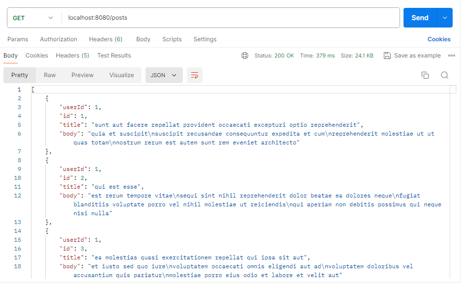

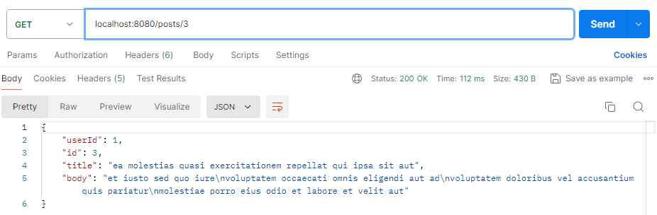

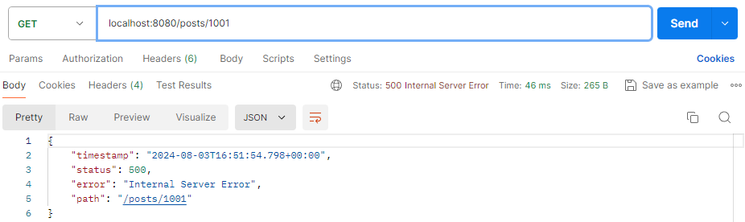


---

### 🗓️ RestTemplate

**RestTemplate** is a synchronous client to perform HTTP requests in Spring. It has been around for a long time and provides a straightforward way to interact with RESTful web services.

**Features:**

- Easy to use: Provides a simple API for performing HTTP operations
- Supports various HTTP methods (GET, POST, PUT, DELETE) and handles request/response conversion
- Interceptors and error handling: Allows customization of request processing through interceptors and provides mechanisms for error handling.

**Use cases:**

- Simple, synchronous HTTP calls: Ideal for applications that do not require non-blocking I/O or reactive programming
- Legacy projects: Suitable for maintaining and extending existing synchronous applications
- If we have complex logic and need to modify something, sometimes we need to use the rest template.

**Example implementation:**

[RestTemplate Codes](https://github.com/affandyfandy/java-sheren/tree/week_08/Week%2008/Lecture%2016/RestTemplate%20Demo/restTemplate)

Article source:

[Baeldung RestTemplate](https://www.baeldung.com/rest-template)

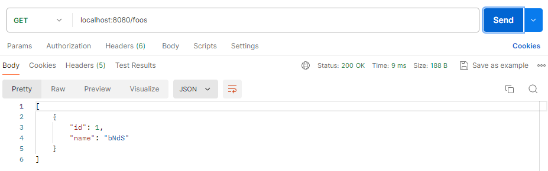

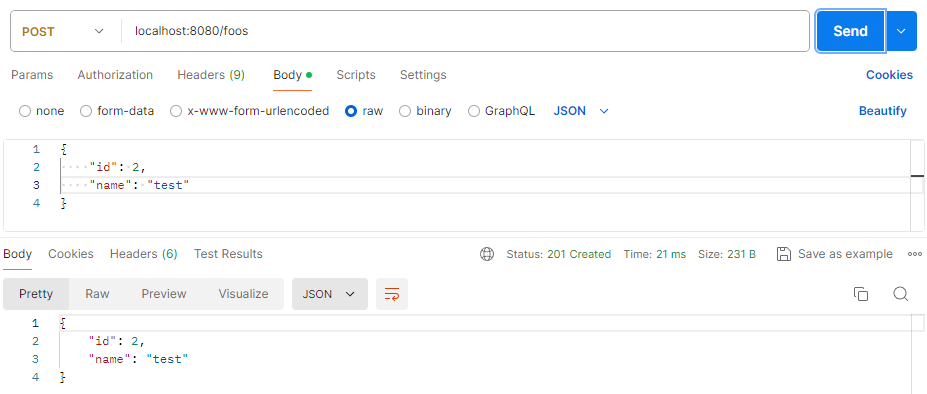

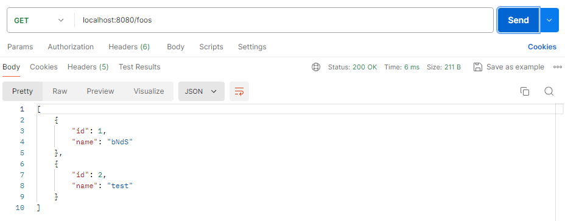

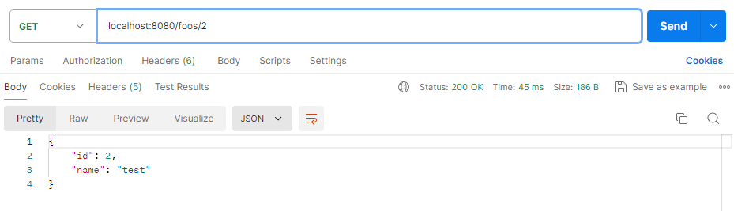

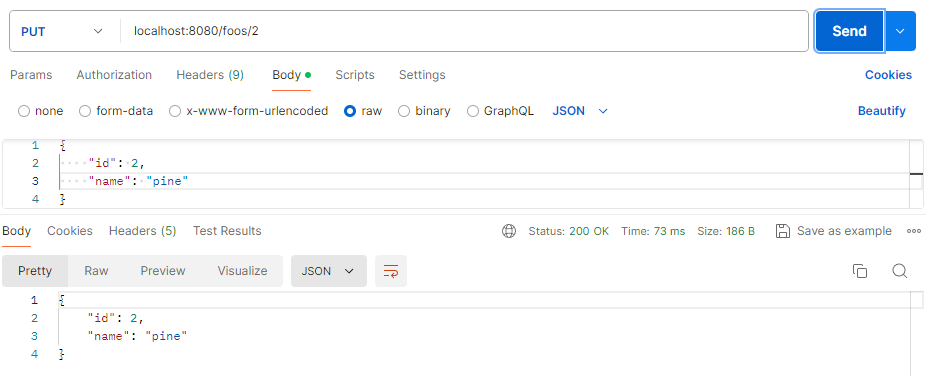

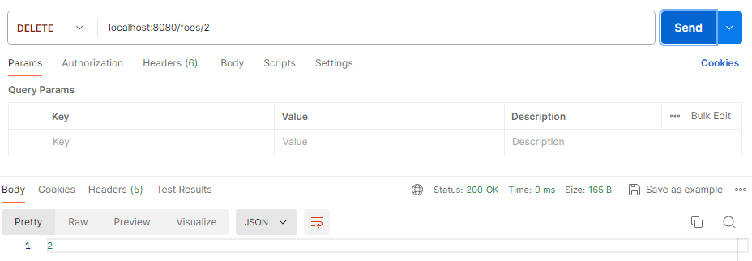

---

### 🌐 WebClient

**WebClient** is a non-blocking, reactive HTTP client introduced in Spring 5 as part of the WebFlux framework. It supports both synchronous and asynchronous operations and is designed for reactive programming.

**Features:**

- Reactive and non-blocking: Built for high concurrency and efficient resource utilization
- Flexible and powerful: Supports a wide range of HTTP methods and advanced configurations
- Integration with reactive streams: Works seamlessly with Project Reactor, providing backpressure support and efficient stream processing.

**Use cases:**

- When we need non-blocking, asynchronous communication
- When we are building reactive applications with Spring WebFlux
- When we need to handle a large number of concurrent connections efficiently.

**Example implementation:**

[WebClient Codes](https://github.com/affandyfandy/java-sheren/tree/week_08/Week%2008/Lecture%2016/WebClient%20Demo/webClient)

Article sources:

[Baeldung Spring 5 WebClient](https://www.baeldung.com/spring-5-webclient)

[Baeldung Spring WebClient JSON List](https://www.baeldung.com/spring-webclient-json-list)

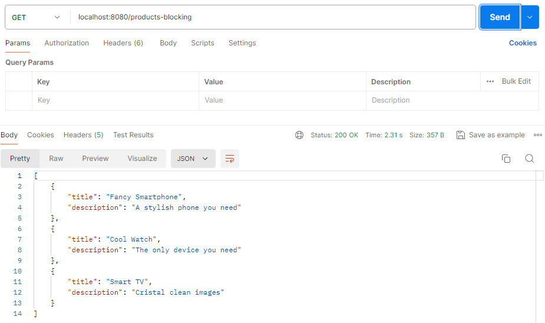

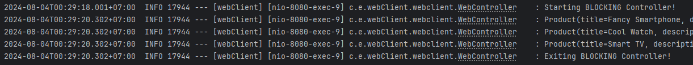

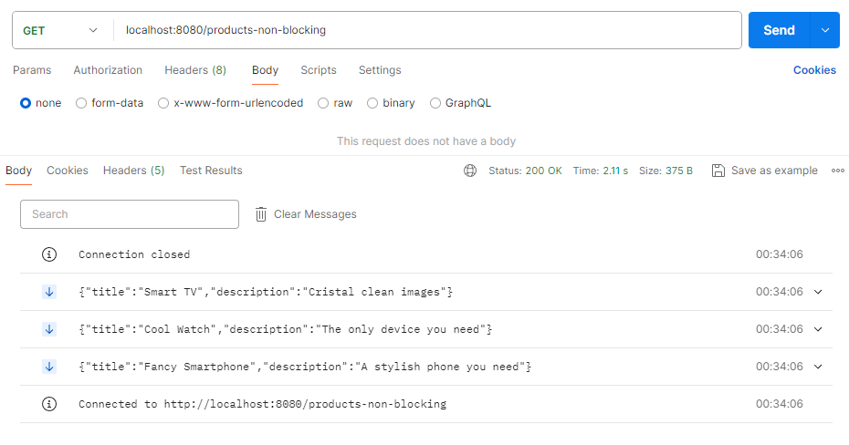

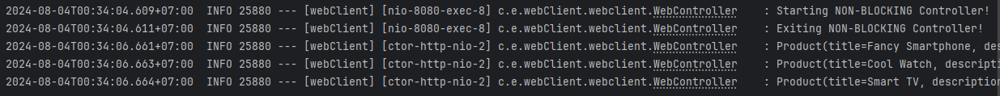

---

### 🔑 Comparison

| Feature | FeignClient | RestTemplate | WebClient |
| --- | --- | --- | --- |
| Approach | Declarative | Imperative | Reactive |
| Synchronous | No (it's inherently asynchronous) | Yes | Yes (supports both synchronous and async) |
| Asynchronous | Yes (integrates well with Spring Cloud) | No | Yes (designed for reactive programming) |
| Ease of Use | Easy (requires minimal configuration) | Moderate (manual handling of HTTP calls) | Moderate (requires understanding of reactive paradigms) |
| Integration | Excellent with Spring Cloud | Good (standard Spring) | Excellent with Spring WebFlux |
| Performance | Good for most use cases | Suitable for straightforward tasks | High performance for concurrent tasks |

---

### 🗒️ Summary

- **FeignClient** is ideal for microservice communication in Spring Cloud, offering a declarative approach that simplifies HTTP calls
- **RestTemplate** is suitable for simple, synchronous HTTP requests, especially in traditional and legacy Spring applications
- **WebClient** is the preferred choice for reactive, non-blocking HTTP communication, excelling in high-concurrency and asynchronous scenarios, particularly with Spring WebFlux.

---

### 👩‍🏫 Microservices Project Implementation Using FeignClient, RestTemplate, and WebConfig

For the implementation, I have created two spring boot applications:

- Microservice 1 for product that is running in port 8081

```java
spring.application.name=product
server.port=8081
```

- Microservice 2 for invoice that is running in port 8082.

```java
spring.application.name=invoice
server.port=8082
```

---

### 📦 Product Microservice

This is the first microservice which running on port `8081`.

🌳 **Project Structure**

```java
product
├───src
│   └───main
│       ├───java
│       │   └───com
│       │       └───example
│       │           └───product
│       │               │   ProductApplication.java
│       │               │
│       │               ├───controller
│       │               │       ProductController.java
│       │               │
│       │               ├───entity
│       │               │       Product.java
│       │               │
│       │               ├───repository
│       │               │       ProductRepository.java
│       │               │ 
│       │               └───service
│       │                      └───impl
│       │                          ProductServiceImpl.java
│       │                   ProductService.java
│       │
│       └───resources
│           └───application.properties
│
└───pom.xml
```

🎯 **API endpoints**

- Get all products: `GET /api/v1/products`

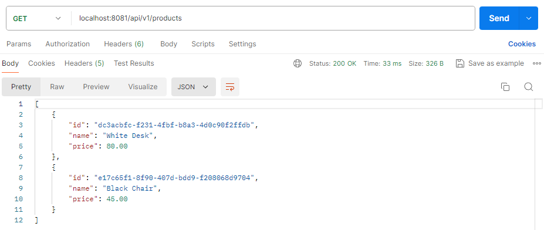

- Get product by id: `GET /api/v1/products/{id}`

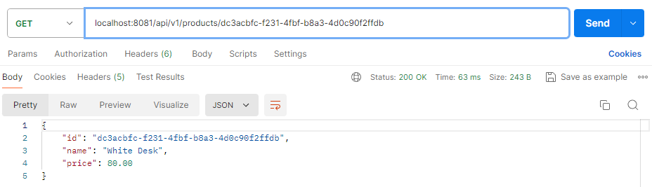

- Create product: `POST /api/v1/products`

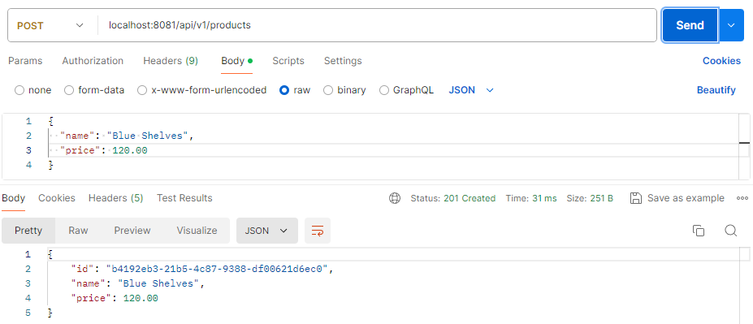

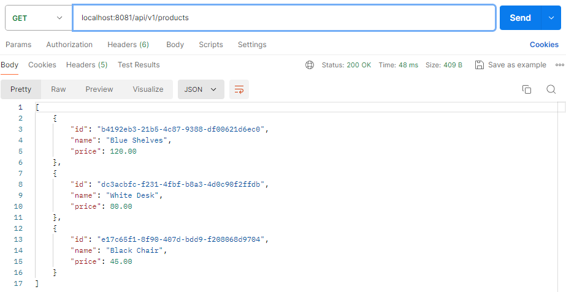

- Update product: `PUT /api/v1/products/{id}`

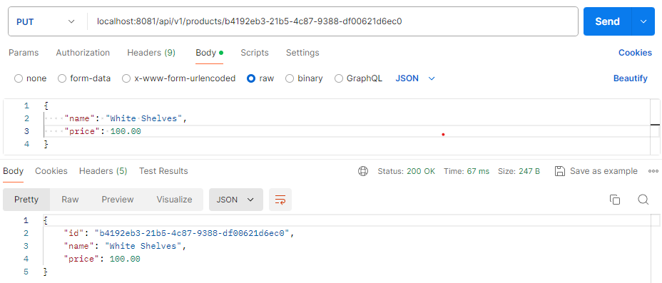

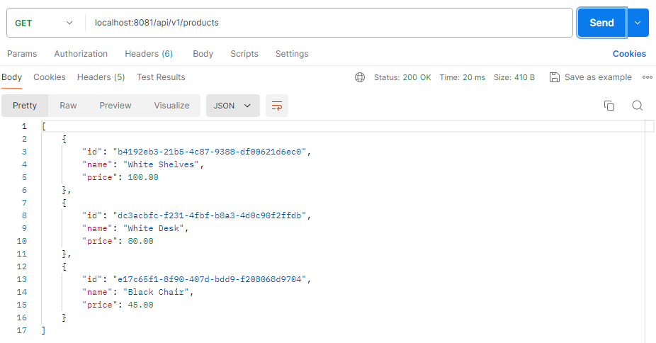

- Delete product: `DELETE /api/v1/products/{id}`

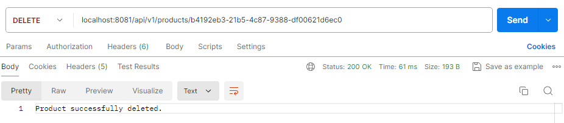

---

### 🗒️ Invoice Microservice

This is the second microservice which running on port `8082`. For this microservice, I have already implemented FeignClient, RestTemplate, and also WebClient.

🌳 **Project Structure**

```java
invoice
├───src
│   └───main
│       ├───java
│       │   └───com
│       │       └───example
│       │           └───invoice
│       │               │   InvoiceApplication.java
│       │               │
│       │               ├───client
│       │               │       ProductFeignClient.java
│       │               │
│       │               ├───config
│       │               │       RestTemplateConfig.java
│       │               │       WebClientConfig.java
│       │               │
│       │               ├───controller
│       │               │       InvoiceController.java
│       │               │
│       │               ├───dto
│       │               │       InvoiceDTO.java
│       │               │       ProductDTO.java
│       │               │
│       │               ├───entity
│       │               │       Invoice.java
│       │               │
│       │               ├───mapper
│       │               │       InvoiceMapper.java
│       │               │
│       │               ├───repository
│       │               │       InvoiceRepository.java
│       │               │ 
│       │               └───service
│       │                      └───impl
│       │                          InvoiceServiceImpl.java
│       │                          InvoiceServiceFeignClientImpl.java
│       │                          InvoiceServiceRestTemplateImpl.java
│       │                          InvoiceServiceWebClientImpl.java
│       │                   InvoiceService.java
│       │                   InvoiceServiceFeignClient.java
│       │                   InvoiceServiceRestTemplate.java
│       │                   InvoiceServiceWebClient.java
│       │
│       └───resources
│           └───application.properties
│
└───pom.xml
```

**💻 FeignClient Codes**

**1️⃣ FeignClient**

To get product from product service, we create `ProductFeignClient`.

```java
@FeignClient(name = "product-service", url = "http://localhost:8081/api/v1/products")
public interface ProductFeignClient {

    @GetMapping("/{id}")
    ProductDTO getProductById(@PathVariable("id") UUID id);
}
```

- `@FeignClient` annotation declares that this interface is a Feign client, which will communicate with another microservice. `url` specifies the base URL of the target service (`"http://localhost:8081/api/v1/products"`)
- `getProductById` defines a `GET` request to retrieve a product by its ID. The `@GetMapping("/{id}")` annotation specifies that this method will be triggered when a `GET` request is made to `/api/v1/products/{id}`, where `{id}` is the UUID of the product.

**2️⃣ FeignClient Service**

This is a service class that uses `ProductFeignClient` to integrate product details while handling invoices. In this service, we created several methods, that are `getInvoiceByIdUsingFeignClient`, `addInvoice`, and `editInvoice`.

```java
@Service
@Transactional
public class InvoiceServiceFeignClientImpl implements InvoiceServiceFeignClient {

    private final InvoiceRepository invoiceRepository;
    private final InvoiceMapper invoiceMapper;
    private final ProductFeignClient productFeignClient;

    @Autowired
    public InvoiceServiceFeignClientImpl(InvoiceRepository invoiceRepository, InvoiceMapper invoiceMapper, ProductFeignClient productFeignClient) {
        this.invoiceRepository = invoiceRepository;
        this.invoiceMapper = invoiceMapper;
        this.productFeignClient = productFeignClient;
    }

    @Override
    public Optional<InvoiceDTO> getInvoiceByIdUsingFeignClient(UUID id) {
        Optional<Invoice> invoiceOpt = invoiceRepository.findById(id);

        if (invoiceOpt.isPresent()) {
            Invoice invoice = invoiceOpt.get();

            List<ProductDTO> products = invoice.getProductIds().stream()
                    .map(productFeignClient::getProductById)
                    .collect(Collectors.toList());

            InvoiceDTO invoiceDTO = invoiceMapper.toDTO(invoice);
            invoiceDTO.setProducts(products);

            return Optional.of(invoiceDTO);
        }
        return Optional.empty();
    }

    @Override
    public InvoiceDTO addInvoice(InvoiceDTO invoiceDTO) {
        Invoice invoice = invoiceMapper.toEntity(invoiceDTO);

        if (invoice.getProductIds() == null || invoice.getProductIds().isEmpty()) {
            throw new IllegalArgumentException("Product IDs cannot be null or empty");
        }

        invoice = invoiceRepository.save(invoice);

        List<ProductDTO> products = invoiceDTO.getProductIds().stream()
                .map(productFeignClient::getProductById)
                .collect(Collectors.toList());

        InvoiceDTO result = invoiceMapper.toDTO(invoice);
        result.setProducts(products);

        return result;
    }

    @Override
    public Optional<InvoiceDTO> editInvoice(UUID id, InvoiceDTO invoiceDTO) {
        Optional<Invoice> existingInvoice = invoiceRepository.findById(id);

        if (existingInvoice.isPresent()) {
            Invoice invoice = existingInvoice.get();

            invoice.setInvoiceDate(invoiceDTO.getInvoiceDate());

            invoice.getProductIds().clear();
            invoice.getProductIds().addAll(invoiceDTO.getProductIds());

            invoice = invoiceRepository.save(invoice);

            // Fetch the updated product details using FeignClient
            List<ProductDTO> products = invoice.getProductIds().stream()
                    .map(productFeignClient::getProductById)
                    .collect(Collectors.toList());

            InvoiceDTO updatedInvoiceDTO = invoiceMapper.toDTO(invoice);
            updatedInvoiceDTO.setProducts(products);

            return Optional.of(updatedInvoiceDTO);
        } else {
            return Optional.empty();
        }
    }
}

```

**3️⃣ InvoiceController**

Then, we add methods in `InvoiceController` for managing invoices, using the `FeignClient` through the service layer.

```java
@GetMapping("/feign-client/{id}")
public ResponseEntity<InvoiceDTO> getInvoiceByIdUsingFeignClient(@PathVariable UUID id) {
    Optional<InvoiceDTO> invoiceDTO = invoiceServiceFeignClient.getInvoiceByIdUsingFeignClient(id);
    return invoiceDTO.map(ResponseEntity::ok)
            .orElseGet(() -> ResponseEntity.notFound().build());
}

@PostMapping
public ResponseEntity<Object> addInvoice(@RequestBody InvoiceDTO invoiceDTO, BindingResult result) {
    InvoiceDTO addedInvoice = invoiceServiceFeignClient.addInvoice(invoiceDTO);
    return ResponseEntity.status(HttpStatus.CREATED).body(addedInvoice);
}

@PutMapping("/{id}")
public ResponseEntity<InvoiceDTO> editInvoice(@PathVariable UUID id, @RequestBody InvoiceDTO invoiceDTO) {
    Optional<InvoiceDTO> editedInvoice = invoiceServiceFeignClient.editInvoice(id, invoiceDTO);
    return editedInvoice.map(ResponseEntity::ok)
            .orElseGet(() -> ResponseEntity.notFound().build());
}
```

Now, we can get invoice by id, add new invoice, and edit invoice using `FeignClient`.

**💻 RestTemplate Codes**

**1️⃣ Configure RestTemplate bean**

```java
@Configuration
public class RestTemplateConfig {

    @Bean
    public RestTemplate restTemplate() {
        return new RestTemplate();
    }
}
```

- `RestTemplateConfig` class defines a `RestTemplate` bean that can be injected into our services.

**2️⃣ RestTemplate Service**

```java
@Service
@Transactional
public class InvoiceServiceRestTemplateImpl implements InvoiceServiceRestTemplate {

    private final InvoiceRepository invoiceRepository;
    private final InvoiceMapper invoiceMapper;
    private final RestTemplate restTemplate;

    @Autowired
    public InvoiceServiceRestTemplateImpl(InvoiceRepository invoiceRepository, InvoiceMapper invoiceMapper, RestTemplate restTemplate) {
        this.invoiceRepository = invoiceRepository;
        this.invoiceMapper = invoiceMapper;
        this.restTemplate = restTemplate;
    }

    public Optional<InvoiceDTO> getInvoiceByIdUsingRestTemplate(UUID id) {
        Optional<Invoice> invoiceOpt = invoiceRepository.findById(id);

        if (invoiceOpt.isPresent()) {
            Invoice invoice = invoiceOpt.get();

            InvoiceDTO invoiceDTO = invoiceMapper.toDTO(invoice);

            List<ProductDTO> products = invoice.getProductIds().stream()
                    .map(productId -> restTemplate.getForObject("http://localhost:8081/api/v1/products/" + productId, ProductDTO.class))
                    .collect(Collectors.toList());

            invoiceDTO.setProducts(products);

            return Optional.of(invoiceDTO);
        }

        return Optional.empty();
    }
}
```

- `getInvoiceByIdUsingRestTemplate` constructs the URL for the external service and uses `RestTemplate` to fetch the `ProductDTO`
- It then fetches the associated products using their IDs and sets them in the `InvoiceDTO`.

**3️⃣ InvoiceController**

```java
@GetMapping("/rest/{id}")
public ResponseEntity<InvoiceDTO> getInvoiceByIdUsingRestTemplate(@PathVariable UUID id) {
    Optional<InvoiceDTO> invoiceDTO = invoiceServiceRestTemplate.getInvoiceByIdUsingRestTemplate(id);
    return invoiceDTO.map(ResponseEntity::ok)
            .orElseGet(() -> ResponseEntity.notFound().build());
}
```

- The `getInvoiceByIdUsingRestTemplate` endpoint in this controller uses `RestTemplate` to retrieve product details.

**💻 WebClient Codes**

**1️⃣ Configure WebClient bean**

```java
@Configuration
public class WebClientConfig {

    @Bean
    public WebClient.Builder webClientBuilder() {
        return WebClient.builder();
    }
}
```

- `WebClientConfig` class defines a `WebClient.Builder` bean that can be injected into our services.

**2️⃣ WebClient Service**

```java
@Service
@Transactional
public class InvoiceServiceWebClientImpl implements InvoiceServiceWebClient {

    private final InvoiceRepository invoiceRepository;
    private final InvoiceMapper invoiceMapper;
    private final WebClient.Builder webClientBuilder;

    @Autowired
    public InvoiceServiceWebClientImpl(InvoiceRepository invoiceRepository, InvoiceMapper invoiceMapper, WebClient.Builder webClientBuilder) {
        this.invoiceRepository = invoiceRepository;
        this.invoiceMapper = invoiceMapper;
        this.webClientBuilder = webClientBuilder;
    }

    public Optional<InvoiceDTO> getInvoiceByIdUsingWebClient(UUID id) {
        Optional<Invoice> invoiceOpt = invoiceRepository.findById(id);

        if (invoiceOpt.isPresent()) {
            Invoice invoice = invoiceOpt.get();

            InvoiceDTO invoiceDTO = invoiceMapper.toDTO(invoice);

            List<ProductDTO> products = invoice.getProductIds().stream()
                    .map(productId -> webClientBuilder.build()
                            .get()
                            .uri("http://localhost:8081/api/v1/products/" + productId)
                            .retrieve()
                            .bodyToMono(ProductDTO.class)
                            .block())
                    .collect(Collectors.toList());

            invoiceDTO.setProducts(products);

            return Optional.of(invoiceDTO);
        }

        return Optional.empty();
    }
}
```

- The method retrieves the invoice from the local database using `invoiceRepository`
- For each `productId` in the `productIds` list, it makes a `GET` request to the `product` service (running on port 8081) using `WebClient` to fetch the corresponding `ProductDTO`
- It collects the products and sets them in the `InvoiceDTO`.

**3️⃣ InvoiceController**

```java
@GetMapping("/web-client/{id}")
public ResponseEntity<InvoiceDTO> getInvoiceByIdUsingWebClient(@PathVariable UUID id) {
    Optional<InvoiceDTO> invoiceDTO = invoiceServiceWebClient.getInvoiceByIdUsingWebClient(id);
    return invoiceDTO.map(ResponseEntity::ok)
            .orElseGet(() -> ResponseEntity.notFound().build());
}
```

- The `getInvoiceByIdUsingWebClient` endpoint in this controller uses `WebClient` to retrieve product details.

🎯 **API endpoints**

- Get invoice by id (using `FeignClient`): `GET /api/v1/invoices/feign-client/{id}`


- Get invoice by id (using `RestTemplate`): `GET /api/v1/invoices/rest/{id}`


- Get invoice by id (using `WebClient`): `GET /api/v1/invoices/web-client/{id}`


- Add invoice (using `FeignClient`): `POST /api/v1/invoices`

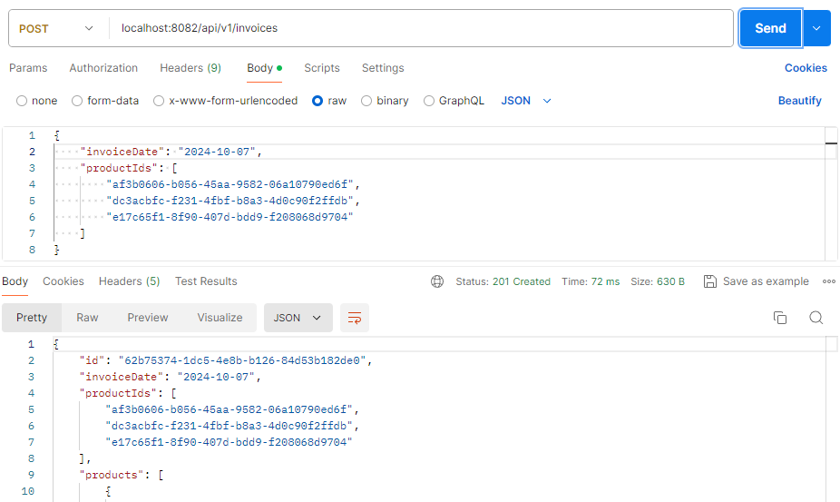

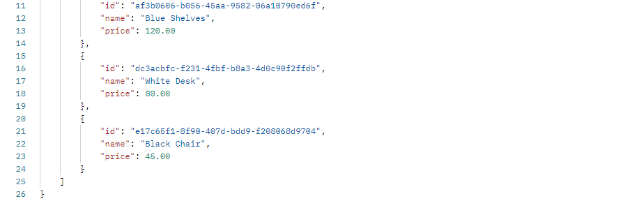

- Edit invoice (using `FeignClient`): `PUT /api/v1/invoices/{id}`

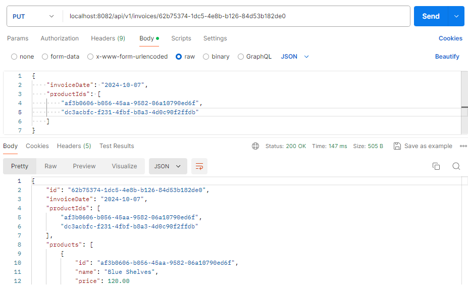

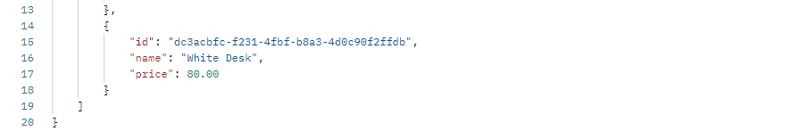

- Delete invoice: `DELETE /api/v1/invoices/{id}`

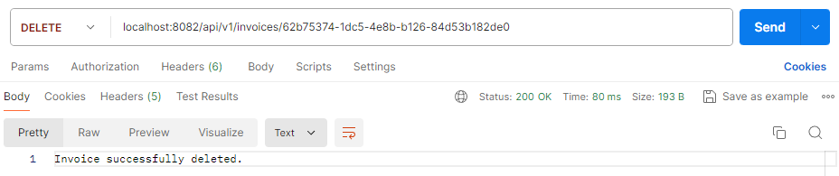