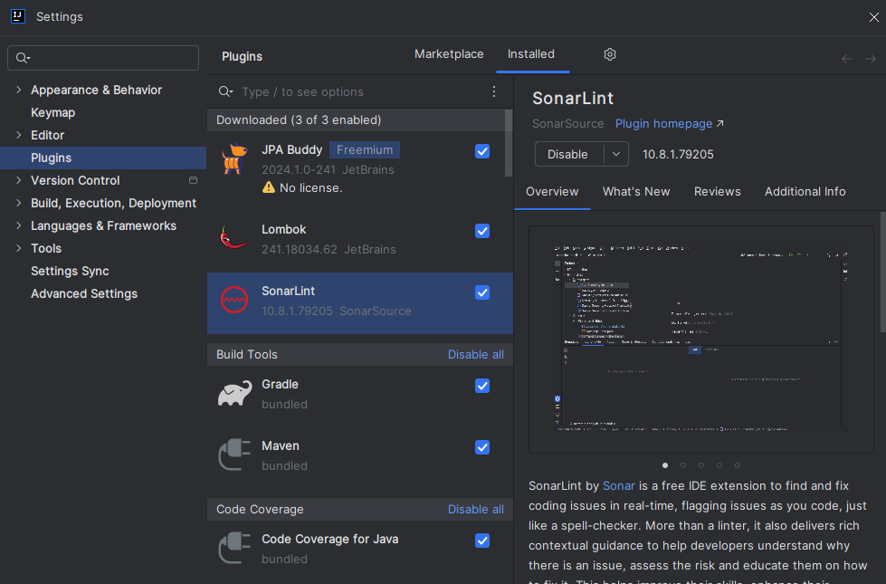
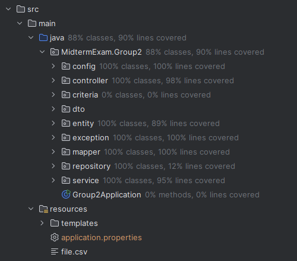
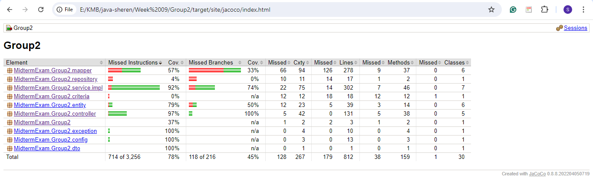
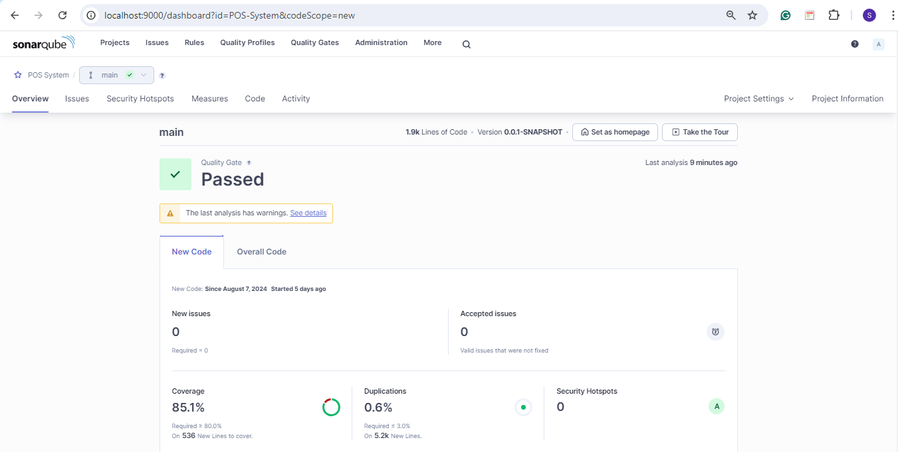
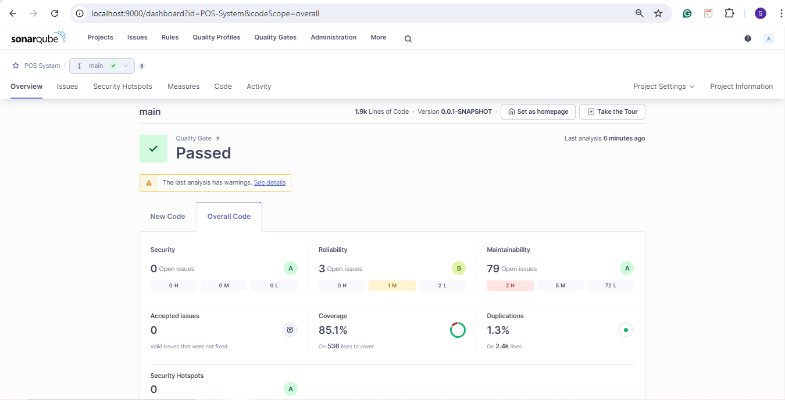

## 💡 Unit Test and Ensure Code Quality With Sonar

This project is the continuity of the mid-term project, that is POS (Point of Sales) system. Here, we conduct a unit test and ensure code quality with Sonar.

### ☁️ Using h2 for data access layer

There are two ways to test repository codes. The first option is using `@DataJpaTest` and not using embedded database. The second option is using a test database, for example, h2. For this option, the test database is separated with our application database. This is preferred as it does not touch the real database. To use h2 for data access layer, we need to config h2 database in `application.properties` for test:

```java
spring.datasource.url=jdbc:h2:mem:testdb
spring.datasource.driverClassName=org.h2.Driver
spring.datasource.username=root
spring.datasource.password=
spring.jpa.database-platform=org.hibernate.dialect.H2Dialect
spring.jpa.hibernate.ddl-auto=create-drop
```

Then, we can start testing our repository codes. I have already implemented h2 for data access layer on my repository codes.

---

### 🗓️ Using Mock/Spy/Mockbean …

There are two ways to test controller. The first one is using `@WebMvcTest` to mock and the second one is using `@ExtendWith(SpringExtension.class)` and `MockHttpServletRequestBuilder`. In this project, I have implemented `@WebMvcTest` to test the controller codes.

For service codes, there are three ways to do testing. First, we can use `@SpringBootTest` for end to end testing. Second, we can use `@ExtendWith(SpringExtension.class)` and `@MockBean.` Last, we can use `@ExtendWith(MockitoExtension.class)`, `@InjectMock` for class under test, and `@Mock` for mock class. In this project, I have implemented the second option in `ProductServiceImplTest` and I use the third option for the other services because it makes our test easier as everything is in the mock and not load all application context.

---

### 🌐 Install SonarLint inteliij plugin and code coverage

I have installed SonarLint plugin in my inteliij.



**Code coverage on inteliij**



---

### ⌨️  **Code coverage report with JaCoCo**

To do this, we need to add JaCoCo plugin first:

```java
<plugin>
	<groupId>org.jacoco</groupId>
	<artifactId>jacoco-maven-plugin</artifactId>
	<version>0.8.8</version>
	<executions>
		<execution>
			<id>prepare-agent</id>
			<goals>
				<goal>prepare-agent</goal>
			</goals>
		</execution>
		<execution>
			<id>report</id>
			<phase>prepare-package</phase>
			<goals>
				<goal>report</goal>
			</goals>
		</execution>
	</executions>
</plugin>
```

Then, we can run unit test (with `mvn package` no skip test). We can find test report detail in `/target` folder `(/site/jacoco/index.html)`. After that, we can push coverage report to SonarQube by config directly in `pom.xml`:

```java
<properties>
  <java.version>17</java.version>
  <sonar.java.coveragePlugin>jacoco</sonar.java.coveragePlugin>
  <sonar.dynamicAnalysis>reuseReports</sonar.dynamicAnalysis>
  <sonar.jacoco.reportPath>${project.basedir}/../target/jacoco.exec</sonar.jacoco.reportPath>
</properties>
```


**Code coverage report on JaCoCo**



---

### 💻 Install SonarQube on local

I have installed SonarQube on local via machine. We can run `StartSonar.bat` to start SonarQube operation. Then, we config Sonar with Spring Boot by adding this plugin in `pom.xml`:

```java
<plugin>
  <groupId>org.sonarsource.scanner.maven</groupId>
  <artifactId>sonar-maven-plugin</artifactId>
  <version>3.9.1.2184</version>
</plugin>
```

After that, we generate token in SonarQube and push the result of analysis based on project key and generated token.

```java
mvn -X clean verify sonar:sonar -D"sonar.projectKey"="POS-System" -D"sonar.projectName"="POS System" -D"sonar.token"="yourtoken"
```

**Code coverage on SonarQube**



