## 💡 Microservices - **Spring Cloud Gateway**

In the previous project, every request will go through the invoice service first. This will be a drawback if we want to add other APIs in the product service, such as create and update. In addition, this also causes problems when we have many services. That is why the gateway offers a solution where every request will go through the gateway service first. This gateway service has high performance, flexibility, and is easy to configure.

### ☁️ API gateway

In a microservices architecture, we have several spring boot applications running on different ports/routes. API gateway acts as a single point of entry for a collection of microservices. Using this, all microservices can be accessed through a single port or route. It provides several features like routing, filtering, load-balancing, circuit breaking, and more.

Previously, I have two spring boot applications:

- Microservice 1 for product that is running in port `8081`

```java
spring.application.name=product
server.port=8081
```

- Microservice 2 for invoice that is running in port `8082`.

```java
spring.application.name=invoice
server.port=8082
```

Then, we can do **Spring Cloud Gateway implementation**. Here, I have implemented Spring Cloud Gateway using properties.

**1️⃣** The first thing we need to do is create a Spring Boot application for the gateway and include the following dependencies in the `pom.xml` file:

```java
<?xml version="1.0" encoding="UTF-8"?>
<project xmlns="http://maven.apache.org/POM/4.0.0" xmlns:xsi="http://www.w3.org/2001/XMLSchema-instance"
	xsi:schemaLocation="http://maven.apache.org/POM/4.0.0 https://maven.apache.org/xsd/maven-4.0.0.xsd">
	<modelVersion>4.0.0</modelVersion>
	<parent>
		<groupId>org.springframework.boot</groupId>
		<artifactId>spring-boot-starter-parent</artifactId>
		<version>3.3.2</version>
		<relativePath/> <!-- lookup parent from repository -->
	</parent>
	<groupId>com.example</groupId>
	<artifactId>gateway</artifactId>
	<version>0.0.1-SNAPSHOT</version>
	<name>gateway</name>
	<description>Demo project for Spring Boot</description>
	<url/>
	<licenses>
		<license/>
	</licenses>
	<developers>
		<developer/>
	</developers>
	<scm>
		<connection/>
		<developerConnection/>
		<tag/>
		<url/>
	</scm>
	<properties>
		<java.version>17</java.version>
	</properties>
	<dependencies>
		<dependency>
			<groupId>org.springframework.boot</groupId>
			<artifactId>spring-boot-starter</artifactId>
		</dependency>
		<dependency>
			<groupId>org.springframework.boot</groupId>
			<artifactId>spring-boot-starter-webflux</artifactId>
		</dependency>
		<dependency>
			<groupId>org.springframework.cloud</groupId>
			<artifactId>spring-cloud-starter-gateway</artifactId>
		</dependency>
		<dependency>
			<groupId>org.springframework.boot</groupId>
			<artifactId>spring-boot-starter-test</artifactId>
			<scope>test</scope>
		</dependency>
		<dependency>
			<groupId>io.projectreactor</groupId>
			<artifactId>reactor-test</artifactId>
			<scope>test</scope>
		</dependency>
	</dependencies>
	<dependencyManagement>
		<dependencies>
			<dependency>
				<groupId>org.springframework.cloud</groupId>
				<artifactId>spring-cloud-dependencies</artifactId>
				<version>2023.0.3</version>
				<type>pom</type>
				<scope>import</scope>
			</dependency>
		</dependencies>
	</dependencyManagement>

	<build>
		<plugins>
			<plugin>
				<groupId>org.springframework.boot</groupId>
				<artifactId>spring-boot-maven-plugin</artifactId>
			</plugin>
		</plugins>
	</build>

</project>
```

**2️⃣** Next, we create a file `application.yml` inside the resources folder.

```java
server:
  port: 8080
spring:
  cloud:
    gateway:
      routes:
        - id: product
          uri: http://localhost:8081
          predicates:
            - Path=/api/v1/products/**
        - id: invoice
          uri: http://localhost:8082
          predicates:
            - Path=/api/v1/invoices/**
```

- `server.port: 8080` specifies the port on which the Spring Cloud Gateway application will run
- `spring.cloud.gateway.routes` defines the routing rules for the gateway, determining how incoming requests are forwarded to different microservices
- `- id: product` defines a route with the identifier `product`. This route will forward requests to the `product` microservice
- `uri: http://localhost:8081` specifies the destination URI for the `product` route. Requests that match this route will be forwarded to the `product` service running on `localhost` at port `8081`
- `predicates: - Path=/api/v1/products/**`  is used to match the HTTP requests. A route is matched if the predicate returns true
- `- id: invoice` defines a route with the identifier invoice. This route will forward requests to the `invoice` microservice
- `uri: http://localhost:8082` specifies the destination URI for the `invoice` route. Requests that match this route will be forwarded to the `invoice` service running on `localhost` at port `8082`
- `predicates: - Path=/api/v1/invoices/**`  is used to match the HTTP requests. A route is matched if the predicate returns true.

**3️⃣** Now, we can run the gateway Spring Boot application and access multiple microservices through a single entry point (the gateway) that is from `http://localhost:8080` which we have been configured before.

---

### 📦 Product Microservice

This is the first microservice which running on port `8081`.

🌳 **Project Structure**

```java
product
├───src
│   └───main
│       ├───java
│       │   └───com
│       │       └───example
│       │           └───product
│       │               │   ProductApplication.java
│       │               │
│       │               ├───controller
│       │               │       ProductController.java
│       │               │
│       │               ├───entity
│       │               │       Product.java
│       │               │
│       │               ├───repository
│       │               │       ProductRepository.java
│       │               │ 
│       │               └───service
│       │                      └───impl
│       │                          ProductServiceImpl.java
│       │                   ProductService.java
│       │
│       └───resources
│           └───application.properties
│
└───pom.xml
```

🎯 **API endpoints**

- Get all products: `GET /api/v1/products`

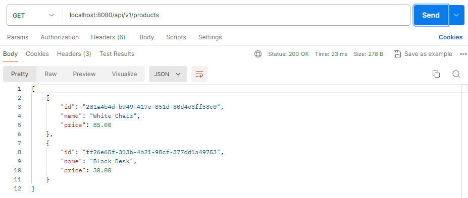

- Get product by id: `GET /api/v1/products/{id}`

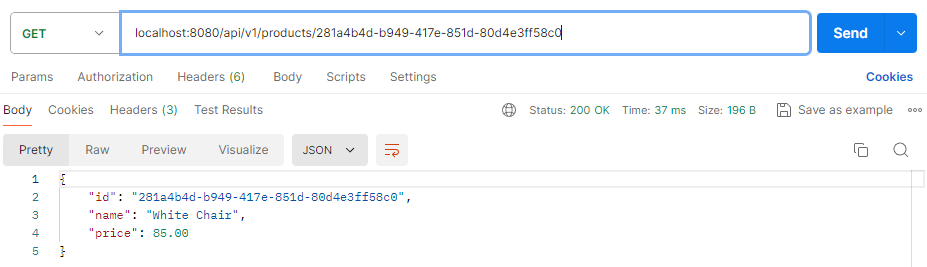

- Create product: `POST /api/v1/products`

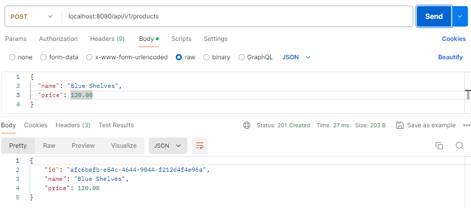

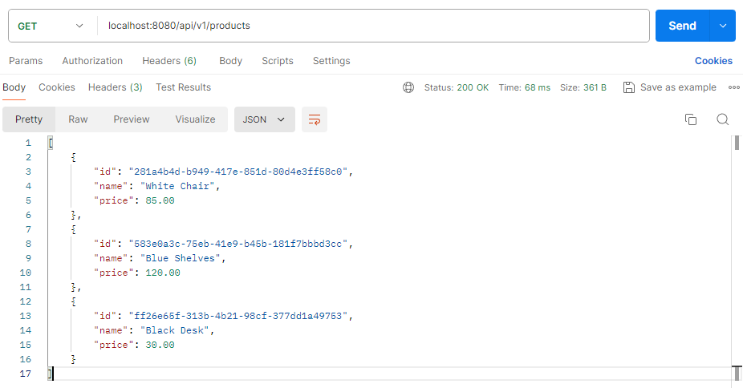

- Update product: `PUT /api/v1/products/{id}`

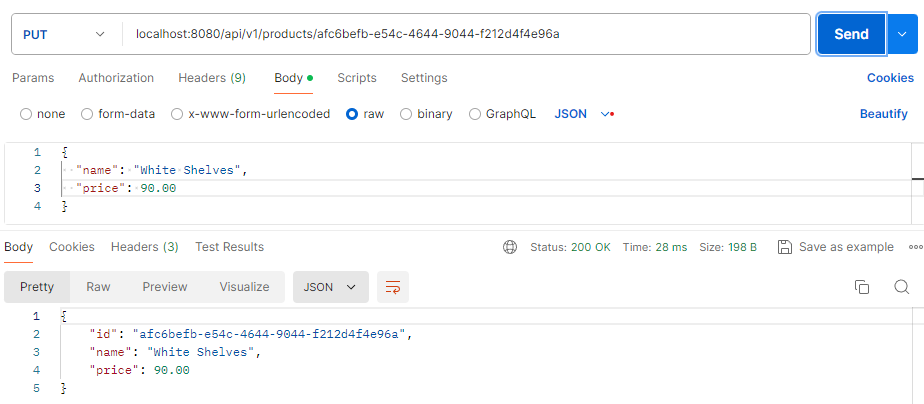


- Delete product: `DELETE /api/v1/products/{id}`

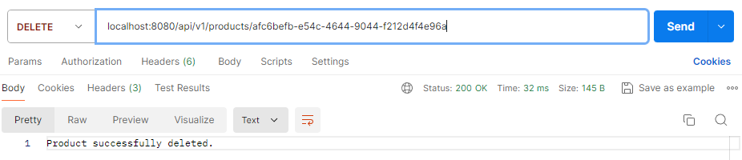

---

### 🗒️ Invoice Microservice

This is the second microservice which running on port `8082`.

🌳 **Project Structure**

```java
invoice
├───src
│   └───main
│       ├───java
│       │   └───com
│       │       └───example
│       │           └───invoice
│       │               │   InvoiceApplication.java
│       │               │
│       │               ├───client
│       │               │       ProductFeignClient.java
│       │               │
│       │               ├───config
│       │               │       RestTemplateConfig.java
│       │               │       WebClientConfig.java
│       │               │
│       │               ├───controller
│       │               │       InvoiceController.java
│       │               │
│       │               ├───dto
│       │               │       InvoiceDTO.java
│       │               │       ProductDTO.java
│       │               │
│       │               ├───entity
│       │               │       Invoice.java
│       │               │
│       │               ├───mapper
│       │               │       InvoiceMapper.java
│       │               │
│       │               ├───repository
│       │               │       InvoiceRepository.java
│       │               │ 
│       │               └───service
│       │                      └───impl
│       │                          InvoiceServiceImpl.java
│       │                          InvoiceServiceFeignClientImpl.java
│       │                          InvoiceServiceRestTemplateImpl.java
│       │                          InvoiceServiceWebClientImpl.java
│       │                   InvoiceService.java
│       │                   InvoiceServiceFeignClient.java
│       │                   InvoiceServiceRestTemplate.java
│       │                   InvoiceServiceWebClient.java
│       │
│       └───resources
│           └───application.properties
│
└───pom.xml
```

🎯 **API endpoints**

- Get invoice by id (using `FeignClient`): `GET /api/v1/invoices/feign-client/{id}`


- Get invoice by id (using `RestTemplate`): `GET /api/v1/invoices/rest/{id}`

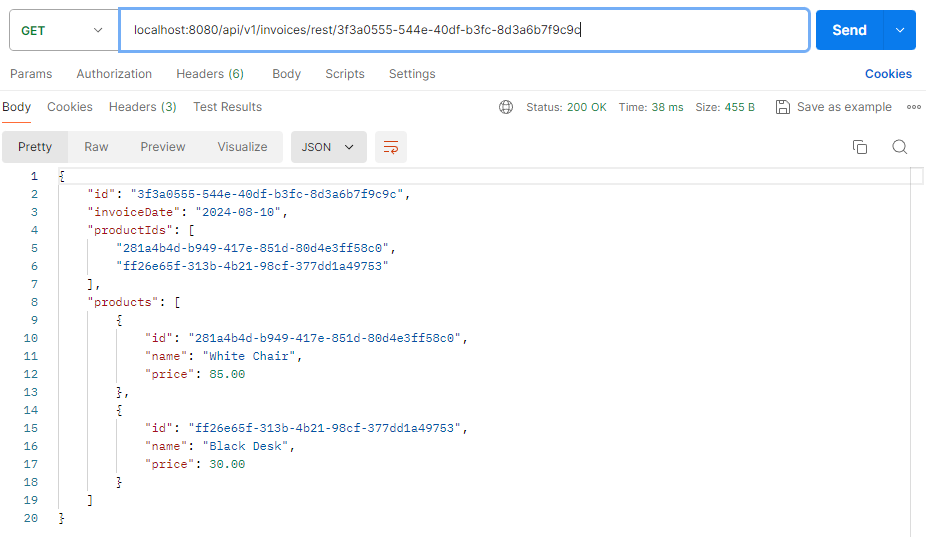

- Get invoice by id (using `WebClient`): `GET /api/v1/invoices/web-client/{id}`


- Add invoice (using `FeignClient`): `POST /api/v1/invoices`

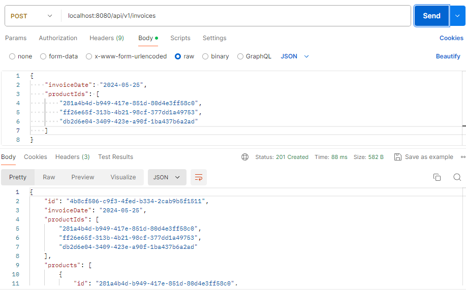

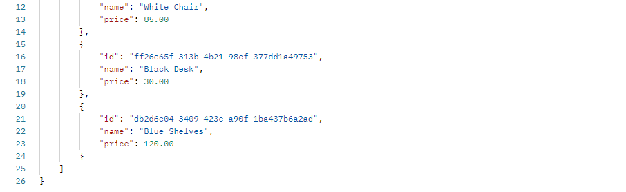

- Edit invoice (using `FeignClient`): `PUT /api/v1/invoices/{id}`

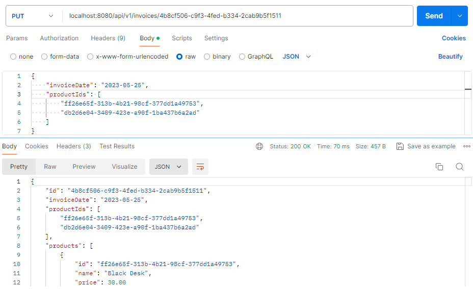


- Delete invoice: `DELETE /api/v1/invoices/{id}`

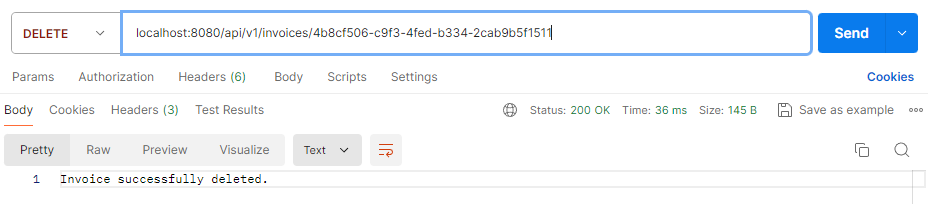