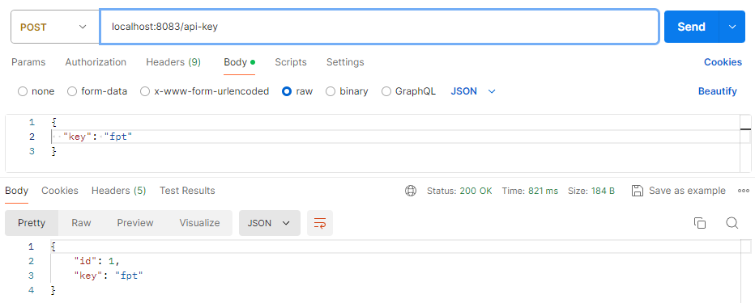
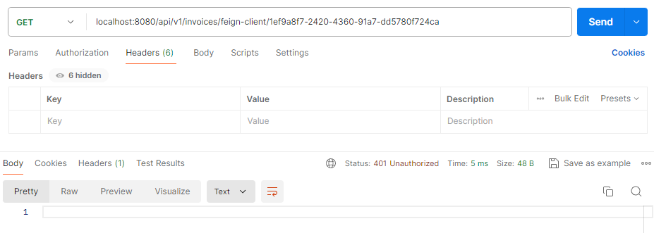
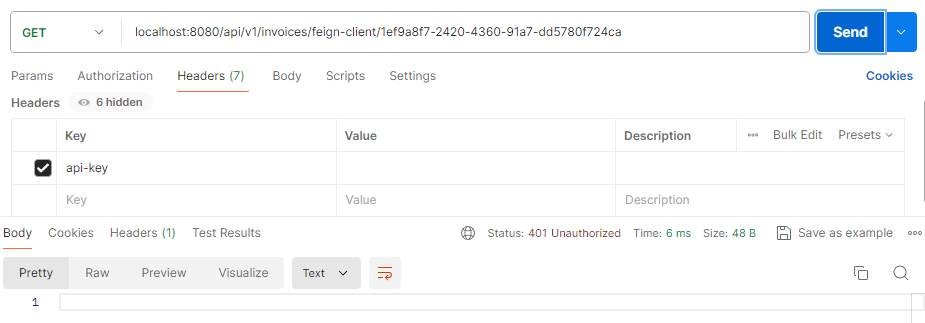
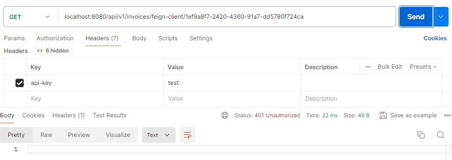
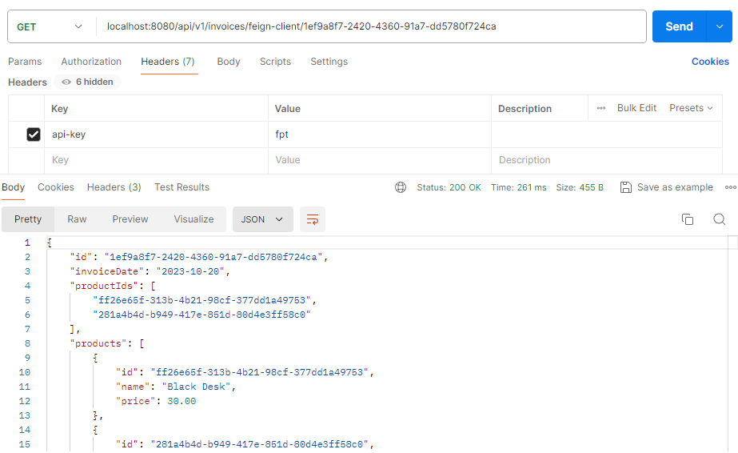

## 💡 Authentication Implementation in Microservices Project and Gateway

In this project, I have added an implementation of authentication for the microservices project. There are three objectives for this project, which are:

- Add filter to verify request having header “api-key”, call authentication service to check is it correct
- Create authentication service storing api-key
- “api-key” is configured in database.

---

### 🌳 Authentication Project Structure

```java
auth
├───src
│   └───main
│       ├───java
│       │   └───com
│       │       └───example
│       │           └───auth
│       │               │   AuthApplication.java
│       │               │
│       │               ├───controller
│       │               │       AuthController.java
│       │               │
│       │               ├───dto
│       │               │       ApiKeyRequest.java
│       │               │
│       │               ├───entity
│       │               │       ApiKey.java
│       │               │
│       │               ├───repository
│       │               │       ApiKeyRepository.java
│       │               │ 
│       │               └───service
│       │                       ApiKeyService.java
│       │
│       └───resources
│           ├───application.properties
│           └───application.yml
│
└───pom.xml
```

In this project, I created an authentication service that will store and validate the `api-key`.  It will expose an API that the Gateway can call to verify the key. The following is the step-by-step implementation for authentication service:

**1️⃣ Create a Spring Boot application**

First, we need to create a Spring Boot application including some dependencies.

[pom.xml]()

**2️⃣ Configure the database**

Here, I configured the database in `application.yml` of the authentication service.

```java
server:
  port: 8083
spring:
  datasource:
    url: jdbc:mysql://localhost:3306/week10
    username: root
    password:
    driver-class-name: com.mysql.cj.jdbc.Driver
  jpa:
    hibernate:
      ddl-auto: update
    show-sql: true
```

This authentication service will be run on port `8083`.

**3️⃣ Create the `ApiKey` entity**

```java
@Entity
@Table(name = "api")
@Data
public class ApiKey {

    @Id
    @GeneratedValue(strategy = GenerationType.IDENTITY)
    @Column(name = "id")
    private Long id;

    @Column(name = "api_key")
    private String key;

}
```

This entity represents the `api-key` in the database.

**4️⃣ Create a DTO for API key input**

```java
@Getter
@Setter
public class ApiKeyRequest {

    private String key;

}
```

This DTO is to receive the API key as input.

**5️⃣ Create the `ApiKeyRepository`**

```java
public interface ApiKeyRepository extends JpaRepository<ApiKey, Long> {
    Optional<ApiKey> findByKey(String key);
}
```

This repository is to interact with the `ApiKey` table.

**6️⃣ Create the authentication controller**

```java
@RestController
public class AuthController {

    private ApiKeyRepository apiKeyRepository;

    @Autowired
    public AuthController(ApiKeyRepository apiKeyRepository) {
        this.apiKeyRepository = apiKeyRepository;
    }

    @GetMapping("/validateApiKey")
    public ResponseEntity<Boolean> validateApiKey(@RequestHeader("api-key") String apiKey) {
        boolean isValid = apiKeyRepository.findByKey(apiKey).isPresent();
        return ResponseEntity.ok(isValid);
    }

    @PostMapping("/api-key")
    public ResponseEntity<ApiKey> createApiKey(@RequestBody ApiKeyRequest apiKeyRequest) {
        ApiKey newApiKey = new ApiKey();
        newApiKey.setKey(apiKeyRequest.getKey());

        ApiKey savedApiKey = apiKeyRepository.save(newApiKey);
        return ResponseEntity.ok(savedApiKey);
    }
}

```

- `validateApiKey` checks whether the provided `api-key` is valid or not
- `createApiKey` is to handle saving API keys where we can send API key data to be stored in the database.

**7️⃣ Run the authentication service**
Run the authentication service on port `8083`.

---

### 🌳 Gateway Project Structure

```java
gateway
├───src
│   └───main
│       ├───java
│       │   └───com
│       │       └───example
│       │           └───gateway
│       │               │   GatewayApplication.java
│       │               │
│       │               ├───config
│       │               │       WebClientConfig.java
│       │               │
│       │               └───filter
│       │                       ApiKeyFilter.java
│       │
│       └───resources
│           ├───application.properties
│           └───application.yml
│
└───pom.xml
```

Here, we update the gateway to use the authentication service. We need to configure the gateway to call the authentication service to verify the `api-key`.

**1️⃣ Create a custom gateway filter**

```java
@Component
public class ApiKeyFilter extends AbstractGatewayFilterFactory<Object> {

    private WebClient.Builder webClientBuilder;

    @Autowired
    public ApiKeyFilter(WebClient.Builder webClientBuilder) {
        this.webClientBuilder = webClientBuilder;
    }

    public ApiKeyFilter() {
        super(Object.class);
    }

    @Override
    public GatewayFilter apply(Object config) {
        return (exchange, chain) -> {
            ServerHttpRequest request = exchange.getRequest();
            HttpHeaders headers = request.getHeaders();
            String apiKey = headers.getFirst("api-key");

            if (apiKey == null || apiKey.isEmpty()) {
                return handleUnauthorizedResponse(exchange);
            }

            return webClientBuilder.build()
                    .get()
                    .uri("http://localhost:8083/validateApiKey")
                    .header("api-key", apiKey)
                    .retrieve()
                    .bodyToMono(Boolean.class)
                    .flatMap(isValid -> {
                        if (Boolean.TRUE.equals(isValid)) {
                            return chain.filter(exchange);
                        } else {
                            return handleUnauthorizedResponse(exchange);
                        }
                    });
        };
    }

    private Mono<Void> handleUnauthorizedResponse(ServerWebExchange exchange) {
        exchange.getResponse().setStatusCode(HttpStatus.UNAUTHORIZED);
        return exchange.getResponse().setComplete();
    }
}
```

Here, I created a filter to validate the `api-key`. If the `api-key` is invalid or null, it will return `UNAUTHORIZED`.

**2️⃣ Register the filter in `application.yml`**

```java
server:
  port: 8080
spring:
  cloud:
    gateway:
      routes:
        - id: product
          uri: http://localhost:8081
          predicates:
            - Path=/api/v1/products/**
          filters:
            - ApiKeyFilter
        - id: invoice
          uri: http://localhost:8082
          predicates:
            - Path=/api/v1/invoices/**
          filters:
            - ApiKeyFilter
```

**3️⃣ Add WebClient configuration**

Here, we configure a `WebClient` bean to make HTTP requests to the authentication service.

```java
@Configuration
public class WebClientConfig {

    @Bean
    public WebClient.Builder webClientBuilder() {
        return WebClient.builder();
    }
}

```

---

### 🎯 Test Result

To begin, let’s we add a new `api-key` for authentication.



Now, let’s test it.

- Without `api-key`



It will return `401 Unauthorized`

- With `api-key` but null



It will return `401 Unauthorized`

- With invalid `api-key`



It will return `401 Unauthorized`

- With valid `api-key`



It will return the correct result.