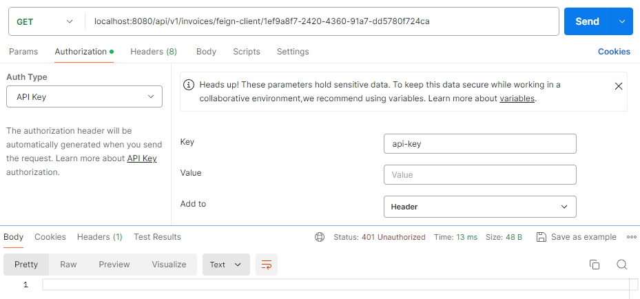
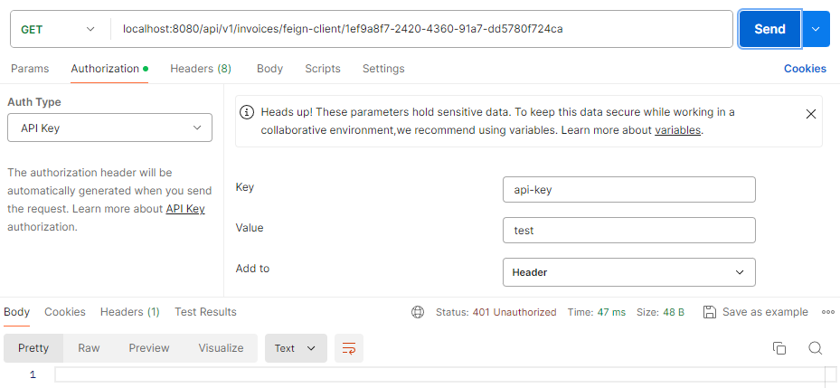
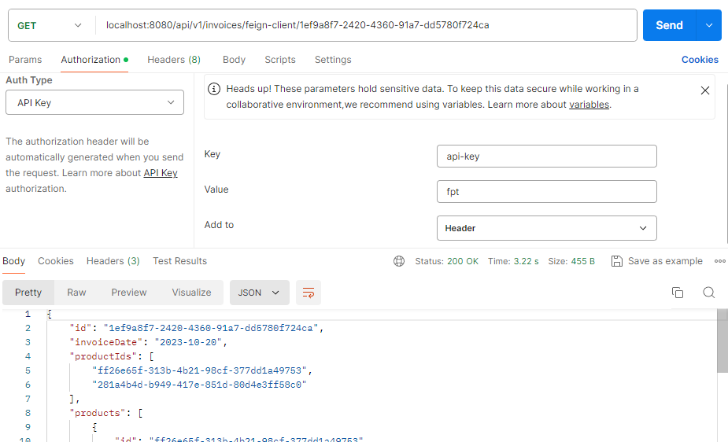
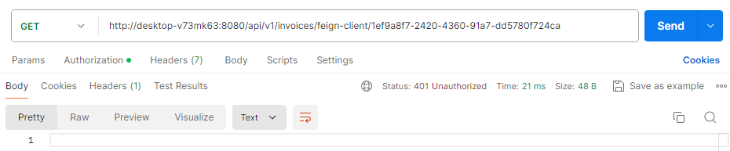
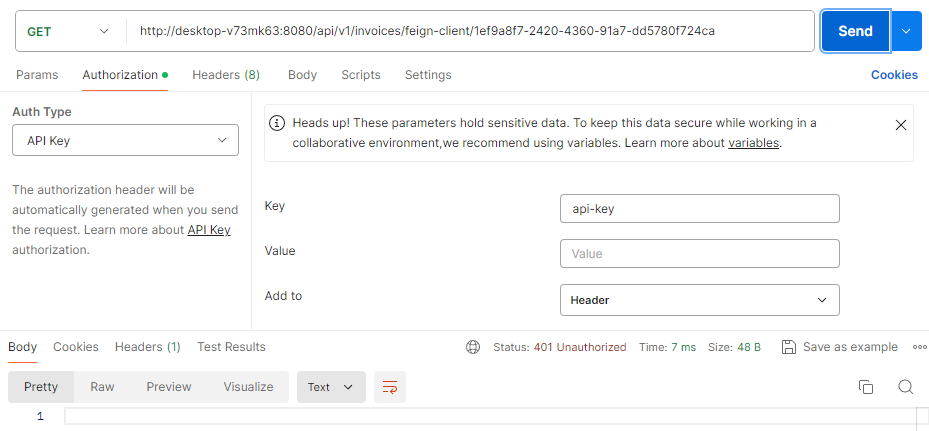
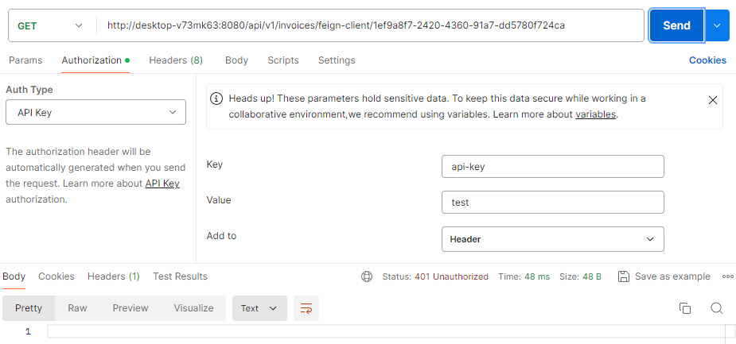
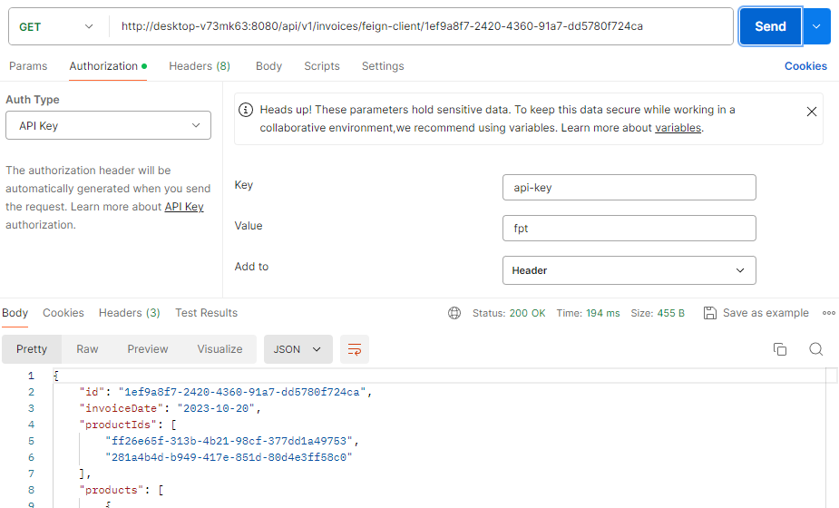
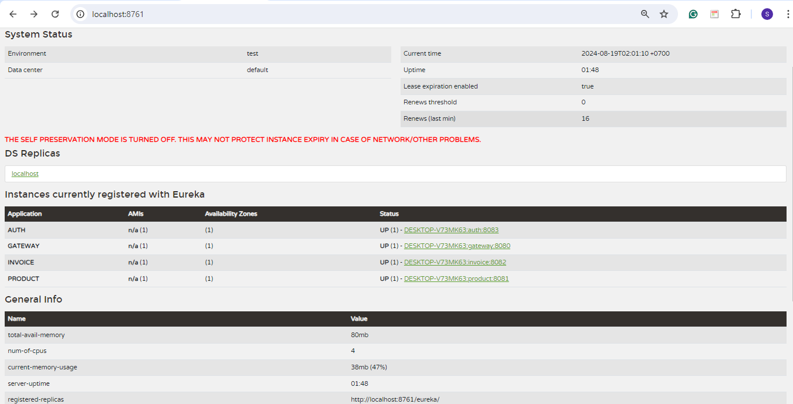
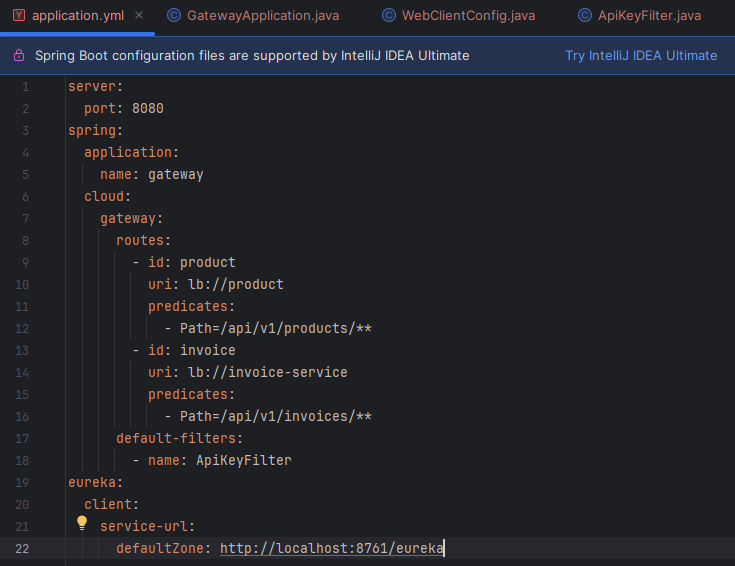
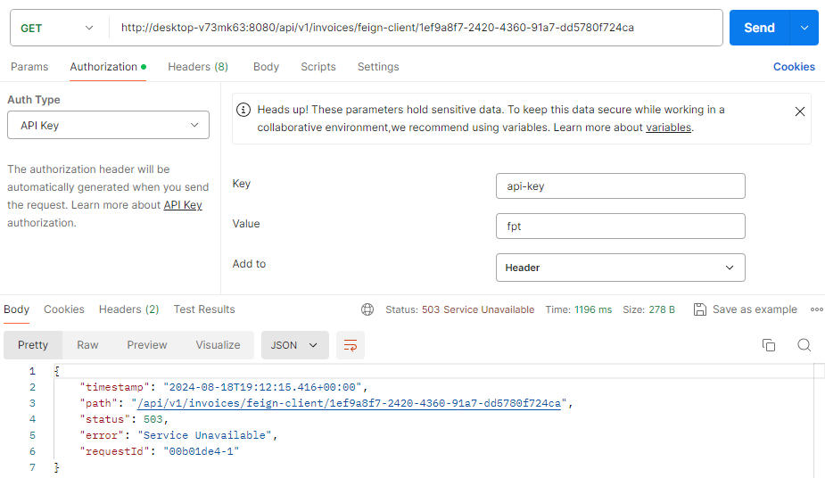

## 💡 Microservices: Discovery Service

In this project, I have added a discovery service for the previous microservices project.

---

### ❔ What is a discovery service?

In a microservices architecture, services are often deployed independently, running on different hosts or ports. Discovery service helps these microservices discover each other dynamically without needing to know each other's exact locations (hostnames or ports) in advance.

---

### 👩‍🏫 How does it work

- **Service registration**: When a microservice starts, it registers itself with the discovery service by providing metadata like its network location (host and port) and other details
- **Service discovery**: Other microservices can query the discovery service to find the network locations of other services. For example, if service A needs to communicate with service B, it will ask the discovery service for the location of Service B
- **Load balancing**: Many discovery services also provide built-in client-side load balancing. When a service asks for another service's location, the discovery service can return multiple instances, and the client can choose one to use, often using load balancing algorithms.

---

### 🔍 Discovery service implementation

For the implementation, let’s we use **Eureka Server**. Eureka is one of the most widely used discovery services in the Spring ecosystem. Eureka Server is a service registry component in the Netflix OSS ecosystem, used in microservices architectures for service discovery. It’s part of the Spring Cloud Netflix suite and serves as a discovery server where all microservices register themselves and can discover other registered services.

How it works:

- **Service registration**:
    - When a microservice starts, it registers itself with the Eureka Server. This registration includes information such as the service's hostname, port, health check URL, and other metadata
    - The registration is done using a Eureka client, which is integrated into the microservice.
- **Service discovery**:
    - Other microservices that need to communicate with a particular service will query the Eureka Server to get the list of all available instances of that service
    - The Eureka Server returns the instances, allowing the client to pick one, often using client-side load balancing.

---

### 🔩 Setting up Eureka Server

**1️⃣ Add dependencies**

```java
<dependency>
	<groupId>org.springframework.cloud</groupId>
	<artifactId>spring-cloud-starter-netflix-eureka-server</artifactId>
</dependency>

<dependencyManagement>
	<dependencies>
		<dependency>
			<groupId>org.springframework.cloud</groupId>
			<artifactId>spring-cloud-dependencies</artifactId>
			<version>2023.0.3</version>
			<type>pom</type>
			<scope>import</scope>
		</dependency>
	</dependencies>
</dependencyManagement>
```

**2️⃣ Enable Eureka Server**

Here, we need to annotate the main Spring Boot application class with `@EnableEurekaServer`.

```java
@SpringBootApplication
@EnableEurekaServer
public class DiscoveryApplication {

	public static void main(String[] args) {
		SpringApplication.run(DiscoveryApplication.class, args);
	}

}
```

**3️⃣ Configure Eureka Server**

We need to add the necessary configurations in `application.yml` .

```java
server:
  port: 8761
eureka:
  client:
    register-with-eureka: false
    fetch-registry: false
  server:
    enable-self-preservation: false

```

- `register-with-eureka: false`: Eureka Server itself should not register with another Eureka instance
- `fetch-registry: false`: Eureka Server does not need to fetch the registry, as it is the registry.

**4️⃣ Access the Eureka dashboard**
Once the server is running, we can access the Eureka Dashboard at `http://localhost:8761`. This dashboard will show all the registered services, their statuses, and other useful information.

---

### 👩‍💻 Configure Eureka Clients (Microservices)

For each microservice that needs to register with Eureka:

**1️⃣ Add Eureka Client dependency**

```java
<dependency>
	<groupId>org.springframework.cloud</groupId>
	<artifactId>spring-cloud-starter-netflix-eureka-client</artifactId>
</dependency>
```

**2️⃣ Enable Eureka Client**

We can annotate the main class of each microservice with `@EnableDiscoveryClient` or `@EnableEurekaClient`. However, this annotation is optional if we have the `spring-cloud-starter-netflix-eureka-client` dependency on the class path. That is why for this project I don’t use that annotation as I have already add the dependency on the class path.

**3️⃣ Configure Eureka Client**

Here, we configure Eureka Client in each microservice’s `application.yml` . For example in `product` microservice:

```java
spring:
  application:
    name: product

server:
  port: 8081

eureka:
  client:
    service-url:
      defaultZone: ${EUREKA_URI:http://localhost:8761/eureka}
  instance:
    preferIpAddress: true
```

- `defaultZone`: Points to the Eureka Server where the service will register.

---

### 👩‍💻 Configure Gateway Service

**1️⃣ Add dependency**

```java
<dependency>
	<groupId>org.springframework.cloud</groupId>
	<artifactId>spring-cloud-starter-netflix-eureka-client</artifactId>
</dependency>
```

**2️⃣ Configure routing in `application.yml`**

```java
server:
  port: 8080
spring:
  application:
    name: gateway
  cloud:
    gateway:
      routes:
        - id: product
          uri: lb://product
          predicates:
            - Path=/api/v1/products/**
        - id: invoice
          uri: lb://invoice
          predicates:
            - Path=/api/v1/invoices/**
      default-filters:
        - name: ApiKeyFilter
eureka:
  client:
    service-url:
      defaultZone: http://localhost:8761/eureka
```

- `lb://`: This prefix indicates that the URI should be resolved using a load-balanced service lookup, meaning it will use Eureka to find the instances of the each service
- `id: invoice`: Unique identifier for the invoice route
- `uri: lb://invoice`: Routes requests to the `invoice` service registered in Eureka
- `Path=/api/v1/invoices/**`: Matches requests with paths under `/api/v1/invoices/`
- `defaultZone: http://localhost:8761/eureka`: Specifies the URL where the Eureka server is running. In this case, it's running locally on port 8761. The Gateway will register itself and query for other services (like `product` and `invoice`) at this URL.

---

### 🎯 Test result

### **Before Eureka:**

- Without `api-key`


- With `api-key` but null



- With invalid `api-key`



- With valid `api-key`



### **After Eureka:**

- Without `api-key`



- With `api-key` but null



- With invalid `api-key`



- With valid `api-key`



### **Eureka Server:**


### **Try to use different name:**

Previously, my application name for invoice is `invoice`. Now, let’s we try to use different name name in the gateway configuration.



Here, we change the URI into `invoice-service`. Then, we test on Postman.



The result is error. Why? Let’s we understand the key concepts first.

- **Service registration in Eureka**:
    - When a service registers with Eureka, it registers with a specific name (e.g., `invoice`)
    - This name is defined in the service's `application.yml` under `spring.application.name.`
- **Gateway configuration**:
    - The `uri: lb://service-name` in the Spring Cloud Gateway configuration tells the Gateway to use Eureka to look up the service by the name `service-name`
    - The `lb://` prefix indicates that the Gateway should perform load balancing across instances registered under this service name in Eureka.

Therefore:

- **`lb://invoice-service`:**
    - If the `invoice` service is registered in Eureka with the name `invoice`, then using `lb://invoice-service:8082` will not work. This is because `invoice-service` does not match the registered service name `invoice` in Eureka
    - The Gateway will not find any service registered as `invoice-service` and thus cannot route the request, resulting in an error.
- **`lb://invoice`:**
    - This URI is more accurate as it matches the service name (`invoice`) registered in Eureka.