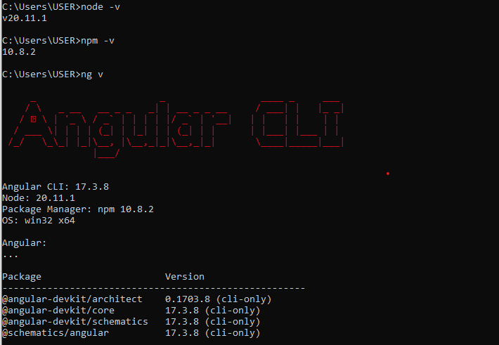
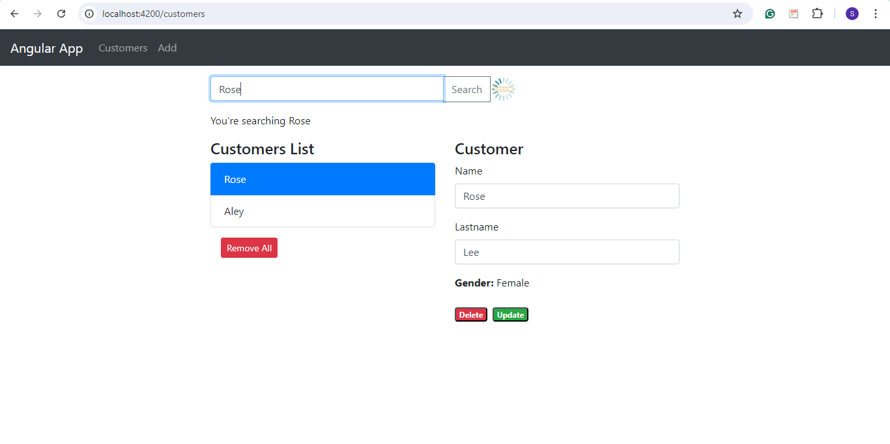
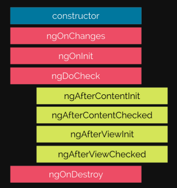
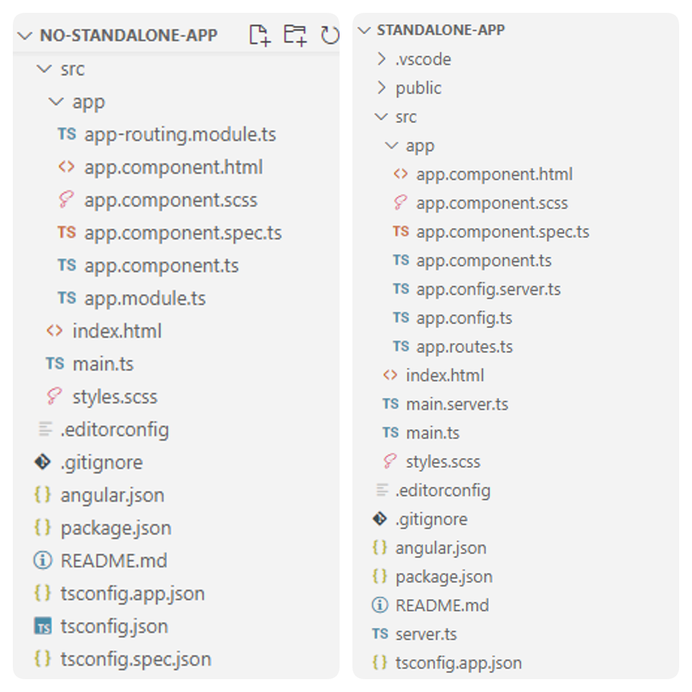
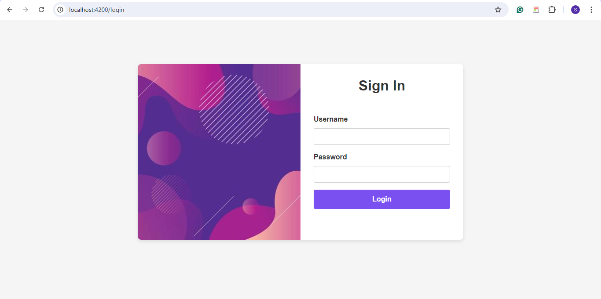
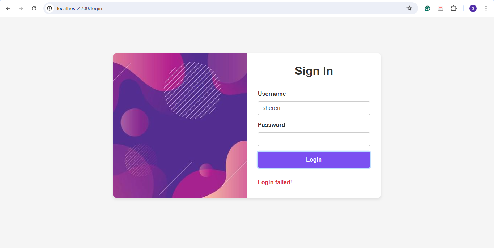

## 💡 Angular

[Session 2: Product Management README](https://github.com/affandyfandy/java-sheren/blob/week_11/Week%2011/session2.md)

### ♻️ Set up environment

As I’ve installed Node.js before, I only need to install Angular CLI in Command Prompt.

```java
npm install -g @angular/cli@17
```

Now, these are the version I’ve installed:



---

### 👩‍💻 Run and look into code structure

I’ve run and looked into the code structure for the angular demo.

[Angular Demo Codes](https://github.com/affandyfandy/java-sheren/tree/week_11/Week%2011/angular-demo-main)



---

### 🔄 Component Lifecycle

**❔ What is component lifecycle?**

A component lifecycle in Angular is the sequence of steps that happen from the component’s creation to its destruction. Each step represents a different part of Angular’s process for rendering components and checking them for updates over time. Understanding this lifecycle helps in managing how our application behaves at different stages.



**1️⃣ Creation**

- **Constructor**: When a component is first created, Angular calls its constructor. This is where the component is initialized, but the component is not yet fully ready
- **ngOnChanges**: This method is called when any of the component's input properties change. It happens before the component is fully initialized.

**2️⃣ Initialization**

- **ngOnInit**: After the component is created, Angular calls `ngOnInit`. This is where we put initialization logic that requires all the component's input properties to be set. It runs once, after the component is created and all input properties are initialized.

**3️⃣ Change detection**

- **ngDoCheck:** Angular regularly checks for changes in our component's data. `ngDoCheck` is called during every change detection cycle. It's useful when we want to manually detect and act upon changes
- **ngAfterContentInit:** `ngAfterContentInit` runs once after all the children nested inside the component ( its content) has been initialized
- **ngAfterContentChecked:** `ngAfterContentChecked` runs every time the children nested inside the component (its content) have been checked for changes.

**4️⃣ View initialization**

- **ngAfterViewInit**: Called once after the component’s view (its template and children) has been fully initialized. It’s where we can safely interact with the view's child components or DOM elements
- **ngAfterViewChecked**: Called every time the children in the component's template (its view) have been checked for changes. It’s useful for responding to changes in the component's view.

**5️⃣ Destruction**

- **ngOnDestroy**: Called just before Angular destroys the component. Angular destroys a component when it is no longer shown on the page, such as being hidden by `NgIf` or upon navigating to another page.

---

### 💻 Standalone and No-Standalone App

For `No-Standalone` app, we generate it by running this command:

```java
ng new no-standalone-app --no-standalone --routing --ssr=false
```

As for `Standalone` app, from 17 version onwards, `Standalone` app will be created by default with CLI.

```java
ng new standalone-app
```



Now, for `No-Standalone` and `Standalone` app:

**1️⃣ Create model that is `user.model.ts`**

[user.model.ts](https://github.com/affandyfandy/java-sheren/blob/week_11/Week%2011/standalone-app/src/app/models/user.model.ts)

**2️⃣ Create service `login.service.ts`**

[login.service.ts](https://github.com/affandyfandy/java-sheren/blob/week_11/Week%2011/standalone-app/src/app/services/login.service.ts)

**3️⃣ For each project, create login component**

`No-Standalone`:

```tsx
ng generate component login
```

`Standalone`:

```tsx
ng generate component login --standalone
```

**4️⃣ Now, we can see the differences**

In `No-Standalone` project:

- Components need to be declared in an `NgModule` (usually `app.module.ts`)
- The `AppComponent` and other components are bootstrapped through the module system.

```tsx
import { NgModule } from '@angular/core';
import { BrowserModule } from '@angular/platform-browser';
import { AppRoutingModule } from './app-routing.module';
import { AppComponent } from './app.component';
import { LoginComponent } from './login/login.component';
import { CommonModule } from '@angular/common';
import { FormsModule } from '@angular/forms';
import { LoginService } from './services/login.service';

@NgModule({
  declarations: [
    AppComponent,
    LoginComponent
  ],
  imports: [
    BrowserModule,
    AppRoutingModule,
    CommonModule,
    FormsModule
  ],
  providers: [LoginService],
  bootstrap: [AppComponent]
})
export class AppModule { }
```

In `Standalone` project:

- We use the `@Component` decorator with `standalone: true`
- Do not need to be declared in a module, they can be directly used and bootstrapped.

```tsx
import { Component } from '@angular/core';
import { CommonModule } from '@angular/common';
import { FormsModule } from '@angular/forms';
import { LoginService } from '../services/login.service';

@Component({
  selector: 'app-login',
  standalone: true,
  templateUrl: './login.component.html',
  styleUrl: './login.component.scss',
  imports: [CommonModule, FormsModule]
})
  export class LoginComponent {
    username: string = '';
    password: string = '';
    loginSuccess: boolean | null = null;

    constructor(private loginService : LoginService) {}

    onLogin(): void {
      if (this.username.trim() === '' || this.password.trim() === '') {
        this.loginSuccess = false;
        return;
      }

      this.loginService.login(this.username, this.password).subscribe(
        (success) => {
          this.loginSuccess = success;
        },
        (error) => {
          console.error('Login error:', error);
          this.loginSuccess = false;
        }
      );
    }
  }
```

### **👩‍🏫 Comparison**

**1️⃣ Module structure**

- **Standalone:**
    - Components, directives, and pipes can be used without an Angular module (`NgModule`)
    - Each component, directive, or pipe can declare its own dependencies directly using the `standalone: true` configuration.
- **No-Standalone:**
    - Requires at least one root module (`AppModule`) to bundle components, directives, and pipes
    - Dependencies and declarations are managed in a centralized module.

**2️⃣ Component declaration**

- **Standalone:**
    - Components are self-contained and do not require declaration in a module
    - We declare dependencies directly in the component using `imports: [...]`.
- **No-Standalone:**
    - Components must be declared in a module to be used
    - Dependencies are imported and declared in the module.

**3️⃣ Dependency management**

- **Standalone:**
    - Allows us to import dependencies directly into components, which reduces the need for a module to handle imports.
- **No-Standalone:**
    - Dependencies are managed centrally in modules, which can lead to more overhead in managing large applications.

**4️⃣ Lazy loading**

- **Standalone:**
    - Components can be lazy-loaded directly without the need for feature modules
    - Simplifies the lazy-loading process.
- **No-Standalone:**
    - Lazy-loading is typically handled via feature modules, which requires extra configuration and complexity.

**5️⃣ Application structure and complexity**

- **Standalone:**
    - Encourages a flatter structure where each component is more self-contained
    - Ideal for small to medium-sized applications or micro-frontends where modularity is less critical.
- **Non-Standalone App:**
    - Follows a hierarchical structure where components are grouped into modules
    - Better suited for larger applications where modularization is necessary.

### **❔ Why we should use standalone type?**

- **Simplicity and flexibility:**
    - Reduces the complexity of managing multiple modules
    - Easier to develop and maintain for smaller applications or specific parts of an app.
- **Better for micro-frontend architectures:**
    - Standalone components are self-contained, making them more suitable for micro-frontends where we may want to integrate multiple independent Angular apps into one.
- **Performance:**
    - Since standalone components are self-contained and import only what they need, it can lead to more optimized bundles and better performance.
- **Easier migration and refactoring:**
    - Easier to convert existing components into standalone ones or to refactor them in the future as Angular evolves.
- **More modern approach:**
    - Aligns with the latest Angular trends and practices, making it future-proof for upcoming Angular updates.

---

### 👥 Login Component (Standalone)

Previously we’ve been created login component for standalone project. Let’s discuss it in more detail. To create login component for Standalone project, we can create the component in terminal.

```java
ng generate component login --standalone
```

**1️⃣ Setting up the service**

Previously, we’ve created `login.service.ts`. The `LoginService` is responsible for handling the login logic.

```tsx
import { Injectable } from "@angular/core";
import { HttpClient } from '@angular/common/http';
import { Observable } from 'rxjs';
import { User } from "../models/user.model";
import { map } from "rxjs/operators";

const baseUrl = 'http://localhost:3000/users';

@Injectable({
  providedIn: 'root'
})
export class LoginService {
  constructor(private http: HttpClient) {}

  login(username: string, password:string): Observable<boolean> {
    return this.http
    .get<User[]>(`${baseUrl}?username=${username}&password=${password}`)
    .pipe(map((users) => users.length > 0));
  }
}
```

- The `@Injectable` decorator with `{ providedIn: 'root' }` ensures that this service is available throughout the application
- The service uses Angular's `HttpClient` to make HTTP requests to a local JSON server (running on `http://localhost:3000/users`)
- The `login` method checks if there is a user with the provided username and password by querying the JSON server. It returns an `Observable<boolean>` that emits `true` if a user is found and `false` otherwise.

**2️⃣ Database mock (`db.json`)**
The `db.json` file is used by `json-server` to mock a backend.

```tsx
{
  "users": [
    {
      "id": "1",
      "username": "sheren",
      "password": "123"
    },
    {
      "id": "2",
      "username": "renata",
      "password": "abc"
    }
  ]
}
```

**3️⃣ Login component (`login.component.ts`)**

Here, I’ve already implemented Angular’s component lifecycle.

```tsx
import { Component, OnInit, OnDestroy } from '@angular/core';
import { CommonModule } from '@angular/common';
import { FormsModule } from '@angular/forms';
import { LoginService } from '../services/login.service';
import { Subscription } from 'rxjs';

@Component({
  selector: 'app-login',
  standalone: true,
  templateUrl: './login.component.html',
  styleUrl: './login.component.scss',
  imports: [CommonModule, FormsModule]
})
export class LoginComponent {
  username: string = '';
  password: string = '';
  loginSuccess: boolean | null = null;
  private loginSubscription: Subscription | null = null;

  constructor(private loginService : LoginService) {
    console.log('LoginComponent constructor');
  }

  ngOnInit(): void {
    console.log('LoginComponent initialized');
  }

  onLogin(): void {
    if (this.username.trim() === '' || this.password.trim() === '') {
      this.loginSuccess = false;
      return;
    }

    this.loginSubscription = this.loginService.login(this.username, this.password).subscribe(
      (success) => {
        this.loginSuccess = success;
        console.log('Login successful:', success);
      },
      (error) => {
        console.error('Login error:', error);
        this.loginSuccess = false;
      }
    );
  }

  ngOnDestroy(): void {
    if (this.loginSubscription) {
      this.loginSubscription.unsubscribe();
    }
    console.log('LoginComponent destroyed');
  }
}
```

- **Component lifecycle**: Implements `OnInit` to perform initialization logic and `OnDestroy` to clean up resources (like subscriptions)
- **Bindings**: The component binds to the form inputs using Angular's two-way data binding (`[(ngModel)]`) for `username` and `password`
- **Login logic**: The `onLogin` method is triggered when the user submits the form. It calls the `login` method in `LoginService`, handling the subscription and setting `loginSuccess` based on the result
- **Subscription management**: The subscription to the login Observable is managed to prevent memory leaks.

**4️⃣ Login template (`login.component.html`)**

```tsx
<head>
  <meta charset="UTF-8" />
  <meta name="viewport" content="width=device-width, initial-scale=1, shrink-to-fit=no" />
  <link rel="stylesheet" href="https://maxcdn.bootstrapcdn.com/bootstrap/4.0.0/css/bootstrap.min.css" />
  <title>Login Page</title>
</head>
<body>
  <div class="container">
    <div class="row justify-content-center">
      <div class="col-md-8">
        <div class="row login-card">
          <div class="col-md-6 login-image">
          </div>
          <div class="col-md-6 login-form">
            <h2>Sign In</h2>
            <form (ngSubmit)="onLogin()">
              <div class="form-group">
                <label for="username">Username</label>
                <input type="text" id="username" [(ngModel)]="username" name="username" required class="form-control" />
              </div>
              <div class="form-group">
                <label for="password">Password</label>
                <input type="password" id="password" [(ngModel)]="password" name="password" required class="form-control" />
              </div>
              <button class="btn btn-login btn-block" type="submit">Login</button>
            </form>
            <br>
            <p *ngIf="loginSuccess === true">Login successful!</p>
            <p *ngIf="loginSuccess === false" class="text-danger">Login failed!</p>
          </div>
        </div>
      </div>
    </div>
  </div>

  <script src="https://kit.fontawesome.com/a076d05399.js"></script>
</body>
```

- Here, we use Bootstrap classes for styling (`container`, `row`, `col-md-6`, etc.)
- The form uses Angular's template-driven forms with `(ngSubmit)` to handle the form submission
- It displays messages based on the value of `loginSuccess`.

**5️⃣ Routing setup (`app.routes.ts`)**

```tsx
import { Routes } from '@angular/router';
import { LoginComponent } from './login/login.component';

export const routes: Routes = [
  { path: '', redirectTo: 'login', pathMatch: 'full' },
  { path: 'login', component: LoginComponent }
];
```

- **Routes array**: Defines an array of routes. The root path (`''`) redirects to `login`, which loads the `LoginComponent`
- The `LoginComponent` is assigned to the `/login` path.

**6️⃣ Main entry point (`index.html`)**

This file serves as the main HTML template.

```tsx
<!DOCTYPE html>
<html lang="en">
<head>
  <meta charset="utf-8">
  <title>StandaloneApp</title>
  <base href="/">
  <meta name="viewport" content="width=device-width, initial-scale=1">
  <link rel="icon" type="image/x-icon" href="favicon.ico">
</head>
<body>
  <app-root></app-root>
</body>
</html>
```

- `<app-root></app-root>` is where Angular injects the root component of our application.

**7️⃣ Run the application**

To run the application, we can run mock API server first.

```tsx
npx json-server db.json
```

It will be running on port `3000`.

Next, we can start the application.

```tsx
ng server
```

Now, we can see the result.



If successful:


If failed:

