## 💡 Angular Project (Product Management)

Objectives:

1. Build a base project structure
2. Demo with “parent listens for child event”
3. Build main component include: header, footer, menu, router outlet
4. Build UI pages for product management (ref mid-term)
    - List product: id, name, price, status, … Search by name, sort by name or price (pagination)
    - Add new product (reactive form)
    - Edit product
    - Activate / deactivate product (toggle each row and in product detail page).

---

### 📦 About

This project is an Angular project which is a part of the Point of Sales (POS) management. In this project, there is product management in which the users can do CRUD operations (Create, Read, Update, and Delete) and also search and sort features. I also include a login feature from the previous project.

---

### 📢 Parent listens for child event

In Angular, the concept of "Parent listens for child event" is implemented using **event binding** and **EventEmitter**. This allows a child component to communicate or send data to its parent component. I have implemented this in my project. `ProductEditComponent` is the child and `ProductDetailComponent` is the parent.

**Parent (`ProductDetailComponent`)**

- HTML (product-detail.component.html):
    
    ```html
    <app-product-edit [product]="product" (productUpdated)="onProductUpdated($event)"></app-product-edit>
    ```
    
- TypeScript (product-detail.component.ts):
    
    ```tsx
    onProductUpdated(updatedProduct: any): void {
      this.product = updatedProduct;
    }
    ```
    

**Child (`ProductEditComponent`)**

- TypeScript (product-edit.component.ts):
    
    ```tsx
    @Input() product: any;
    @Output() productUpdated = new EventEmitter<any>();
    
    updateProduct(): void {
      this.product.updatedTime = getCurrentTimestamp();
      this.productService.update(this.product.id, this.product).subscribe(updatedProduct => {
        this.productUpdated.emit(updatedProduct);
        alert("Product updated!");
      });
    }
    ```
    

❔ **How it works**

- The parent component (`ProductDetailComponent`) passes data (the `product` object) to the child component (`ProductEditComponent`)
- The child component modifies this data and, after updating, emits an event (`productUpdated`) to notify the parent that the product has been updated
- The parent component listens for this event and updates its own `product` property accordingly.

---

### 💻 Run the application

For running the application, we can:

**1️⃣** Start the `json-server`

```tsx
npx json-server db.json
```

**2️⃣** Start the Angular project

```tsx
ng serve
```

---

### 👩‍🏫 Result

When running `localhost:4200`, it will redirect to login page. Here, the users need to fill their username and password.

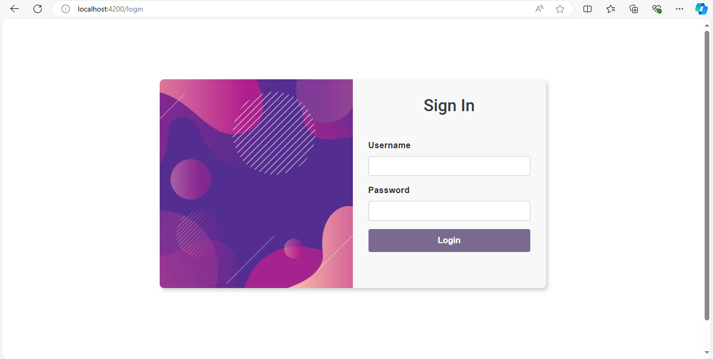

After successful login, it will redirect to product list page where the users can see list of products and do CRUD operations here.


If the users click add product button, a dialog will show up where the users can fill the new product data.
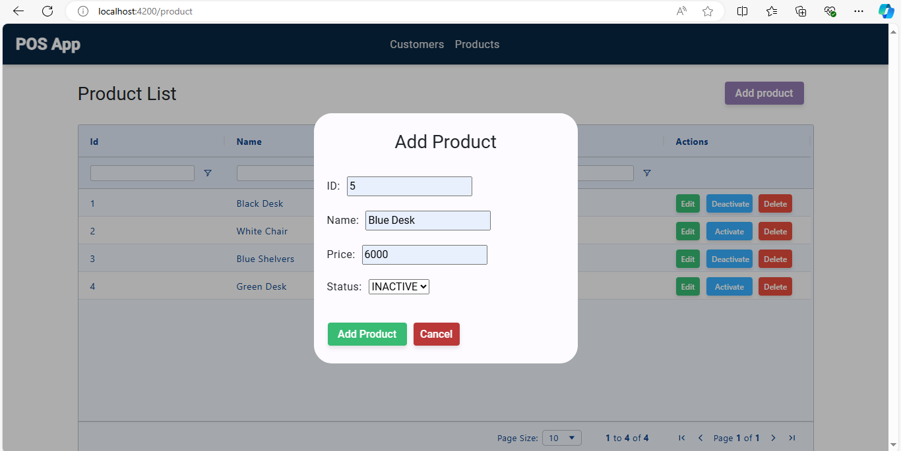
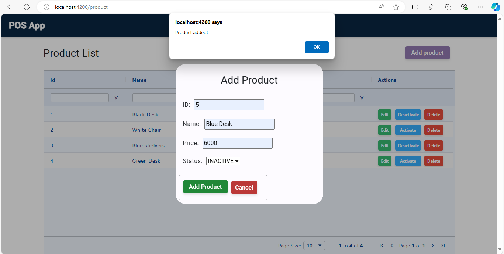

The new product has been added.


Here, I click activate toggle button for product id 5. Previously, the status is INACTIVE. Now, the status is ACTIVE.
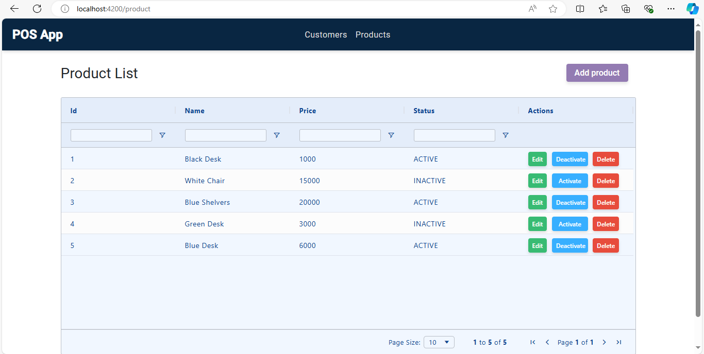

If the users click edit button, it will redirect to edit page.
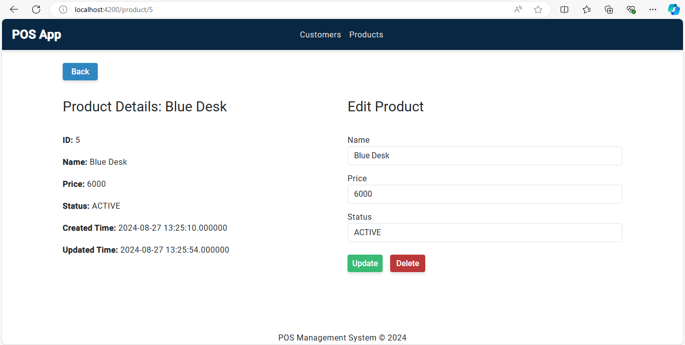

Here, I have implemented parent listens for child event.
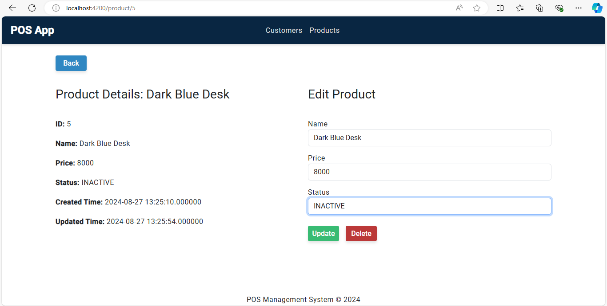

After clicking the update button, the product has been updated.
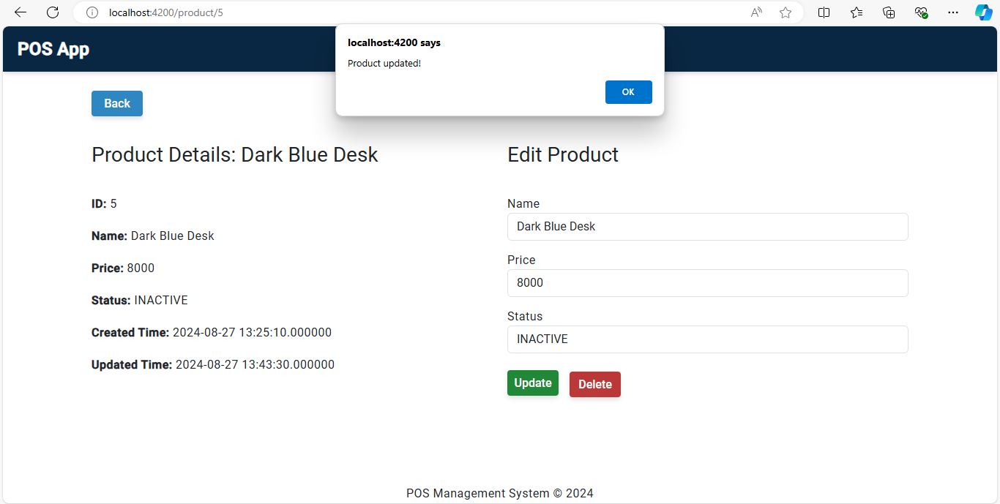

If the users click delete button, there will be a confirmation if the users really want to delete the product.
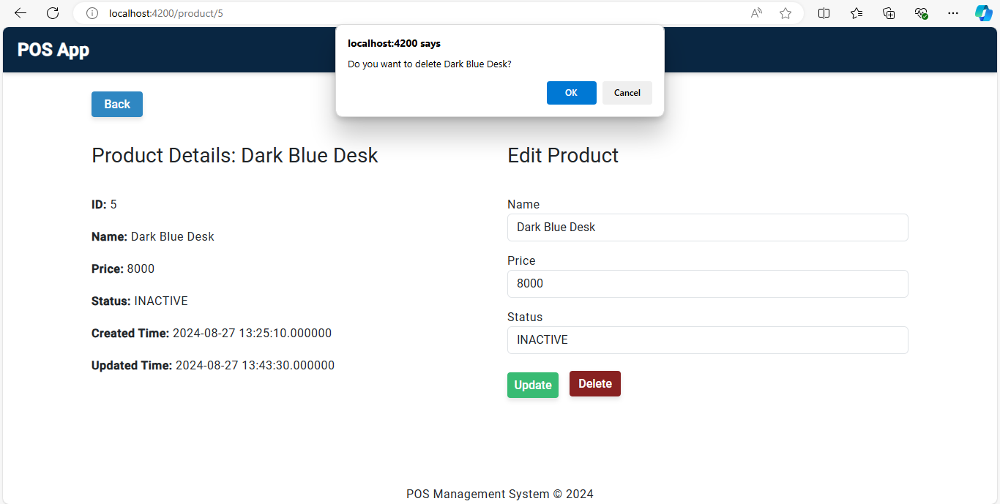

If the users click OK, the product is deleted.
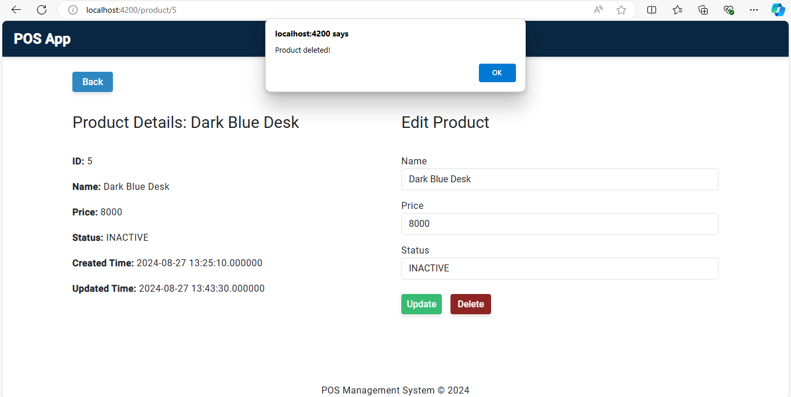
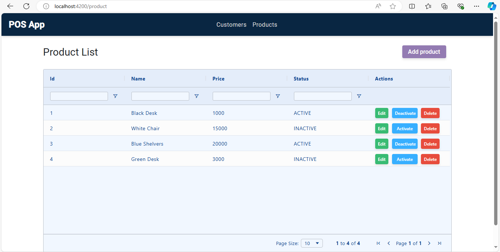

We can also delete a product from product list page by clicking the delete button.
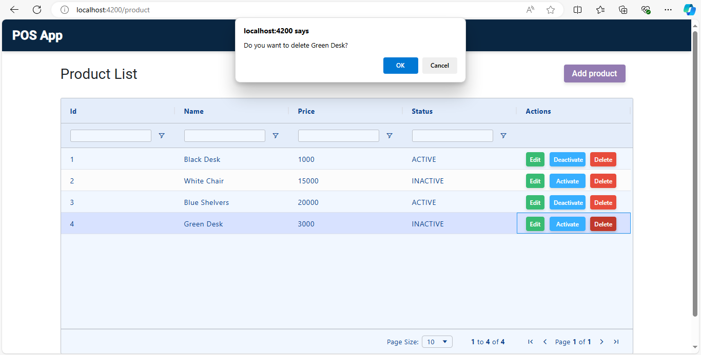
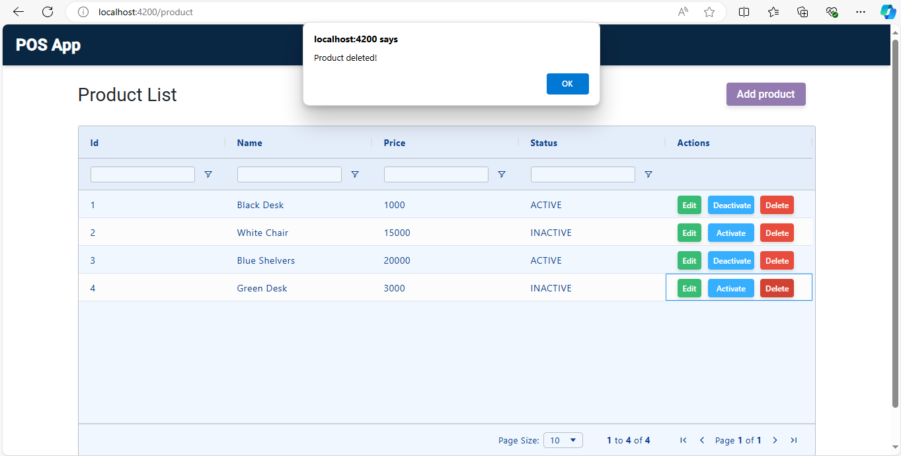

The product has been deleted.
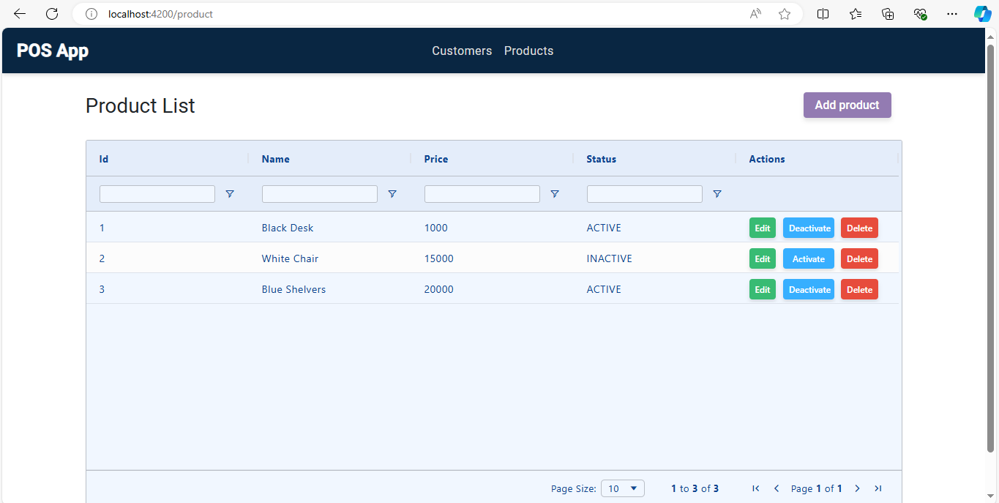