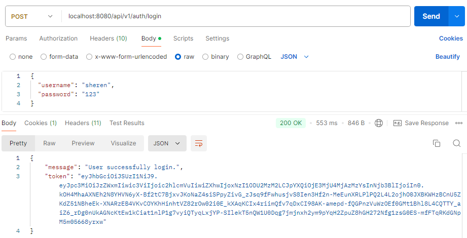
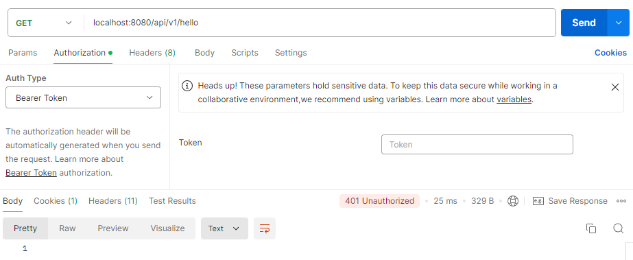
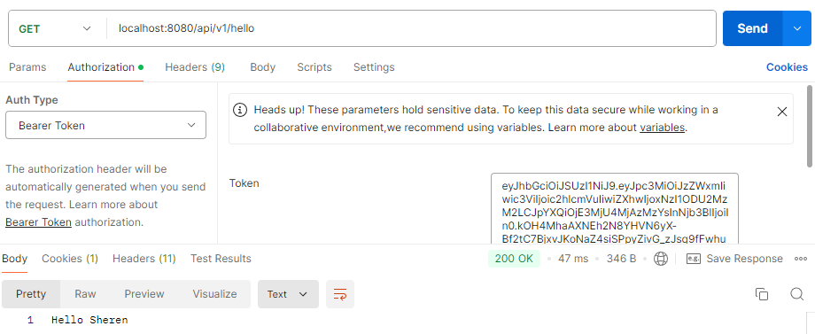
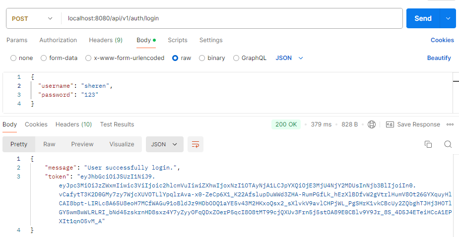
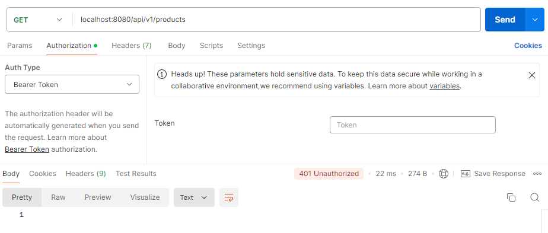
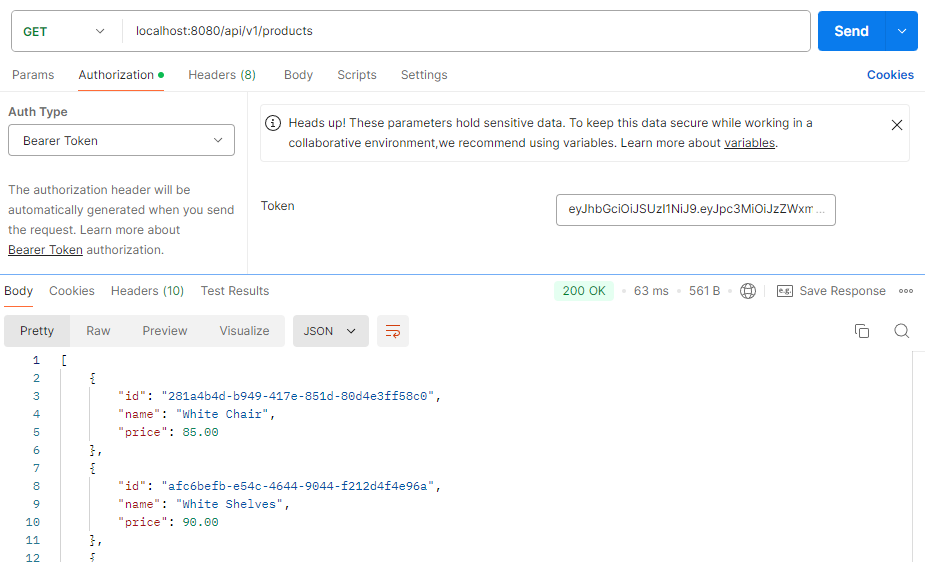
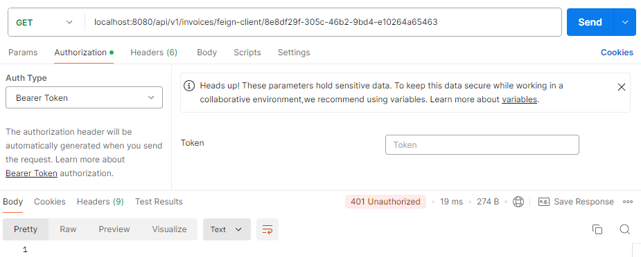
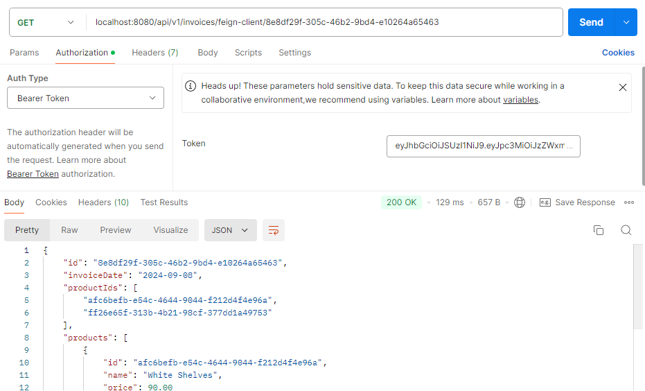

## 💡 Spring Security (OAuth2 and JWT)

Objectives:

- Implementing OAuth2 + Rest API (Newest - Spring Security 6)
- Apply assignment 1 for microservice project (use rest api stack). Gateway as the resource server.

---

### 🔐 About

**Spring security** is a powerful framework that provides authentication, authorization, and access control in Spring applications. OAuth2 is used to to authenticate and authorize users and JWT is the token format that is used for authentication information. This is common in microservices application where an Authorization Server issues JWT tokens and Resource Server validates and uses these tokens to control access. In this project, I have implemented Spring Security with OAuth2 and JWT using Spring Security 6, which is the newest.

---

### ⚙️ Project setup

First, let’s we add these dependencies in `pom.xml` .

```tsx
<dependencies>
    <dependency>
        <groupId>org.springframework.boot</groupId>
        <artifactId>spring-boot-starter-data-jpa</artifactId>
    </dependency>
    <dependency>
        <groupId>org.springframework.boot</groupId>
        <artifactId>spring-boot-starter-oauth2-resource-server</artifactId>
    </dependency>
    <dependency>
        <groupId>org.springframework.boot</groupId>
        <artifactId>spring-boot-starter-web</artifactId>
    </dependency>
    <dependency>
        <groupId>com.mysql</groupId>
        <artifactId>mysql-connector-j</artifactId>
        <scope>runtime</scope>
    </dependency>
    <dependency>
        <groupId>org.projectlombok</groupId>
        <artifactId>lombok</artifactId>
        <optional>true</optional>
    </dependency>
</dependencies>
```

In this project, we have added:

- Spring data JPA because we are making use of the storage to store user data
- OAuth2 Resource Server for security
- Spring web for building web APIs
- MySQL Driver
- Lombok

---

### 🔐 Implement Asymmetric KeyPair

Here, we implement asymmetric key pair encryption with RSA for securing JWTs. We will create public and private keys for encryption and decryption. To do this, we can use OpenSSL to generate an RSA-key keypair in `src/main/resources/certs` directory.

To generate a private key (RSA):

```tsx
openssl genpkey -algorithm RSA -out private-key.pem
```

This command generates an RSA private key and saves it in the `private-key.pem`.

To extract the public key from the private key:

```tsx
openssl rsa -pubout -in private-key.pem -out public-key.pem
```

This command extract the public key and stores it in the `public-key.pem` .

Then, we add these lines in `application.yml`:

```tsx
rsa:
  private-key: classpath:certs/private-key.pem
  public-key: classpath:certs/public-key.pem
```

These lines will tell Spring where to find our public and private keys for encrypting and decrypting our JWT tokens.

Next, we add `RsaKeyConfigProperties` in `config` package.

```tsx
@ConfigurationProperties(prefix = "rsa")
public record RsaKeyConfigProperties(RSAPublicKey publicKey, RSAPrivateKey privateKey) {
}
```

We are using `RSAPublicKey` and `RSAPrivateKey` which indicates that our application is using RSA keys for signing and verifying JWTs. RSA is an asymmetric encryption algorithm, where a private key is used to sign the JWT (so that only our server can generate valid tokens) and a public key is used to verify it (so that any entity with the public key can validate the token’s authenticity).

---

### 👥 Setting user module

We create user module to manage all user activities.

**1️⃣ Create `User`**

[User.java codes](https://github.com/affandyfandy/java-sheren/blob/week_13/Week%2013/Assignment%2001/spring-security-app/src/main/java/com/example/spring_security_app/entity/User.java)

This class serves as our entity.

**2️⃣ Create `UserRepository`**

[UserRepository.java codes](https://github.com/affandyfandy/java-sheren/blob/week_13/Week%2013/Assignment%2001/spring-security-app/src/main/java/com/example/spring_security_app/repository/UserRepository.java)

This interface handles JPA database interaction and queries.

**3️⃣ Create `AuthUser`**

[AuthUser.java codes](https://github.com/affandyfandy/java-sheren/blob/week_13/Week%2013/Assignment%2001/spring-security-app/src/main/java/com/example/spring_security_app/auth/AuthUser.java)

This is for managing user permissions and roles.

**4️⃣ Create `AuthService`**

[AuthService.java codes](https://github.com/affandyfandy/java-sheren/blob/week_13/Week%2013/Assignment%2001/spring-security-app/src/main/java/com/example/spring_security_app/service/AuthService.java)

This is for managing all logics that enable authentication, such as generating tokens.

**5️⃣ Create `JpaUserDetailsService`**

[JpaUserDetailsService.java codes](https://github.com/affandyfandy/java-sheren/blob/week_13/Week%2013/Assignment%2001/spring-security-app/src/main/java/com/example/spring_security_app/service/JpaUserDetailsService.java)

This class handles loading users from the database for login.

**6️⃣ Create `AuthDTO`**

[AuthDTO.java codes](https://github.com/affandyfandy/java-sheren/blob/week_13/Week%2013/Assignment%2001/spring-security-app/src/main/java/com/example/spring_security_app/dto/AuthDTO.java)

This class is for managing data transfers between the client and server request and response.

**7️⃣ Create `AuthController`**

[AuthController.java codes](https://github.com/affandyfandy/java-sheren/blob/week_13/Week%2013/Assignment%2001/spring-security-app/src/main/java/com/example/spring_security_app/controller/AuthController.java)

This class is for managing routes for authentication requests, such as login.

---

### 🔑 Set up security

In `config` package, we create `SecurityConfig`.

```tsx
@Configuration
@EnableWebSecurity
@EnableMethodSecurity
public class SecurityConfig {

    private static final Logger log = LoggerFactory.getLogger(SecurityConfig.class);
    private RsaKeyConfigProperties rsaKeyConfigProperties;
    private JpaUserDetailsService jpaUserDetailsService;

    @Autowired
    public SecurityConfig(RsaKeyConfigProperties rsaKeyConfigProperties, JpaUserDetailsService jpaUserDetailsService) {
        this.rsaKeyConfigProperties = rsaKeyConfigProperties;
        this.jpaUserDetailsService = jpaUserDetailsService;
    }

    @Bean
    public AuthenticationManager authManager() {
        var authProvider = new DaoAuthenticationProvider();
        authProvider.setUserDetailsService(jpaUserDetailsService);
        authProvider.setPasswordEncoder(passwordEncoder());
        return new ProviderManager(authProvider);
    }

    @Bean
    public SecurityFilterChain filterChain(HttpSecurity http, HandlerMappingIntrospector introspector) throws Exception {
        return http
                .csrf(csrf -> {
                    csrf.disable();
                })
                .cors(cors -> cors.disable())
                .authorizeHttpRequests(auth -> {
                    auth.requestMatchers("/error/**").permitAll();
                    auth.requestMatchers("/api/v1/auth/**").permitAll();
                    auth.anyRequest().authenticated();
                })
                .sessionManagement(s -> s.sessionCreationPolicy(SessionCreationPolicy.STATELESS))
                .oauth2ResourceServer((oauth2) -> oauth2.jwt((jwt) -> jwt.decoder(jwtDecoder())))
                .userDetailsService(jpaUserDetailsService)
                .httpBasic(Customizer.withDefaults())
                .build();
    }

    @Bean
    JwtDecoder jwtDecoder() {
        return NimbusJwtDecoder.withPublicKey(rsaKeyConfigProperties.publicKey()).build();
    }

    @Bean
    JwtEncoder jwtEncoder() {
        JWK jwk = new RSAKey.Builder(rsaKeyConfigProperties.publicKey()).privateKey(rsaKeyConfigProperties.privateKey()).build();

        JWKSource<SecurityContext> jwks = new ImmutableJWKSet<>(new JWKSet(jwk));
        return new NimbusJwtEncoder(jwks);
    }

    @Bean
    PasswordEncoder passwordEncoder() {
        return new BCryptPasswordEncoder();
    }
}
```

On these codes, we:

- Permits all requests to `/error/**` and `/api/v1/auth/**`
- Requires authentication for all other requests
- `AuthenticationManager` is set up to authenticate users based on the user details loaded from the JPA repository
- Validating JWT tokens with the `jwtDecoder()` bean
- `jwtDecoder()` bean configures a `JwtDecoder` that uses the public RSA key to validate JWT tokens
- `jwtEncoder()` bean configures a `JwtEncoder` that signs JWT tokens using the private RSA key.

In the base application, we add this annotation:

```tsx
@EnableConfigurationProperties(RsaKeyConfigProperties.class)
```

In addition, we add a dummy user in the database by using command line runner to create users when we start the application in our base to test the application.

---

### **📝 Create `TestController`**

Here, we create `TestController` to test if all requests other than `/error/**` and `/api/v1/auth/**` require authentication or not. Let’s create a simple API:

```tsx
@RestController
@RequestMapping("/api/v1")
public class TestController {

    @GetMapping("/hello")
    public String sayHello(Model model, @RequestParam(value = "name",
            defaultValue = "Sheren", required = false) String name) {
        model.addAttribute("name", name);
        return "Hello " + name;
    }
}
```

---

### 💻 Result

A token will be generated if we login with the correct username and password.



If we try to request but did not provide token, the result will be unauthorized since it requires authentication.



If we provide the correct token, then we can see the result.



---

### 📁 Apply Spring Security in microservices project

In microservices applications, a common choice is to use API gateway as the entry point. API gateway can act as an OAuth2 Resource Server. For this one, the gateway enforcing that each request has a valid access token before it is send to the back-end. For this project, I will use microservice project from the previous lesson and implement Spring Security on that.

**❔ How to do that?**

**1️⃣ Copy `public-key.pem` from `auth`**

First, we need to create `certs` directory in `src/main/resources` . Then, we copy the content of that file. Ensure that the content in `public-key.pem` is same with `public-key.pem` in `auth`.

**2️⃣ `application.yml` in gateway**

```tsx
server:
  port: 8080
spring:
  cloud:
    gateway:
      routes:
        - id: product
          uri: http://localhost:8081
          predicates:
            - Path=/api/v1/products/**
        - id: invoice
          uri: http://localhost:8082
          predicates:
            - Path=/api/v1/invoices/**
        - id: auth
          uri: http://localhost:8083
          predicates:
            - Path=/api/v1/auth/**

security:
  oauth2:
    resourceserver:
      jwt:
        public-key-location: classpath:certs/public-key.pem

rsa:
  public-key: classpath:certs/public-key.pem
```

- It defines the routes for the microservices (`product`, `invoice`, `auth`). Each route forwards requests to the appropriate service based on the request path
- The `gateway` acts as a resource server in this setup. The `public-key-location` points to the RSA public key that will be used to verify the JWT tokens. This key must be the same as the public key used by the `auth` service to issue the JWT tokens.

**3️⃣ Public key usage**

In both the `auth` and `gateway` projects, we are using an RSA key pair for JWT token signing and verification. The `auth` project uses the private key to sign JWT tokens, while the `gateway` uses the public key to verify the signature of incoming JWT tokens. The `public-key.pem` file contains the public key. By ensuring that the `gateway` and `auth` projects use the same public key, the gateway can trust the tokens issued by the `auth` service.

**4️⃣ Create `GatewaySecurityConfig` in `config`**

```tsx
@Configuration
public class GatewaySecurityConfig {

    private static final Logger log = LoggerFactory.getLogger(GatewaySecurityConfig.class);

    @Value("classpath:certs/public-key.pem")
    private Resource publicKeyResource;

    @Bean
    public SecurityWebFilterChain securityWebFilterChain(ServerHttpSecurity http) throws Exception {
        return http
                .csrf(csrf -> {
                    csrf.disable();
                })
                .authorizeExchange(exchange -> exchange
                        .pathMatchers("api/v1/auth/**").permitAll()
                        .anyExchange().authenticated())
                .oauth2ResourceServer(oauth2 -> oauth2
                        .jwt(jwt -> {
                            try {
                                jwt.jwtDecoder(jwtDecoder());
                            } catch (Exception e) {
                                throw new RuntimeException(e);
                            }
                        }))
                .build();
    }

    @Bean
    public ReactiveJwtDecoder jwtDecoder() throws Exception {
        RSAPublicKey publicKey = loadPublicKey();
        return NimbusReactiveJwtDecoder.withPublicKey(publicKey).build();
    }

    private RSAPublicKey loadPublicKey() throws Exception {
        byte[] keyBytes = publicKeyResource.getInputStream().readAllBytes();
        String publicKeyContent = new String(keyBytes)
                .replace("-----BEGIN PUBLIC KEY-----", "")
                .replace("-----END PUBLIC KEY-----", "")
                .replaceAll("\\s+", "");
        log.info("Public key content: " + publicKeyContent);
        KeyFactory keyFactory = KeyFactory.getInstance("RSA");
        X509EncodedKeySpec keySpec = new X509EncodedKeySpec(Base64.getDecoder().decode(publicKeyContent));
        return (RSAPublicKey) keyFactory.generatePublic(keySpec);
    }
}
```

- Requests to the `/api/v1/auth/**` endpoint are allowed without authentication, but all other routes require authentication
- The `gateway` is configured as an OAuth2 resource server that validates JWT tokens. It uses the public key to decode and validate JWT tokens
- The `ReactiveJwtDecoder` is a custom bean that loads the RSA public key from the `public-key.pem` file and uses it to verify JWT tokens.

---

### 💻 Run the application and the result

To run the application, we need to run `product`, `invoice`, `gateway`, and `auth` applications.

First, we will generate token in `localhost:8080/api/v1/auth/login` .



Now, we want to get list of products. Let’s try without providing the token.



It will return unauthorized.

Then, let’s we provide the token generated before in the authorization.



It will return the correct result.

Let’s test for invoice also.

No token:



It returned unauthorized.

With correct token:



It returned the correct result.