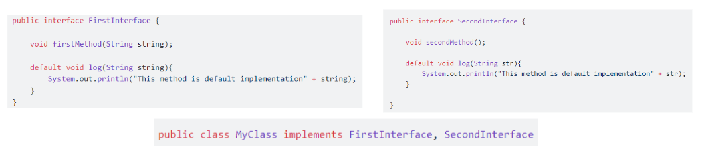
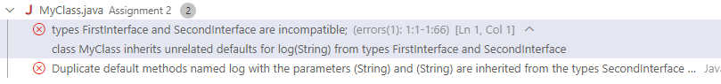

## 💡 **What happen if implement 2 interface have same default method?**

**The codes:**


**The result:**



**Explanation:**

When a class implements two interfaces that have the same default method, there will be a conflict as the compiler does not know which default method to use. To resolve this, there are two ways. The first one is the class must be override the conflicting default method and provide its own implementation. The second one is using super keyword for either firstMethod or secondMethod.

**Solution:**

```java
public interface FirstInterface {
    void firstMethod(String string);

    default void log(String string) {
        System.out.println("This method is default implementation" + string);
    }
}
```

```java
public interface SecondInterface {
    void secondMethod();

    default void log(String str) {
        System.out.println("This method is default implementation" + str);
    }
}
```

Override the conflicting method by providing its own implementation:

```jsx
public class MyClass implements FirstInterface, SecondInterface {
    @Override
    public void firstMethod(String string) {
        System.out.println("First method implementation: " + string);
    }

    @Override
    public void secondMethod() {
        System.out.println("Second method implementation");
    }

    @Override
    public void log(String str) {
        System.out.println("MyClass log: " + str);
    }

    public static void main(String[] args) {
        MyClass myClass = new MyClass();

        myClass.firstMethod("Hi, this is the first method"); // Output: First method implementation: Hi, this is the first method
        myClass.secondMethod(); // Output: Second method implementation
        myClass.log("Test log message"); // Output: MyClass log: Test log message
    }
}
```

Using super keyword to override the default method by firstMethod or secondMethod:

```java
@Override
    public void log(String str) {
        // System.out.println("MyClass log: " + str);
        SecondInterface.super.log(str);
    }
```

**Explanation:**

1. FirstInterface and SecondInterface define a defaultmethod with the same signature ‘log’
2. To resolve the conflicting default method, we need to override the conflicting default method and provides its own implementation. In MyClass class, we implement both FirstInterface and SecondInterface. Then, we provide its own implementation of firstMethod and secondMethod
3. To resolve the conflict, the first way is that we override the ‘log’ method by providing its own implementation. Or we can use super keyword to override it either using the firstMethod or secondMethod.

## 💡 The difference between abstract class and interface

### Abstract class

Abstract class is a class that cannot be instantiated on its own and is meant to be subclassed.

**Syntax:**

- Declared using abstract keyword
- Can have both abstract (without implementation) and concrete (with implementation) methods
- Cannot be instantiated which means we cannot create object of an abstract class. Only through a subclass
- Abstract class can have constructors like any other class
- Abstract class can be used as a base class for other classes, which means that they can be inherited by other classes
- Support single inheritance (a class can inherit from one abstract class).

**Purpose**:

- Use when we want to provide a common base class with some default behavior that derived class can share and override
- Providing a base class for related classes, encapsulating common fields and methods. This helps in reducing code duplication and maintain the codes.

**Example:**

```java
abstract class Animal {
// Concrete method
public void eat() {
    System.out.println("This animal eats food.");
}

// Abstract method
public abstract void makeSound();
}

class Cat extends Animal {
public void makeSound() {
    System.out.println("Meow");
}
}

public class Main {
public static void main(String[] args) {
    Animal myCat = new Cat();
    myCat.eat(); // Output: This animal eats food.
    myCat.makeSound(); // Output: Meow
}
}

```

### Interface class

An interface is a contract that specifies a set of methods that a class must implement.

- Declared using interface keyword
- Can have only abstract methods (prior to Java 8). From Java 8 onwards, interfaces can also have default and statics methods with concrete implementations
- Cannot be instantiated directly. Only through a class that implements the interface
- Interface cannot have instance fields/constructors
- Interface can contain only constants, method signatures, default methods (with implementation)
- Support multiple inheritance (a class can implement multiple interfaces.

**Purpose:**

- Use when we want to define a contract for multiple classes to implement
- Can implement multiple inheritances, allowing for a form of multiple inheritance. This helps in creating reusable code.

**Example:**

```java
interface Animal {
void eat(); // Abstract method
void makeSound(); // Abstract method
}

class Cat implements Animal {
public void eat() {
    System.out.println("Cat eats food.");
}

public void makeSound() {
    System.out.println("Meow");
}
}

public class Main {
public static void main(String[] args) {
    Animal myCat = new Cat();
    myCat.eat();
    myCat.makeSound();
}
}
```

## 💡 @FunctionalInterface

The @FunctionalInterface annotation in Java is used to indicate that an interface is a functional interface. A functional interface is an interface with exactly one abstract method. These interfaces are also knows as Single Abstract Method (SAM) interfaces and are key to enabling lambda expressions in Java.

**Purpose**

- Used to ensure that the interface follows to the requirements of a functional interface. If the interface contains more than one abstract method, the compiler will generate an error
- Using this annotation makes it clear to other developers that the interface is intended to be afunctional interface which can improve code readability and maintainability
- Provides target types for lambda expressions and method references

**Rules**

- The interface must have exactly one abstract method. It can have any number of default methods and static methods
- Even we don’t use the @FunctionalInterface annotation, any interface with single abstract method is considered as functional interface
- If an interface inherits another interface, it remains a functional interface if it doesn’t add any new abstract methods. However, it can inherit abstract methods from the parent interface.

**Example:**

```java
@FunctionalInterface
interface MyFunctionalInterface {
void execute();

// Default method
default void defaultMethod() {
}

// Static method
static void staticMethod() {
}
}

public class Main {
public static void main(String[] args) {
    // Using a lambda expression to implement the functional interface
    MyFunctionalInterface myFunc = () -> System.out.println("Executing...");
    
    // Calling the method
    myFunc.execute();
}
}
```