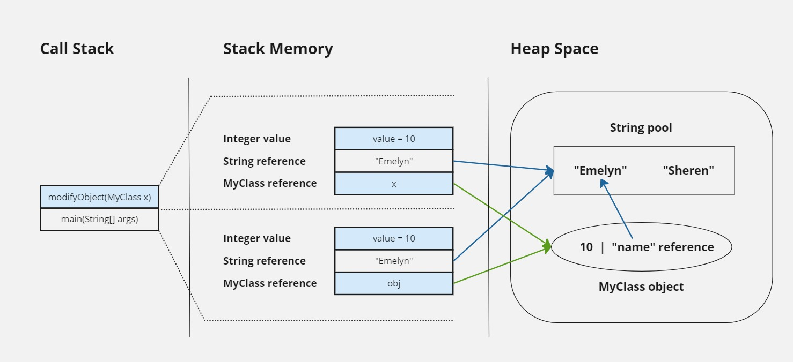
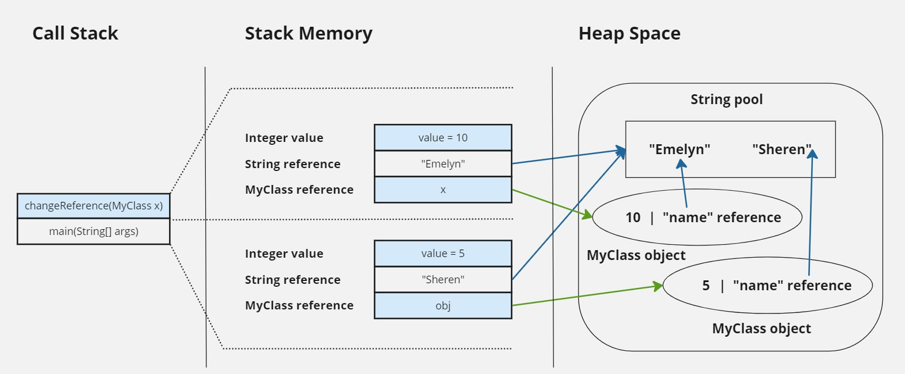

## Stack and Heap

Both stack and heap are memory sections used in programs, but they differ in allocation, management, and purpose. 

### Stack Memory

Stack is used for static memory allocation (defined at compile time) and execution of threads. It stores primitive data types (int, float, etc), method calls, local variables, and reference variables to objects in heap space. It’s accessed using Last-In First-Out (LIFO) memory allocation system. The variables in stack memory created when a method is called and destroyed once the method execution is complete.

### Heap Space

Heap space is used for dynamic memory allocation. It stores objects and arrays that are created during the execution of the program. It has a larger size and it managed by the garbage collector.

## Passing Reference Types

### Modify the object that the reference points to

Based on the codes provided in the previous slide, let’s add another String field in MyClass.

```java
class MyClass {
    int value;
    String name; // add string field
}

public class Main {
    public static void main(String[] args) {
        MyClass obj = new MyClass(); // obj reference is in stack, MyClass object is in heap
        obj.value = 5; // 'value' is in heap as part of MyClass object
        obj.name = "Sheren"; // 'name' is in heap as part of MyClass object

        modifyObject(obj);

        System.out.println("obj.value after modifyObject: " + obj.value); // output: obj.value after modifyObject: 10
        System.out.println("obj.value after modifyObject: " + obj.name); // obj.value after modifyObject: Emelyn
    }

    public static void modifyObject(MyClass x) {
        x.value = 10;
        x.name = "Emelyn";
    }
}
```

Explanation:

1. Stack memory
    - The reference variable obj is created in stack memory
    - When ‘modifyObject(obj)’ is called, a new stack frame is created for the ‘modifyObject’ method. The parameter ‘x’ is created in the stack memory of this new frame. ‘x’ is a reference to the same ‘MyClass’ object that ‘obj’ references
    - The stack frame for ‘modifyObject’ is removed once the method execution completes
    - The changes made to the ‘MyClass’ object through ‘x’ persist because ‘x’ and ‘obj’ reference the same object in heap memory.
2. Heap memory
    - A new ‘MyClass’ object is created in heap memory
    - ‘obj.value = 5;’: The ‘value’ field of the ‘MyClass’ object in heap is set to 5
    - .obj.name = “Sheren”;’: The ‘name’ field of the ‘MyClass’ object in heap is set to the string “Sheren”
    - The ‘MyClass’ object referenced by ‘x’ is the same object referenced by ‘obj’. This means both ‘x’ and ‘obj’ point to the same object in heap memory
    - ‘x.value = 10;’: Modifies the ‘value’ field of the ‘MyClass’ object in heap to 10
    - ‘x.name = “Emelyn”;’: Modifies the ‘name’ field of the ‘MyClass’ object in heap to “Emelyn”.
    - The ‘MyClass’ object in heap now has ‘value’ set to 10 and ‘name’ set to “Emelyn”
    

**Summary**

Reference passing

In Java, when we pass an object to a method, we are passing the reference to that object (a pointer to the object in heap memory). Changes made to the object via this reference will affect the actual object in heap memory.

Heap and stack interaction

- Stack memory holds references to objects
- Heap memory holds the actual objects
- Modifications to the object via its reference in stack memory affect the object in heap memory.
    
    

**The Visual Diagram**



- Changes made to the ‘MyClass’ object through ‘x’ modify the contents of the object because ‘x’ and ‘obj’ reference the same object in heap memory.
- obj.value after modifyObject will be 10 and obj,value after modifyObject will be “Emelyn”.

### Cannot change the reference itself to point to a different object

Codes:

```java
class MyClass {
    int value;
    String name; // add string field
}

public class Main {
    public static void main(String[] args) {
        MyClass obj = new MyClass(); 
        obj.value = 5;
        obj.name = "Sheren";
        
        changeReference(obj);

        System.out.println("obj.value after modifyObject: " + obj.value); // output: obj.value after modifyObject: 5
        System.out.println("obj.value after modifyObject: " + obj.name); // output: obj.value after modifyObject: Sheren
    }

    public static void changeReference(MyClass x) {
        x = new MyClass(); // this changes local reference, not the original reference
        x.value = 10;
        x.name = "Emelyn";
    }
}
```

Explanation:

- This passing reference type did not change the original reference as it is only change the local reference
- In the changeReference method ‘x = new MyClass();’ creates a new ‘MyClass’ object in heap space and changes the reference ‘x’ to point to this new object
- Note that ‘obj’ in the ‘main’ method still points to the original ‘MyClass’ object
- The original ‘MyClass’ object pointed to by ‘obj’ remains unchanged because ‘changeReference’ only modified the local reference ‘x’
- Therefore, ‘obj.value’ remains 5 and ‘obj.name’ remains “Sheren”.

**The Visual Diagram**



- The reference ‘x’ in the ‘changeReference’ method is local to that method and does not affect the ‘obj’ reference to the ‘main’ method
- The ‘changeReference’ method creates a new ‘MyClass’ object and assigns it to ‘x’, but this does not change the object that ‘obj’ in ‘main’ refers to
- Therefore, the original ‘MyClass’ object referenced by ‘obj’ remains unchanged after the ‘change Reference’ method is called.