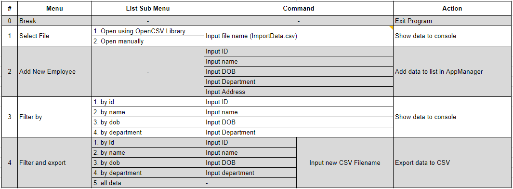

## Assignment 7 - Console Menu (Employee Management System)

This is a Java console employee management system project. It uses AppManager class as Singleton to control the entire application.

### Wireframe

### Class diagram

